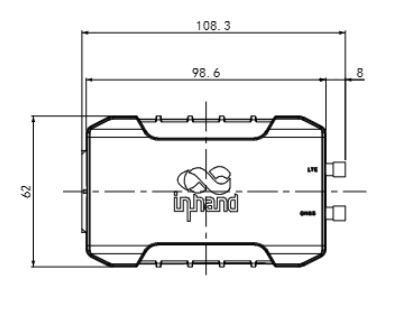
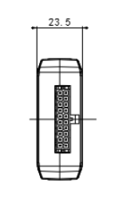
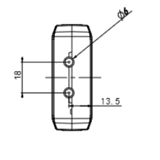

  

    

      
    

    

      Lightweight Vehicle Tracking, Reliable Connectivity, Precise Positioning
    

  

  

    

      VT200 Vehicle Telematics Gateway
    

    

      

        
· LTE Cat1 / Cat-M1

        
· GNSS

      

      

        
· CAN / I/O

        
· Inertial

      

    

  

# 1. Product Overview

**The InHand VT200 is a vehicle telematics gateway capable of reliable operation even when the vehicle is powered off.**

**Positioning:** LTE + GNSS + inertial navigation telematics gateway for vehicle tracking, fleet management, and asset monitoring

**Key Features:**
- **High-performance tracking:** GNSS positioning with inertial navigation for continuous location accuracy
- **Driving behavior monitoring:** accelerometer and gyroscope enable real-time monitoring of braking, acceleration, and collision events
- **Extensive interfaces:** CAN bus, RS232/RS485, DI/AI, DO, and 1-Wire for flexible vehicle integration
- **Continuous operation:** cache supports continuous data recording when the internet connection is unavailable
- **Cloud & device ecosystem:** supports mainstream IoT platforms such as AWS/Azure and other tracking services

## Core Technical Specifications

|Technical Indicator|Specification|
|---|---|
|Cellular Network|LTE Cat1 / Cat-M1|
|Positioning Capability|GNSS (GPS / Galileo / Beidou / GLONASS) + Inertial Navigation (DR)|
|Cloud Platform Access|Supports AWS IoT, Azure IoT, Aliyun IoT, and mainstream third-party tracking platforms|
|Transmission Protocols|TCP, UDP, HTTP, MQTT, JT808|
|Transparent Transmission|Supports transparent transmission for OBD-II / J1939 / CAN / ELD, and RS232/RS485 serial passthrough|
|Security Capability|Supports SSL/TLS encryption and platform-side security authentication|
|Dimensions|98.6 × 62 × 23.5 mm (built-in antenna) / 108.3 × 62 × 23.5 mm (external antenna)|
|Interfaces|CAN, RS232, RS485, DI/AI, DO, 1-Wire, USB Type-C|
|Power Supply Range|9 ~ 36 VDC|
|Operating Temperature|-20 ℃ ~ 60 ℃|
|Protection Rating|IP40|
|Storage Temperature|-40 ℃ ~ 85 ℃|

# 2. Product Dimensions

  

    
    
Front View

  

  

    
    
Interface Side View

  

  

    
    
Height Side View

  

  
Notes:

  
1. All dimensions are in millimeters (mm).

  
2. All dimensions are approximate and for reference only.

  
3. Drawings must not be used for manufacturing.

  
4. Dimensions are subject to part and manufacturing tolerances.

    
5. Specifications may change without prior notice.

# 3. Hardware Specifications

| Category / Parameter | Specification |
|---|---|
| **Networking & Cellular** | |
| Network Type | LTE Cat1 / Cat-M1 |
| Cellular Antenna | Built-in ceramic antenna or external SMA (model dependent) |
| GNSS Antenna | Built-in ceramic antenna or external SMA (model dependent) |
| SIM | Nano-SIM (4FF), single SIM card |
| **Satellite Navigation** | |
| Satellite Support | GPS / Galileo / Beidou / GLONASS |
| Channels | 72 channels |
| Initial Positioning Sensitivity | -164 dBm (initial positioning time 26 s) |
| Tracking Sensitivity | -156 dBm (hot start) / -147 dBm (cold start) |
| Location Accuracy | 2.5 m (CEP50) |
| Update Frequency | 10 MHz |
| Inertial Navigation | Supports dead-reckoning (DR) |
| Acceleration | Measurement range: ±2 / ±4 / ±8 / ±16g |
| Angular Velocity | Measurement range: ±125 / ±250 / ±500 / ±1000 / ±2000dps |
| **Electrical & Environment** | |
| Working Voltage | 9 ~ 36 VDC |
| Operating Temperature | -20 ℃ ~ 60 ℃ |
| Storage Temperature | -40 ℃ ~ 85 ℃ |
| Humidity | 95% RH @ 50 ℃ (non-condensing) |
| ESD | IEC 61000-4-2 (4 kV test) |
| Protection Rating | IP40 |
| Battery Capacity (battery models) | 1000 mAh |
| Battery Material (battery models) | Lithium-ion |
| Battery Operating Temperature | Charging: 0 ℃ ~ 45 ℃; Discharging: -20 ℃ ~ 60 ℃ |
| Battery Storage Temperature | -20 ℃ ~ 35 ℃ |
| **Mechanical** | |
| Shell Material | ABS + PC |
| Dimensions | 98.6 × 62 × 23.5 mm (built-in) / 108.3 × 62 × 23.5 mm (external) |
| **Vehicle Interfaces** | |
| CAN Bus | 1 channel |
| Ignition Signal | 1 channel (ACC/IGT) |
| Digital Input / Analog Input | 4 channels (DI/AI) |
| Digital Output | 2 channels (max. 300 mA) |
| 1-Wire | 1 channel |
| Serial Port | RS232 and RS485 |
| External Interfaces | USB 2.0 Type-C, SIM slot, LED indicators |

# 4. Software Specifications

| Category / Parameter | Specification |
|---|---|
| **Network Features** | |
| Cloud Platforms | AWS IoT, Azure IoT, Aliyun IoT, Wialon, Traccar, GPSWox, WhiteLable Tracking, ThingsBoard, MQTT Cloud, Customer Private Cloud, and other supported platforms |
| Transport Protocols | TCP, UDP, HTTP, MQTT, JT808 |
| Encryption | SSL/TLS |
| **Vehicle Data & Transparent Transmission** | |
| Data Transmission | OBD-II / J1939 / CAN bus / ELD transparent transmission |
| Serial Transparent Transmission | RS232/RS485 transparent; supports Modbus RTU to Modbus |
| **Event & Reporting** | |
| Event Alarm | Collision detection, motion detection, overspeed, IO change, ignition signal detection |
| Reporting | Support SMS or FlexAPI over TCP/UDP/MQTT |
| **Configuration Interface** | |
| Configuration | USB 2.0 Type-C |
| **Security** | |
| Authentication | Supported for secure communications (per platform) |
| **Certification** | |
| Certifications* | CE, FCC, IC, PTCRB, E-Mark |

# 5. Ordering Information

## Model Rule

**Model code:** VT200-\<WMNN\>

\<WMNN\>: Cellular Type & Module

## Product Models

<table style="width:100%; table-layout:fixed;">
  <colgroup>
    <col style="width:25%;">
    <col style="width:29%;">
    <col style="width:46%;">
  </colgroup>
  <tr><th>Model</th><th>Cellular Type / Region</th><th>Bands</th></tr>
  <tr><td><strong>VT200-FQ33-BAT</strong></td><td>LTE Cat1, North America</td><td>LTE-FDD B2/B4/B5/B12/B13;  WCDMA B2/B4/B5</td></tr>
  <tr><td><strong>VT200-FQ33</strong></td><td>LTE Cat1, North America</td><td>LTE-FDD B2/B4/B5/B12/B13;  WCDMA B2/B4/B5</td></tr>
  <tr><td><strong>VT200-FQ33-ANT</strong></td><td>LTE Cat1, North America</td><td>LTE-FDD B2/B4/B5/B12/B13;  WCDMA B2/B4/B5</td></tr>
  <tr><td><strong>VT200-FQ33-ANT-BAT</strong></td><td>LTE Cat1, North America</td><td>LTE-FDD B2/B4/B5/B12/B13;  WCDMA B2/B4/B5</td></tr>
  <tr><td><strong>VT200-FQ02-BAT</strong></td><td>LTE Cat-M1, Global</td><td>LTE-FDD B1/B2/B3/B4/B5/B8/B12/B13/B18/B19/B20/B25/B26/B27/B28/B66/B85</td></tr>
  <tr><td><strong>VT200-FQ02</strong></td><td>LTE Cat-M1, Global</td><td>LTE-FDD B1/B2/B3/B4/B5/B8/B12/B13/B18/B19/B20/B25/B26/B27/B28/B66/B85</td></tr>
  <tr><td><strong>VT200-FQ02-ANT</strong></td><td>LTE Cat-M1, Global</td><td>LTE-FDD B1/B2/B3/B4/B5/B8/B12/B13/B18/B19/B20/B25/B26/B27/B28/B66/B85</td></tr>
  <tr><td><strong>VT200-FQ02-ANT-BAT</strong></td><td>LTE Cat-M1, Global</td><td>LTE-FDD B1/B2/B3/B4/B5/B8/B12/B13/B18/B19/B20/B25/B26/B27/B28/B66/B85</td></tr>
</table>

## Cable Accessories

| Cable | Order Code | Specifications |
|---|---|---|
| 20 PIN Cable | SCAB000381 | P1 is 20PIN female, connected to VT200; P2 is open end, AWG24 for other signals; connector HX30002-20 |
| OBD-II 16 PIN Test Cable | SCAB000399 | OBD-II 16 PIN test line; cable standard UL2464; wire length 1500 mm |
| J1939 6 PIN Test Cable | SCAB000409 | J1939 6 PIN interface test line; cable standard UL2464; wire length 1500 mm |

# 6. Contact Us

- **Website:** [InHand Networks](https://www.inhand.com.cn)
- **Copyright:** © InHand Networks. All rights reserved.

# 7. Connector Pin Assignment

## IO 20PIN Definition

<table style="width:78%;">
  <colgroup>
    <col style="width:15%;">
    <col style="width:23%;">
    <col style="width:62%;">
  </colgroup>
  <tr><th align="center">Pin</th><th align="center">Definition</th><th align="left">Description</th></tr>
  <tr><td align="center">1</td><td align="center">CAN0_H</td><td>CAN0 bus high-level signal</td></tr>
  <tr><td align="center">2</td><td align="center">RS485_A</td><td>RS485 A line</td></tr>
  <tr><td align="center">3</td><td align="center">GND</td><td>Signal ground</td></tr>
  <tr><td align="center">4</td><td align="center">RS232_TX</td><td>RS232 transmit signal</td></tr>
  <tr><td align="center">5</td><td align="center">DO1</td><td>Digital output 1</td></tr>
  <tr><td align="center">6</td><td align="center">GND</td><td>Signal ground</td></tr>
  <tr><td align="center">7</td><td align="center">AI1/DI1</td><td>Analog input 1 or digital input 1</td></tr>
  <tr><td align="center">8</td><td align="center">AI3/DI3</td><td>Analog input 3 or digital input 3</td></tr>
  <tr><td align="center">9</td><td align="center">IGT</td><td>Ignition detection input</td></tr>
  <tr><td align="center">10</td><td align="center">VIN-</td><td>Power negative terminal</td></tr>
  <tr><td align="center">11</td><td align="center">CAN0_L</td><td>CAN0 bus low-level signal</td></tr>
  <tr><td align="center">12</td><td align="center">RS485_B</td><td>RS485 B line</td></tr>
  <tr><td align="center">13</td><td align="center">1Wire</td><td>1-Wire bus interface</td></tr>
  <tr><td align="center">14</td><td align="center">RS232_RX</td><td>RS232 receive signal</td></tr>
  <tr><td align="center">15</td><td align="center">DO2</td><td>Digital output 2</td></tr>
  <tr><td align="center">16</td><td align="center">GND</td><td>Signal ground</td></tr>
  <tr><td align="center">17</td><td align="center">AI2/DI2</td><td>Analog input 2 or digital input 2</td></tr>
  <tr><td align="center">18</td><td align="center">AI4/DI4</td><td>Analog input 4 or digital input 4</td></tr>
  <tr><td align="center">19</td><td align="center">GND</td><td>Signal ground</td></tr>
  <tr><td align="center">20</td><td align="center">VIN+</td><td>Power positive terminal</td></tr>
</table>
