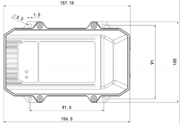
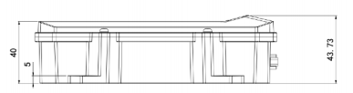

  

    

      
    

    

      Reliable Tracking, Rugged Design, Open Interfaces
    

  

  

    

      VT320 Vehicle Telematics Gateway
    

    

      

        
· LTE Cat-M

        
· GNSS

      

      

        
· CAN / OBD

        
· IP66

      

    

  

# 1. Product Overview

**The Vehicle Telematics 320 (VT320) provides reliable operation in harsh environments even when the vehicle is powered off.**

**Key Features:**
- **Reliable tracking:** GNSS multi-constellation positioning with inertial navigation support
- **Driving behavior monitoring:** gyroscope + inertial sensor monitoring for braking, acceleration, collision and other events
- **Extensive vehicle interfaces:** dual CAN bus, serial ports, I/O, Bluetooth, and 1-Wire
- **Data resilience:** cache supports continuous recording when Internet connectivity is unavailable
- **Vehicle-rugged design:** IP66 protection rating and wide working voltage range

## Core Technical Specifications

| Metric | Spec |
|---|---|
| Cellular Network | LTE Cat1 / LTE Cat-M1 |
| Positioning | GPS / Galileo / Beidou / GLONASS + inertial navigation (DR) |
| Cloud Integration | AWS IoT, Azure IoT, Aliyun IoT, Wialon, Traccar, GPSWox, ThingsBoard |
| Network Features | TCP / UDP / HTTP / MQTT transport; SMS or FlexAPI reporting |
| Vehicle Data Access | OBD-II / J1939 / J1979 / J1708 |
| Security | Certificate-based access capability; model-dependent operator certifications |
| Dimensions | Approximately 157.15 × 100 × 43.73 mm |
| Vehicle Interfaces | 2 × CAN, RS232, RS485, DI/DO, 1-Wire, analog input, dual SIM |
| Power Supply | 9-48 V DC |
| Operating Temperature | -40 C to 85 C |
| Protection Rating | IP66 |
| Battery | 1200 mAh Ni-MH |

# 2. Product Dimensions

  

    
    
Front View

  

  

    
    
IHeight Side View

  

  

    
Notes:

    
1. All dimensions are in millimeters (mm).

    
2. All dimensions are approximate and for reference only.

    
3. Drawings must not be used for manufacturing.

    
4. Dimensions are subject to part and manufacturing tolerances.

    
5. Specifications may change without prior notice.

  

# 3. Hardware Specifications

| Category / Parameter | Specification |
|---|---|
| **Cellular & GNSS** | |
| Network Type | LTE Cat1 / Cat-M1 |
| Antenna | LTE FPC built-in or external SMA (model dependent); GNSS ceramic built-in or external SMA |
| Satellite Support | GPS / Galileo / Beidou / GLONASS |
| Channels | 72 channels |
| Initial Positioning Sensitivity | -167 dBm (initial positioning time 26 s) |
| Tracking Sensitivity | -157 dBm (hot start); -148 dBm (cold start) |
| Location Accuracy | 2.5 m (CEP50) |
| Update Frequency | 0.25 Hz ~ 10 MHz (configurable) |
| Bluetooth | Bluetooth 4.1 |
| **Inertial Sensor** | |
| Acceleration Range | ±2 / ±4 / ±8 / ±16 g |
| Angular Velocity Range | ±125 / ±250 / ±500 / ±1000 / ±2000 dps |
| Inertial Navigation | Supports dead-reckoning (DR) |
| **Working Conditions** | |
| Working Voltage | 9–48 V DC |
| Operating Temperature | -40 °C ~ 85 °C |
| Humidity | 95% RH @ 50 °C (non-condensing) |
| ESD | IEC 61000-4-2 (4 kV test) |
| Protection Rating | IP66 |
| Battery Capacity | 1200 mAh |
| Battery Material | Ni-MH |
| Battery Temperature Range | Charging: 0 °C ~ 45 °C; Discharging: -40 °C ~ 85 °C |
| Storage Temperature | For 1 month: -40 °C ~ 55 °C; For 1 year: -40 °C ~ 35 °C |
| Shell Material | Engineering plastic + engineering plastic alloy (PC + ABS) |
| **Vehicle Interfaces** | |
| CAN Bus | 2 channels |
| Diagnostics | J1708 / OBD-II / J1939 supported (vehicle protocols) |
| RS485 | 1 channel |
| RS232 | 1 channel |
| Ignition Signal | 1 channel |
| Digital Input | 4 channels |
| Digital Output | 3 channels (max 300 mA) |
| 1-Wire | 1 channel (supports 4 sensors) |
| Analog Input | 1 channel + 1 channel |
| SIM Card | 2 × FF, push-in slot |
| I/O PIN | 26 PIN |
| LED Indicators | 2 LED indicators (cellular status / GNSS status) |

# 4. Software Specifications

| Category / Parameter | Specification |
|---|---|
| **Cloud Platforms & Connectivity** | |
| Cloud Platforms | AWS IoT, Azure IoT, Aliyun IoT, Wialon, Traccar, GPSWox, WhiteLabel Tracking, ThingsBoard, Customer Platform |
| Transport Protocols | TCP / UDP / HTTP / MQTT |
| **Vehicle Data & Transparent Transmission** | |
| Vehicle Data | OBD-II, J1939, J1979 and J1708 |
| Transparent Transmission | RS232/RS485 transparent; Modbus RTU to Modbus (data acquisition) |
| **Event Alarm & Reporting** | |
| Event Alarm | Collision detection, motion detection, overspeed, IO change, ignition signal detection |
| Reporting Support | SMS or FlexAPI over TCP/UDP/MQTT |
| ELD | Supported |
| BLE Forwarding | Forward vehicle data via BLE |
| **Configuration Interface** | |
| Configuration | RS232 or Bluetooth; USB Type-C |
| **Certificate (as listed)** | |
| Certifications* | FCC / IC / PTCRB / AT&T / Verizon (model-dependent) |

# 5. Ordering Information

## Model Rule

**Model code:** VT320-\<WMNN\>

\<WMNN\>: Cellular Type & Module (LTE Cat M1 module variants)

## Product Models

| Model | Type / Region | Frequency / Bands (as listed) |
|---|---|---|
| VT320-FQ02 | LTE Cat-M1 / Global | LTE-FDD: B1/B2/B3/B4/B5/B8/B12/B13/B14/B18/B19/B20/B25/B26/B27/B28/B66/B85 |

## Cable Accessories

| Cable | Order Code | Specifications |
|---|---|---|
| 26 PIN Cable | SCAB000370 | P1 is 26 PIN female connected to VT320; P2 is open end requiring 9–48 V adaptor (engineering environments / indoor tests) |
| OBD 16 PIN Test Cable | SCAB000399 | OBD 16 PIN interface test line; UL2464; wire length 1500 mm |
| J1939 6 PIN Test Cable | SCAB000409 | J1939 6 PIN interface test line; UL2464; wire length 1500 mm |
| J1939 9 PIN Test Cable | SCAB000410 | J1939 9 PIN interface test line; UL2464; wire length 1500 mm |

# 6. Contact Us

- **Website:** [InHand Networks](https://www.inhand.com.cn)
- **Copyright:** © InHand Networks. All rights reserved.

# 7. Accessories

| Accessory | Order Code | Specifications |
|---|---|---|
| 26 PIN Cable | SCAB000370 | The cable has P1 and P2 ends: P1 is 26PIN female, connected to VT320; P2 is open end, which requires a 9-48V adaptor. Suitable for engineering environments and indoor tests. |
| OBD 16PIN Test Cable | SCAB000399 | OBD 16PIN interface test line; cable standard UL2464; wire length 1500 mm. |
| J1939 6PIN Test Cable | SCAB000409 | J1939 6PIN interface test line; cable standard UL2464; wire length 1500 mm. |
| J1939 9PIN Test Cable | SCAB000410 | J1939 9PIN interface test line; cable standard UL2464; wire length 1500 mm. |
| Quick terminal -3in3out | ECON060255 | Rated voltage 600V, rated current 30A, 40*18.6*14.5 mm, flame retardant grade V0. |
| Power adapter 12V/2A (EU standard) | APWR000121 | Switching power supply - 12V/2A - round connector - vertical (European standard) - DC line length 1.5 m, office test use. |
| Power adapter 12V/2A (US standard) | APWR000122 | Switching power supply - 12V/2A - round connector - vertical (US standard) - DC line length 1.5 m, office test use. |

