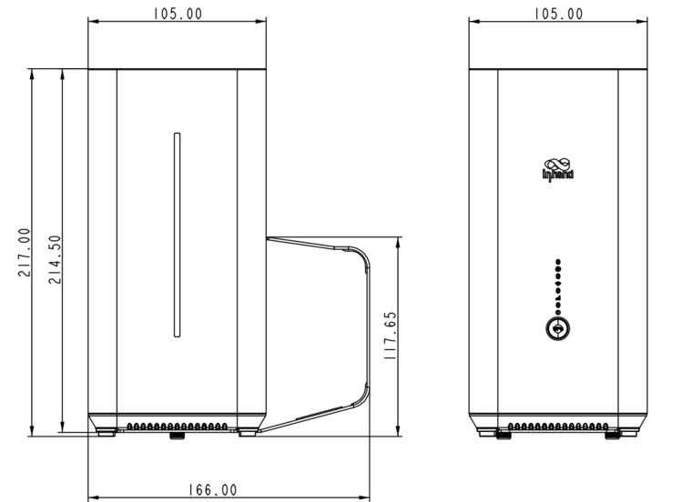

  

    

      
    

    

      即刻连接，畅享网络
    

  

  

    

      CPE02 5G 蜂窝路由器
    

    

      

        
· 5G SA/NSA

        
· Wi-Fi 6 AX3000

      

      

        
· 云管理

        
· 即插即用

      

    

  

## 1. 产品概述

**CPE02 是一款集成了 5G、Wi-Fi 6 及有线宽带等多种网络接入方式的多功能蜂窝路由器，凭借便捷的 5G 连接能力，可在各类应用场景中为客户提供高速、稳定的数据网络服务。**

**产品特点：** 
- **极速 5G 连接：** 5G 下行 2.6 Gbps，支持 SA/NSA 组网，向下兼容 CAT12，网络无缝切换
- **多重链路保障：** 5G 蜂窝和有线双链路接入，自动故障切换，链路冗余备份与负载均衡
- **强劲 Wi-Fi 6：** 2×2 MIMO，最大速率 AX3000 Mbps，并发 128 台终端，满足高密度场景
- **即插即用：** 无需布线和复杂设置，桌面/墙壁等多种安装方式，易部署易使用
- **云端统一管理：** 小星云管家平台，零接触部署、远程配置、可视化监控，突破运维地域限制

## 核心技术指标

|技术指标|规格|
| --- | --- |
| 蜂窝网络 | 5G SA/NSA + 4G LTE；NSA 下行 2.6 Gbps；SA 下行 2.0 Gbps |
| 云管理 | 小星云管家 |
| VPN | IPsec VPN、L2TP VPN、OpenVPN* |
| Wi-Fi | Wi-Fi 6 双频 2.4 / 5 GHz；3000 Mbps |
| 安全 | SHA512；访问控制；黑白名单 |
| 网络特性 | IPv4 / IPv6；VLAN；DHCP；DDNS；静态路由；链路探测 |
| 尺寸 (L × W × H) | 105 × 105 × 217 mm |
| 重量 | 800 g |
| 有线接口 | 2 × GbE（中国/欧洲）或 1 × 2.5G + 1 × GbE（北美） |
| SIM 接口 | 1 × Nano 4FF；eSIM 可选 |
| 供电与功耗 | 12 V / 2 A；≤ 15 W |
| 认证 | IP20；CE、FCC、IC、PTCRB、AT&T、Verizon、T-Mobile；EMC Level 2 |

## 2. 产品尺寸

  

    
    
正视图

  

  

    
    
接口图

  

  

    
注意：

    
1. 所有尺寸单位为毫米（mm）。

    
2. 尺寸（长 × 宽 × 高）：105 × 105 × 217 mm。

    
3. 产品安装支架可选。

    
4. 所有尺寸均为近似值，仅供参考。

    
5. 图示尺寸不得用于生产加工。

  

## 3. 硬件规格

| 类别/参数 | 规格 |
| --- | --- |
| **性能指标** | |
| CPU | IPQ5018 |
| 防火墙吞吐量 | 1 Gbps |
| 推荐用户数 | 200（Wi-Fi：128） |
| **接口** | |
| 蜂窝 | 5G NSA：2.6 Gbps 下行 / 650 Mbps 上行；5G SA：2.0 Gbps 下行 / 1.0 Gbps 上行；4G LTE：600 Mbps 下行 / 150 Mbps 上行 |
|  | 4×4 MIMO 5G Sub-6 GHz，256QAM |
| 以太网 | 2 × GbE（中国/欧洲）或 2.5G + 1G（北美），支持 WAN/LAN 和双 LAN |
| SIM 卡 | 1 × Nano 4FF，1 × eSIM 可选 |
| Type-C | 仅用作调试 |
| 复位 | 支持硬件恢复出厂 |
| WPS | 支持客户端一键免密连接 Wi-Fi |
| **Wi-Fi** | |
| 制式 | Wi-Fi 6，802.11 a/b/g/n/ac/ax |
| 最大速率 | 3000 Mbps |
| 发射功率 | 2.4 GHz：17 dBm；5 GHz：17 dBm |
| 天线增益 | ≤ 5 dBi |
| **电源** | |
| 供电电压 | 12 V / 2 A |
| 功耗 | ≤ 15 W |
| **指示灯** | |
| LED | 5G、Wi-Fi、Signal、Power |
| **机械** | |
| 尺寸 (长 × 宽 × 高) | 105 × 105 × 217 mm |
| 重量 | 800 g |
| 安装方式 | 桌面式安装、壁挂式安装 |
| 防护等级 | IP20 |
| **环境** | |
| 工作温度 | -10 °C ~ +40 °C |
| 储藏温度 | -40 °C ~ +85 °C |
| 湿度 | 5 % ~ 95 % RH（无凝结） |
| **认证** | |
| 认证 | CE、FCC、IC、PTCRB、AT&T、Verizon、T-Mobile |
| EMC | EMC Level 2 |

## 4. 软件规格

| 类别/参数 | 规格 |
| --- | --- |
| **云管理** | |
| 平台 | 小星云管家 |
| 功能 | 零接触远程部署、批量升级、配置下发、云连接远程终端维护、双因素身份认证 |
| 小星云 APP | 可视化仪表盘：设备统计、联网状态、连接质量分析（延迟、丢包、吞吐率）、流量统计、蜂窝信号统计、接口状态、客户端统计分析、上行链路管理 |
| **网络特性** | |
| 接入方式 | 5G/4G、有线宽带 |
| 拨号服务 | 支持 PPPoE、蜂窝自动重拨、APN 配置 |
| 智能链路 | 实时链路探测 |
| IP 协议 | IPv4、IPv6 |
| 网络协议 | VLAN、DHCP（Server/Client）、DHCP Snooping、DNS、URL Filtering、DDNS、Fixed Address allocation、IP Passthrough、STP、ARP、ICMP |
| 测速 | 云平台集成 Ookla 测速服务 |
| VPN | IPsec VPN、L2TP VPN、OpenVPN* |
| 路由 | 静态路由 |
| **Wi-Fi** | |
| 功能 | 支持多 SSID 模式、SSID VLAN 属性、SSID 隐藏、Wi-Fi Portal* |
| 加密方式 | WPA/WPA2/WPA3* |
| **安全** | |
| Admin 密码 | SHA512 哈希算法加密 |
| Web | 多重加固防攻击、会话超时自动弹出、错误密码锁账号 |
| **防火墙** | |
| 功能 | 3L 入站/出站规则、端口转发、SNAT、DNAT、远程访问控制、黑白名单过滤、域名过滤、策略路由*、流量整形* |
| **可靠性** | |
| 升级 | 支持计划升级 |
| 日志 | 支持运行日志、诊断日志 |
| 事件 | 支持用户登录、连接断开、设备重启等运行事件 |
| 告警 | 支持设备本地邮件告警；支持平台短信、邮件告警 |
| 诊断工具 | ICMP、packet capture、tracert |

## 5. 订购信息

### 型号规则

**Model code:** CPE02-\<WMNN\>

\<WMNN\>: 无线通讯类型与模块（Cellular Type & Module）

### 产品型号

| 型号 | 区域 | 5G Sub-6 | LTE-FDD | LTE-TDD | 以太网 | Wi-Fi |
| --- | --- | --- | --- | --- | --- | --- |
| CPE02-CNNR | 中国 | SA n1/n3/n5/n7/n8/n20/n28/n38/n40/n41/n66/n77/n78；NSA n1/n3/n7/n28/n38/n40/n41/n77/n78 | B1/B2/B3/B4/B5/B7/B8/B20/B28/B66 | B34/B40/B41 | 2 × GbE | AX3000 |
| CPE02-NANR | 北美 | SA n1/n2/n3/n5/n7/n8/n12/n13/n14/n18/n20/n25/n26/n28/n29/n30/n38/n40/n41/n48/n66/n70/n71/n75/n76/n77/n78/n79；NSA 同上 | B1/B2/B3/B4/B5/B7/B8/B12/B13/B14/B17/B18/B19/B20/B25/B26/B28/B29/B30/B32/B66/B71 | B34/B38/B39/B40/B41/B42/B43/B48 | 1 × 2.5G + 1 × 1G | AX5400 |
| CPE02-EUNR | 欧洲/亚太 | SA n1/n3/n5/n7/n8/n20/n28/n38/n40/n41/n66/n77/n78；NSA n1/n3/n7/n28/n38/n40/n41/n77/n78 | B1/B2/B3/B4/B5/B7/B8/B20/B28/B66 | B34/B40/B41 | 2 × 1G | AX3000 |

## 6. 联系我们

- **官网：** [映翰通官网](https://www.inhand.com.cn)
- **版权声明：** ©映翰通网络 保留所有权利
