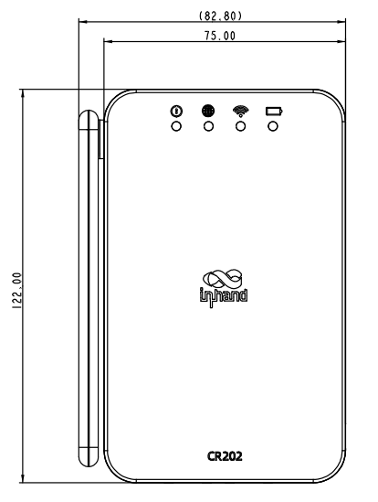
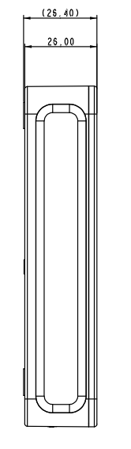
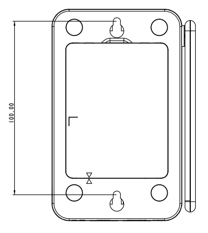

  

    

      
    

    

      随时随地，畅享网络
    

  

  

    

      CR202-Lite 系列蜂窝路由器
    

    

      

        
· 4G

        
· Wi-Fi

      

      

        
· 内置电池

        
· 云管理

      

    

  

## 1. 产品概述

**CR202-Lite 是一款多功能的蜂窝路由器，集成了 4G、Wi-Fi 和有线宽带等多种网络接入技术，采用可折叠天线和可拆卸 3000mAh 锂电池设计，可在任何场景中为用户提供高速、稳定的数据网络服务。**

**产品特点：** 
- **多种网络接入：** 蜂窝、Wi-Fi、有线，可同时容纳 32 台终端设备接入
- **灵活电源方案：** 适配器供电或 3000mAh 锂电池，最长 8 小时续航，可拆卸电池可自由更换
- **轻巧便携：** 可折叠天线、紧凑机身，一手可握，出行随身携带
- **便捷云管理：** 接入 Device Manager 云平台，统一管理上万分布式站点设备
- **设计精巧：** 122 × 75 × 26.4 mm 小巧尺寸，桌面放置、壁挂安装

## 核心技术指标

|技术指标|规格|
| --- | --- |
| 蜂窝网络 | 4G LTE CAT4（下行 150 Mbps / 上行 50 Mbps） |
| 云管理 | Device Manager |
| Wi-Fi | 2.4 GHz，802.11 b/g/n，300 Mbps，AP/STA |
| 网络与安全 | NAT、静态路由、APN/PPPoE/DHCP；SPI 防火墙、ACL |
| 接入能力 | 32 台终端 |
| 有线 / SIM | 1 × WAN（可切 LAN）+ 1 × LAN，10/100 Mbps；Nano SIM 或 eSIM |
| 供电 / 电池 | TYPE-C 5 V / 2 A；可选 3000 mAh，约 8 h |
| 尺寸 / 重量 | 122 × 75 × 26.4 mm；235 g |
| 温度 / 防护 | 工作 -10 °C ~ +50 °C；存储 -20 °C ~ +60 °C；IP30 |
| 认证 | FCC、IC、PTCRB、Verizon、AT&T*、T-MOBILE*、CE*、UN38.3 |

## 2. 产品尺寸

  

    
    
正视图

  

  

    
    
接口图

  

  

    
    
侧视图

  

  

    
注意：

    
1. 所有尺寸单位为毫米（mm）。

    
2. 尺寸（长 × 宽 × 高）：122 × 75 × 26.4 mm（不含天线）。

    
3. 所有尺寸均为近似值，仅供参考。

    
4. 图示尺寸不得用于生产加工。

  

## 3. 硬件规格

| 类别/参数 | 规格 |
| --- | --- |
| **性能指标** | |
| 吞吐量 | 100 Mbps |
| 接入用户数 | 32 |
| **接口** | |
| 蜂窝 | 4G LTE CAT4，150 Mbps 下行 / 50 Mbps 上行 |
| 以太网端口 | 1 × WAN（可切换为 LAN）+ 1 × LAN，2 × 10/100 Mbps |
| SIM 卡座 | 1 × Nano SIM 或 1 × eSIM |
| 天线接头 | 1 × 外置 4G 蜂窝天线，2 × 内置 Wi-Fi 天线 |
| 复位按键 | 针孔式复位按键 |
| 开关按键 | 1 × 开关按键 |
| **指示灯** | |
| LED | 系统 / 联网 / Wi-Fi / 电池（部分型号：信号） |
| **Wi-Fi** | |
| 射频 | 单频 2.4 GHz |
| 最大传输带宽 | 300 Mbps |
| 传输协议 | IEEE 802.11 b/g/n |
| 模式 | AP / STA |
| **电源** | |
| 电源接口 | TYPE-C |
| 电源功耗 | 5 V / 2 A |
| 电池（可选） | 3000 mAh，供电约 8 小时 |
| **机械特性** | |
| 安装方式 | 桌面放置、壁挂安装 |
| 产品尺寸 | 122 × 75 × 26.4 mm（不含天线） |
| 产品重量 | 235 g |
| 外壳 | 塑料 |
| 散热方式 | 无风扇散热 |
| **环境** | |
| 工作温度 | -10 °C ~ +50 °C |
| 存储温度 | -20 °C ~ +60 °C |
| 防护等级 | IP30 |
| **认证** | |
| 认证 | FCC、IC、PTCRB、Verizon、AT&amp;T*、T-MOBILE*、CE*、UN38.3 |
| 保修期 | 1 年 |

## 4. 软件规格

| 类别/参数 | 规格 |
| --- | --- |
| **网络特性** | |
| 网络接入 | 支持 APN 接入认证 |
| 认证方式 | CHAP/PAP |
| 网络制式 | GSM/EDGE、WCDMA、TDD LTE/FDD LTE |
| LAN 协议 | ARP |
| WAN 协议 | 静态 IP、PPPoE、DHCP |
| IP 应用 | DHCP Server、DHCP Client、DNS、Telnet、IP Passthrough |
| 路由 | 静态路由 |
| NAT | 支持 NAT |
| **安全** | |
| 防火墙 | 全状态包检测（SPI）、防范拒绝服务（DoS）攻击、过滤多播/Ping 探测包 |
| 访问控制 | ACL、内容 URL 过滤 |
| 其他 | NAT、DMZ、端口映射、虚拟 IP 映射、IP-MAC 绑定 |
| **可靠性** | |
| 链路备份 | 支持热备份、冷备份、负载均衡 |
| 链路在线检测 | 发送心跳包检测，断线自动连接 |
| 看门狗 | 设备运行自检技术，设备运行故障自修复 |
| **网络管理** | |
| 配置方式 | Telnet、Web、SSH |
| 升级方式 | Web 升级、Device Manager 升级 |
| 短信功能 | 状态查询、重启设备 |
| 按需拨号 | 按需拨号、数据激活、短信激活 |
| 网管功能 | 支持映翰通 Device Manager 设备云网管平台，批量管理 |
| 流量管理 | 支持流量阈值设定、流量统计和流量告警功能 |
| 告警功能 | 系统重启、LAN 端口上下线、流量告警、SIM 卡故障等 |
| 维护工具 | Ping、Traceroute |
| 状态查询 | 系统状态、modem 状态、网络连接状态、路由状态 |

## 5. 订购信息

### 型号规则

**Model code：** CR202-\<WMNN\>-WLAN-\<B/NA\>-\<E/NA\>-Lite

\<WMNN\>：无线通讯类型 & 模块（Cellular Type & Module）

WLAN：Wi-Fi

\<B/NA\>：B = 电池，NA = 无电池

\<E/NA\>：E = 仅支持 eSIM，NA = 仅支持外置 Nano SIM（部分型号适用）

### 产品型号

| 型号 | 区域 | 规格说明 |
|------|------|----------|
| CR202-CNC4-WLAN-\<B/NA\>-\<E/NA\>-Lite | 中国 | LTE-FDD B1/B3/B5/B8；LTE-TDD B34/B38/B39/B40/B41；WCDMA B1/B5/B8；GSM/EDGE B3/B8；WLAN Wi-Fi；B 带电池，NA 无电池；E 仅 eSIM，NA 仅外置 Nano SIM |
| CR202-EUC4-WLAN-\<B/NA\>-Lite | 欧洲/亚太 | LTE-FDD B1/B3/B5/B7/B8/B20/B28；LTE-TDD B38/B40/B41；WCDMA B1/B5/B8；GSM/EDGE B3/B8；WLAN Wi-Fi；B 带电池，NA 无电池；仅支持外置 Nano SIM |
| CR202-NAC6-WLAN-\<B/NA\>-Lite | 北美 | LTE-FDD B2/B4/B5/B7/B12/B13/B14/B25/B26/B29/B30/B66/B71；LTE-TDD B41/B48；WLAN Wi-Fi；B 带电池，NA 无电池；支持 eSIM 和外置 Nano SIM |

**示例：** CR202-CNC4-WLAN-B-E-Lite 表示 CR202-Lite 系列无线路由器，支持 FDD、TDD、WCDMA 和 GSM/EDGE 网络，支持 Wi-Fi AP & Client 模式，带电池，内部集成 eSIM 卡，激活可用。

## 6. 联系我们

- **官网：** [映翰通官网](https://www.inhand.com.cn)
- **版权声明：** ©映翰通网络 保留所有权利
