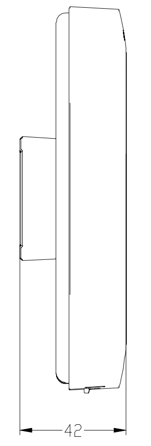

  

    

      
    

    

      Wi-Fi 6 高性能接入, 云管理, 企业级安全
    

  

  

    

      EAP600 企业级AP
    

    

      

        
· Wi-Fi 6

        
· 云管理

      

      

        
· Mesh组网

        
· Portal认证

      

    

  

# 1. 产品概述

**EAP600 是一款面向企业办公、酒店、零售门店等标准场景的室内双频 Wi-Fi 6 吸顶 AP，可提供高并发、低时延与可视化云运维能力。**

**产品特点：**
- **高性能接入:** 双频并发最高 2974 Mbps，支持高密度终端接入
- **云端运维:** 小星云管家支持零接触部署、批量升级和可视化监控
- **灵活组网:** 支持路由/桥接模式切换与 AP 间 Mesh 自组织网络
- **安全认证:** 支持 WPA/WPA2/WPA3、访客网络隔离与 Portal 认证
- **易于部署:** 支持放装与吸顶安装，支持 12V DC 与 802.3af 供电

## 核心技术指标

|技术指标|规格|
| --- | --- |
| 云管理 | 小星云管家 |
| Wi-Fi | Wi-Fi 6 双频，2×2 MU-MIMO，2974 Mbps |
| 网络特性 | 静态 IP/DHCP、IPv4/IPv6*；每频段 8 SSID，VLAN/IP 可配 |
| 安全 | WPA/WPA2/WPA3（含企业）、Portal*、MAC 黑白名单 |
| Mesh / 模式 | AP 间 Mesh；路由 / 桥接 |
| 内存 / 闪存 | 512 MB DDR3；128 MB NAND |
| 有线接口 | 1 × RJ45 千兆 |
| 供电 / 功耗 | 12 V DC / 802.3af；≤ 12 W |
| 尺寸 / 安装 | 158 × 158 × 28 mm；放装、吸顶 |
| 环境 | 工作 0 °C ~ 45 °C |
| 认证 | CE、FCC、IC |

# 2. 产品尺寸

  

    
    
正视图

  

  

    
    
侧视图

  

  

    
注意：

    
1.所有尺寸单位为毫米（mm）。

    
2.所有尺寸均为近似值，仅供参考。

    
3.图示尺寸不得用于生产加工。

    
4.尺寸需符合零件及制造公差要求。

    
5.尺寸如有变更，恕不另行通知。

  

# 3. 硬件规格

| 类别/参数 | 规格 |
|--------------------------|------|
| **产品定位** | |
| 场景 | 适用于企业办公、酒店等标准场景的高性能室内 Wi-Fi 6 吸顶 AP，覆盖面积约 120 平方米 |
| 推荐接入数 | 150 |
| **核心硬件** | |
| 内存 | 512 MB DDR3 |
| 闪存 | 128 MB NAND |
| 网口 | 1 x RJ45 千兆以太网口 |
| 蓝牙 | 不支持 |
| 按钮 | 1 x 针孔式 Reset 按钮 |
| 指示灯 | 4 x LED（PWR/WAN/2.4G/5G） |
| 天线 | 2 x 内置双频 Wi-Fi 天线 |
| **射频特性** | |
| 无线架构 | 2 x 2 MU-MIMO，双频并发最大速率 2974 Mbps |
| 2.4 GHz 速率 | 最高 574 Mbps（802.11b/g/n/ac/ax） |
| 5 GHz 速率 | 最高 2.4 Gbps（802.11a/n/ac/ax） |
| 最大发射功率 | 2.4 GHz / 5 GHz：20 dBm |
| 最大天线增益 | 2.4 GHz / 5 GHz：3 dBi |
| **电源与环境** | |
| 供电方式 | 12 V DC / 802.3af PD 受电 |
| 功耗 | <= 12 W |
| 尺寸 (W x D x H) | 158 x 158 x 28 mm |
| 安装方式 | 放装、吸顶 |
| 工作温度 | 0 deg C ~ 45 deg C |
| 存储温度 | -40 deg C ~ 70 deg C |
| 环境湿度 | 5% ~ 95%（无凝霜） |
| 防护等级 | IP30 |
| 认证 | CE、FCC、IC |

# 4. 软件规格

| 类别/参数 | 规格 |
|--------------------------|------|
| **云管理** | |
| 平台 | 小星云管家 |
| 统一接入 | 支持设备统一纳管 |
| 零接触部署 | 支持远程快速上线 |
| 批量运维 | 支持批量升级、批量管理 |
| **网络特性** | |
| 联网方式 | 静态 IP / DHCP |
| IP 协议 | IPv4 / IPv6* |
| SSID | 每个频段支持 8 个 SSID |
| VLAN/IP | 支持自定义 Wi-Fi 网络 IP 地址或 VLAN ID |
| **无线与安全** | |
| Wi-Fi 安全 | WPA-PSK，WPA/WPA2/WPA3（含企业级） |
| 访客网络 | 支持 |
| Portal* | 支持手机号、微信、Facebook、Radius 认证 |
| MAC 过滤 | 支持黑/白名单地址过滤 |
| Mesh | 支持 AP 间 Mesh 组网 |
| **可视化运维** | |
| 仪表盘 | 设备信息、接口状态、流量统计、客户端接入、告警总览 |
| 拓扑* | 显示 AP 上/下行拓扑连接状态 |
| 客户端列表 | 展示客户端流量、连接时长等 |
| Wi-Fi Experience | 提供客户端 Wi-Fi 质量分析 |
| **工作模式** | |
| 模式 | 支持路由器模式、桥接模式 |

# 5. 订购信息

## 型号规则

**Model code:** EAP600-\<WMNN\>

\<WMNN\>: 产品版本标识（功能与区域组合）

## 产品型号

| 型号 | 区域 | 规格说明 |
| --- | --- | --- |
| EAP600-LITE | 全球版 | 企业级入门 Wi-Fi 6 AP；2.4 GHz / 5 GHz 双射频；最大速率 2974 Mbps；1 × 千兆网口 |

# 6. 联系我们

- **官网：** [映翰通官网](https://www.inhand.com.cn)
- **版权声明：** ©映翰通网络 保留所有权利

