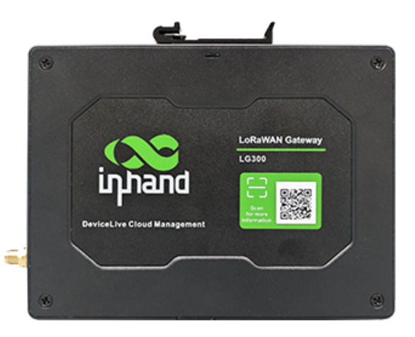
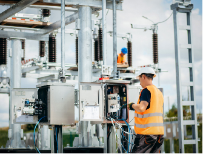
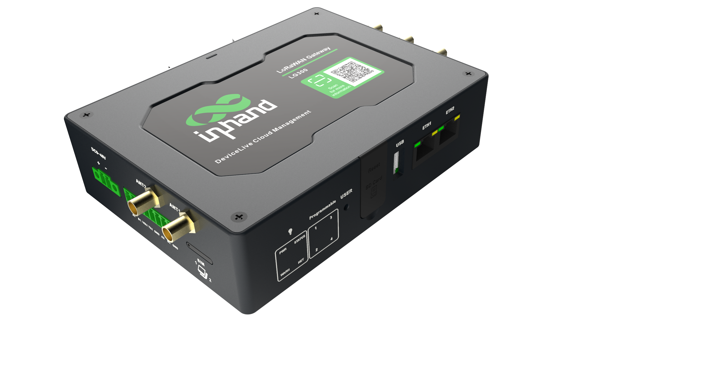

  

    

      
    

    

      高安全、高性能、云管理的 LoRaWAN 边缘网关
    

  

  

    

      EC312 系列 LoRaWAN 边缘网关
    

    

      

        
· 多链路

        
· LoRaWAN

      

      

        
· 可编程

        
· MQTT

      

    

  

# 1. 产品概述

**EC312 是面向工业物联网的工业级 LoRaWAN 可编程边缘网关，支持大规模节点接入与多链路冗余通信。**

**产品特点：**
- **LoRa高容量:** 基于 SX1302，最高支持约 2000 节点接入
- **远距覆盖:** 视距最远可达 15km，支持城区 NLOS 覆盖
- **链路冗余:** 以太网/蜂窝/Wi-Fi 互备，支持双 SIM 故障切换
- **安全可靠:** 支持 Secure Boot、TPM2.0、TrustZone、看门狗与掉电保护
- **开放易集成:** Debian 11 + Docker + 多协议，兼容主流 IoT 云平台

## 核心技术指标

|技术指标|规格|
|---|---|
|蜂窝网络|LTE Cat1（按型号支持不同频段）|
|LoRaWAN|支持 LoRaWAN 网关功能，最高约 2000 节点接入|
|云管理|支持 InHand DeviceLive / 公有云接入|
|网络特性|APN、VPDN、CHAP/PAP，支持 Web/Telnet/SSH 配置|
|二次开发|Debian 11 + Docker，支持 Python 应用开发|
|工业/电力协议|DLT645-2007、IEC104|
|尺寸（W × D × H）|145 × 106 × 36 mm|
|重量|339 g|
|接口|2 × FE，Nano SIM ×2，USB2.0，BLE 4.2|
|供电|9~48V DC|
|工作温度|-20 ~ 70 ℃|
|防护等级|IP30|

# 2. 产品尺寸

  

    
    
正视图

  

  

    
    
侧视图

  

    

    
    
接口图

  

  

    
注意：

1.所有尺寸单位为毫米（mm）。

2.所有尺寸均为近似值，仅供参考。

3.图示尺寸不得用于生产加工。

4.尺寸需符合零件及制造公差要求。

5.尺寸如有变更，恕不另行通知。

  

# 3. 硬件规格

| 类别/参数 | 规格 |
|--------------------------|------|
| **硬件平台** | |
| CPU | ARM Cortex-A53 @ 1.4GHz |
| RAM | 1GB DDR4（1GB SDRAM / DDR4） |
| FLASH | 8GB eMMC |
| **LoRaWAN** | |
| 基带芯片 | Semtech SX1302 |
| 通道 | 8，半双工 |
| 频段 | RU864 / IN865 / EU868 / US915 / AU915 / KR920 / AS923 / CN470 |
| 最大发射功率 | 27 dBm |
| 接收灵敏度 | -140 dBm（125KHz / SF12） |
| 接入节点 | 2000 |
| 通信距离 | 城区 2 km NLOS 覆盖，视距 LOS 15 km（视环境与天线安装方式） |
| **连接与接口** | |
| 以太网端口 | 2 × 10/100M 以太网 |
| 串口 | 1 × RS-232/485 + 1 × RS-485（带隔离） |
| 按键 | 针孔式复位按键 × 1，可编程按键 × 1 |
| SIM卡座 | Nano SIM × 2 |
| 天线接头 | LTE: SMA × 1，Wi-Fi: SMA × 1，GPS: SMA × 1，LoRaWAN: SMA × 1（北美产品型号 LTE 天线接口：SMA × 1） |
| LED指示灯 | PWR, STATUS, WARN, NET, USER * 4 |
| USB | USB2.0 Type-A |
| TF | 支持 MicroSD，最高可扩展 32GB |
| WiFi | Wi-Fi STA，802.11ac/a/b/g/n，2.4G/5G |
| 蓝牙 | BLE 4.2 |
| GNSS | 卫星定位GPS |
| **电源与功耗** | |
| 输入电压 | 9~48V DC |
| 典型值（OS 空闲态） | 平均功耗 2.5W |
| 掉电保护 | 断电后保持 20s（安全关机） |
| 掉电告警 | 掉电后可发送掉电告警 |
| **机械规格** | |
| 产品尺寸 | 145 × 106 × 36 mm |
| 产品重量 | 339 g |
| 安装方式 | 挂耳、导轨 |
| 防护等级 | IP30 |
| 外壳与散热 | 金属+塑料外壳，无风扇散热 |
| RTC | 支持（纽扣电池备份） |
| 硬件看门狗 | 支持 |
| TPM | 内置 TPM 芯片，TPM v2.0 |
| **环境与认证** | |
| 存储温度 | -40 ~ 85 ℃ |
| 工作温度 | -20 ~ 70 ℃ |
| 环境湿度 | 5~95%（无凝露） |
| 物理特性 | 防震 IEC60068-2-27 振动 IEC60068-2-6 跌落 IEC60068-2-32 |
| EMC指标 | EN61000-4-2，level 3，静电 EN61000-4-3，level 3，辐射电场 EN61000-4-4，level 3，脉冲电场 EN61000-4-5，level 3，浪涌 EN61000-4-6，level 3，传导骚扰抗扰度 EN61000-4-8，&gt;level 2，工频磁场抗扰度，水平方向/垂直方向 400A/m EN61000-4-12，level 3，震荡波抗扰度 |
| 认证 | CE, FCC, IC, PTCRB |

# 4. 软件规格

| 类别/参数 | 规格 |
|--------------------------|------|
| **操作系统** | |
| 操作系统 | Debian 11（Kernel 5.10.168） |
| **LoRaWAN** | |
| LoRaWAN LNS | 内置 LoRaWAN 网络服务器，兼容主流网络服务器（The ThingsStack、ChirpStack 等） |
| LoRaWAN 协议 | LoRaWAN 1.0 / 1.0.2，Class A/B/C |
| **网络特性** | |
| 网络接入 | APN、VPDN |
| 接入认证 | CHAP/PAP |
| 网络制式 | LTE CAT 1 |
| WAN协议 | 静态 IP、DHCP |
| LAN协议 | ARP、Ethernet |
| IP应用 | ICMP、DNS、TCP/UDP、TCP Server、DHCP |
| IP路由 | 静态路由 |
| **安全** | |
| Secure Boot | 支持 |
| Trust Zone | 支持 |
| 网络安全 | 支持防火墙功能 |
| 用户管理 | 支持多级用户权限管理 |
| 数据安全 | 支持防火墙功能 |
| 其他技术 | OpenVPN、IPSec、TPM2.0 |
| **可靠性** | |
| 链路探测 | 心跳检测与自动重连 |
| 内置看门狗 | 设备运行自检技术，设备运行故障自修复 |
| 备份机制 | 链路冗余（有线、蜂窝、Wi-Fi 互为备份） |
| 双卡切换 | 支持双 SIM 链路切换 |
| **数据采集协议（DSA）** | |
| Python二次开发 | 多编程语言开发平台 |
| 工业协议 | Modbus RTU Master/Slave，Modbus TCP Master/Slave，EtherNet/IP，ISO on TCP，OPC UA Client/Server，Mitsubishi MC 3C/3E/3C Over TCP，Mitsubishi CPU Port，FINSUDP，HostLink，PPI |
| Docker | 集成 Docker，支持应用容器化管理 |
| **网络管理** | |
| 配置方式 | Web、Telnet、SSH |
| 升级方式 | Web、FOTA、DFOTA |
| 日志功能 | 支持本地系统日志、远程日志，重要日志掉电保存 |
| 配置备份 | 支持配置文件导入和导出 |
| 远程管理 | 支持 InHand DeviceLive 或 HTTP、HTTPS、Telnet、SSH 等 |
| 平台功能 | 支持基于云的参数配置、容器管理、应用和固件管理 |

# 5. 订购信息

## 型号规则

**Model code:** EC312-H-\<WMNN\>-\<Lxxx\>

\<WMNN\>: 无线通讯类型 & 模块  
\<Lxxx\>: LoRaWAN 频段版本（如 L868/L915/L470）

## 产品型号

<table style="width:100%; table-layout:fixed;">
  <colgroup>
    <col style="width:29%;">
    <col style="width:16%;">
    <col style="width:40%;">
    <col style="width:15%;">
  </colgroup>
  <tr><th>型号</th><th>区域</th><th>&lt;WMNN&gt;: 无线通讯类型 &amp; 模块</th><th>&lt;Lxxx&gt;</th></tr>
  <tr><td style="white-space: nowrap;">EC312-H-FQ53-L868</td><td style="white-space: nowrap;">EMEA</td><td>CAT1 FDD: B1/B3/B7/B8/B20/B28 TDD: B38/B40/B41 GSM: B2/B3/B5/B8</td><td>EU868</td></tr>
  <tr><td style="white-space: nowrap;">EC312-H-FQ33-L915</td><td style="white-space: nowrap;">North  America</td><td>CAT1 FDD: B2/B4/B5/B12/B13/B25/B26 WCDMA: B2/B4/B5</td><td>US915/AS923</td></tr>
  <tr><td style="white-space: nowrap;">EC312-H-FQ53-L915</td><td style="white-space: nowrap;">EMEA</td><td>CAT1 FDD: B1/B3/B7/B8/B20/B28 TDD: B38/B40/B41 GSM: B2/B3/B5/B8</td><td>US915/AS923</td></tr>
  <tr><td style="white-space: nowrap;">EC312-H-LQA3-L470</td><td style="white-space: nowrap;">China</td><td>CAT1 LTE-FDD: B1/B3/B5/B8 LTE-TDD: B34/B38/B39/B40/B41</td><td>CN470</td></tr>
</table>

# 6. 联系我们

- **官网：** [映翰通官网](https://www.inhand.com.cn)
- **版权声明：** ©映翰通网络 保留所有权利
