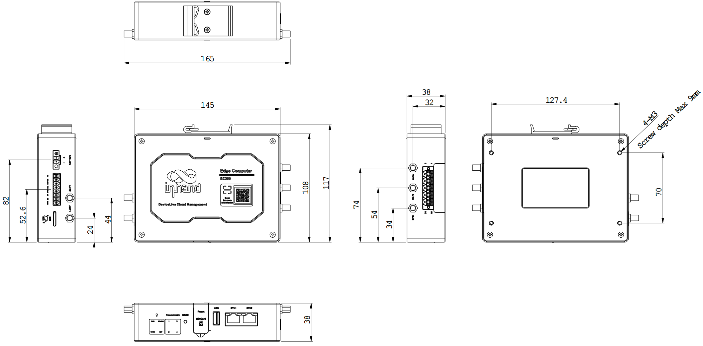
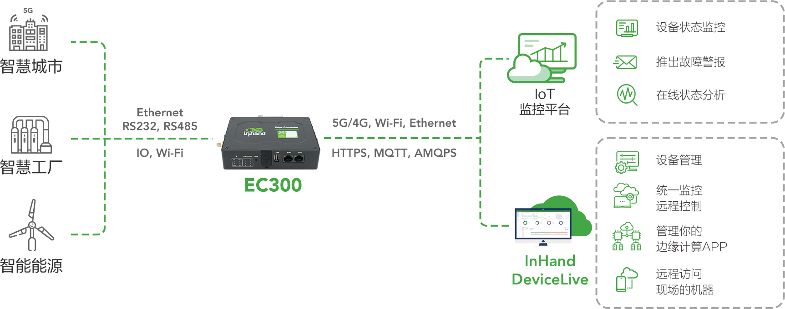

  

    

      
    

    

      拥抱边缘计算，为工业数字化赋能
    

  

  

    

      EC312 系列基础型边缘计算机
    

    

      

        
· 高安全性

        
· 高可靠性

      

      

        
· DeviceLive 云管理

        
· 可扩展

      

    

  

# 1. 产品概述

**EC312 系列是面向轻量级工业边缘应用开发的基础型边缘计算机，具备通信冗余、开放平台和高安全能力。**

**产品特点：**
- **通信可靠:** 有线/蜂窝/Wi-Fi 互备，双SIM切换与链路自愈
- **接口丰富:** FE、RS232/RS485、USB、Micro SD，并支持多种扩展
- **开放平台:** Debian 11 + Docker，支持 C/C++/Python 应用开发
- **安全加固:** Secure Boot、TPM2.0、TrustZone、防火墙与VPN
- **云端运维:** 支持 DeviceLive 远程批量管理设备、容器与应用

## 核心技术指标

|技术指标|规格|
|---|---|
|蜂窝网络|5G SA/NSA（中国）、LTE Cat6（北美）、LTE Cat1|
|网络特性|APN、VPDN、CHAP/PAP，支持 Web/SSH 配置与远程管理|
|云管理|DeviceLive 云平台远程管理|
|二次开发|支持 C/C++/Python 开发，支持 Docker |
|电力协议|DLT645、IEC101/104、DNP3.0|
|其他协议|BACnet、CNC|
|处理器与内存|ARM Cortex-A53 @ 1.4GHz，1GB DDR4|
|存储|8GB eMMC|
|以太网接口|2 × 10/100Mbps|
|供电|9~48V DC|
|工作温度|-20 ~ 70 ℃|
|防护等级|IP30|

# 2. 产品尺寸

  

    
    
正视图

  

  

    
    
侧视图

  

  

    
    
接口图

  

  
  

    
注意：

1.所有尺寸单位为毫米（mm）。

2.所有尺寸均为近似值，仅供参考。

3.图示尺寸不得用于生产加工。

4.尺寸需符合零件及制造公差要求。

5.尺寸如有变更，恕不另行通知。

  

# 3. 硬件规格

| 类别/参数 | 规格 |
|--------------------------|------|
| **硬件平台** | |
| CPU | ARM Cortex-A53 @ 1.4GHz |
| RAM | 1GB DDR4（1G SDRAM） |
| FLASH | 8GB eMMC |
| **LoRaWAN** | |
| LoRaWAN | 仅中国使用需与映翰通 LT310 产品配套 |
| 频段 | 470MHz - 510MHz |
| 通信距离 | 室内/市区通信距离 1km；户外/视距通信距离 5km |
| 发射功率 | -9dBm - 22dBm |
| 通信理论速率 | 0.15Kbps - 46.8Kbps |
| 灵敏度 | -140dBm |
| 信道 | 80 |
| **连接与接口** | |
| 以太网端口 | 2 × 10/100Mbps |
| 串口 | 1 × RS-232/485 + 1 × RS-485（带隔离） |
| CAN | 最高支持 CAN FD（扩展） |
| 按键 | 针孔式复位按键 × 1；可编程按键 × 1 |
| SIM卡座 | 抽屉式卡座 × 1，2 × NANO SIM |
| 天线接头 | 4G：SMA × 1、Wi-Fi：SMA × 1、GPS：SMA × 1、LoRa：SMA × 1；注：北美产品型号 4G 天线：SMA × 2 |
| LED指示灯 | PWR, STATUS, WARN, NET，USER * 4 |
| 扩展接口 | LoRa 最高支持 2 × RS232/RS485/4-20mA/CAN FD（带隔离） 最高支持 4 × DI + 4 × DO（带隔离，扩展） |
| 蓝牙 | BLE 4.2 |
| USB | USB 2.0，1 × Type A |
| TF | 支持 Micro SD，最高可扩展 32GB |
| WiFi（可选） | Wi-Fi STA，802.11ac/a/b/g/n，2.4G/5G 双频 |
| GNSS（可选） | 卫星定位GPS |
| **电源与功耗** | |
| 输入电压 | 9~48V DC |
| 典型值（OS 空闲态） | 电源功耗 6W |
| 掉电保护 | 超级电容设计，断电后保持 20s（安全关机） |
| 掉电告警 | 掉电后可发送掉电告警 |
| **机械规格** | |
| 产品尺寸 | 145 × 106 × 36 mm |
| 产品重量 | 339 g |
| 安装方式 | 挂耳、导轨 |
| 防护等级 | IP30 |
| 外壳与散热 | 金属+塑料，无风扇散热 |
| RTC | 纽扣电池备份 RTC |
| 硬件看门狗 | 支持 |
| 安全芯片（选配） | TPM2.0 / SE 芯片可选 |
| **环境与认证** | |
| 存储温度 | -40 ~ 85 ℃ |
| 工作温度 | -20 ~ 70 ℃ |
| 环境湿度 | 5~95%（无凝霜） |
| 物理特性 | 防震 IEC60068-2-27 振动 IEC60068-2-6 跌落 IEC60068-2-32 |
| EMC指标 | EN61000-4-2，level 3，静电 EN61000-4-3，level 3，辐射电场 EN61000-4-4，level 3，脉冲电场 EN61000-4-5，level 3，浪涌 EN61000-4-6，level 3，传导骚扰抗扰度 EN61000-4-8，&gt;level 2，工频磁场抗扰度，水平方向/垂直方向 400A/m EN61000-4-12，level 3，震荡波抗扰度 |
| 认证 | CE、FCC、IC、PTCRB、Verizon、AT&T |

# 4. 软件规格

| 类别/参数 | 规格 |
|--------------------------|------|
| **操作系统** | |
| 操作系统 | Debian 11（Kernel 5.10.168） |
| **网络特性** | |
| 网络接入 | APN、VPDN |
| 接入认证 | CHAP/PAP |
| 网络制式 | 5G SA/NSA（中国）、LTE Cat6（北美）、LTE Cat1 |
| WAN协议 | 静态 IP、DHCP |
| LAN协议 | ARP、Ethernet |
| IP应用 | ICMP、DNS、TCP/UDP、TCP Server、DHCP |
| IP路由 | 静态路由 |
| **安全性** | |
| Secure Boot | 支持 |
| Trust Zone | 支持 |
| 网络安全 | 支持防火墙功能 |
| 用户管理 | 支持多级管理权限 |
| 数据安全 | 支持VPN功能 |
| **可靠性** | |
| 链路探测 | 发送心跳包检测，断线自动连接 |
| 内置看门狗 | 设备运行自检技术，设备运行故障自修复 |
| 备份机制 | 有线、蜂窝、Wi-Fi 互备份 |
| 双卡切换 | 支持双 SIM 链路切换 |
| **开放式平台与数据采集协议（DSA）** | |
| Python二次开发 | 支持 C/C++/Pyhon 等多种编程语言 |
| 云平台 | 支持 AWS、Azure、阿里等云平台 |
| 工业协议 | Modbus RTU Master/Slave, Modbus TCP Master/Slave, EtherNet/IP, ISO on TCP, OPC UA Client/Server, Mitsubishi MC 3C/3E/3C OverTCP, Mitsubishi CPU Port, FINSUDP, HostLink, PPI |
| 电力协议 | DLT645-2007, IEC101/104, DNP3.0 |
| 其他协议 | BACnet, CNC |
| Docker | 支持 |
| **网络管理** | |
| 配置方式 | Web、SSH |
| 升级方式 | 支持 web 升级、DeviceLive 远程升级 |
| 日志功能 | 支持本地系统日志、远程日志，重要日志掉电保存 |
| 配置备份 | 支持配置文件的导入和导出 |
| 远程管理 | 支持 InHand DeviceLive 云平台 |
| 平台功能 | 支持设备远程访问、设备远程批量管理、边缘应用远程批量管理、容器远程管理；支持基于云的参数配置、容器管理、应用和固件管理 |

# 5. 订购信息

## 型号规则

**Model code:** EC312-\<B/H\>-\<WMNN\>-[XXXX]-[X]

\<B/H\>: GNSS/Wi-Fi/BT/TPM能力（B为无，H为支持）  
\<WMNN\>: 无线通讯类型 & 模块  
[XXXX]: 扩展模块选项（可选）  
[X]: 操作系统选项（可选）

## 产品型号

| 型号 | 区域 | \<B/H\>: GNSS/Wi-Fi/BT/TPM | \<WMNN\>: 无线通讯类型 & 模块 | [XXXX]: 扩展模块 | [X]: 操作系统 |
|------|------|----------------------------|-------------------------------|------------------|---------------|
| EC312-B-NRQ1 | 中国 | 无 | 5G NR NSA: n78/n79 5G NR SA: n1/n3/n5/n8/n28/n41/n77/n78/n79 LTE-FDD: B1/B3/B5/B8 LTE-TDD: B34/B38/B39/B40/B41 WCDMA: B1/B8 | 可选 | 默认IEOS |
| EC312-H-NRQ1 | 中国 | 支持 | 5G NR NSA: n78/n79 5G NR SA: n1/n3/n5/n8/n28/n41/n77/n78/n79 LTE-FDD: B1/B3/B5/B8 LTE-TDD: B34/B38/B39/B40/B41 WCDMA: B1/B8 | 可选 | 默认IEOS |
| EC312-B-LQA3 | 中国 | 无 | LTE-FDD: B1/B3/B5/B8 LTE-TDD: B34/B38/B39/B40/B41 | 可选 | 默认IEOS |
| EC312-H-LQA3 | 中国 | 支持 | LTE-FDD: B1/B3/B5/B8 LTE-TDD: B34/B38/B39/B40/B41 | 可选 | 默认IEOS |
| EC312-B-FQ53 | EMEA | 无 | CAT1 FDD: B1/B3/B7/B8/B20/B28 TDD: B38/B40/B41 GSM: B2/B3/B5/B8 | 可选 | 默认IEOS |
| EC312-H-FQ53 | EMEA | 支持 | CAT1 FDD: B1/B3/B7/B8/B20/B28 TDD: B38/B40/B41 GSM: B2/B3/B5/B8 | 可选 | 默认IEOS |
| EC312-H-FQ33 | 北美 | 支持 | CAT1 FDD: B2/B4/B5/B12/B13/B25/B26 WCDMA: B2/B4/B5 | 可选 | 默认IEOS |
| EC312-H-FQ73 | 澳洲及拉丁美洲 | 支持 | CAT1 FDD: B1/B2/B3/B4/B5/B7/B8/B28/B66 TDD: B38/B40/B41 GSM: B2/B3/B5/B8 | 可选 | 默认IEOS |
| EC312-H-EN00 | 全球无蜂窝 | 支持（不含GNSS） | 无蜂窝 | 可选 | 默认IEOS |

## 扩展模块选项（可选）

| [XXXX] PN码 | 特性 |
|-------------|------|
| NAAD | 2×4-20mA AI + 4×DI + 4×DO |
| N44C | 2×RS-485 + 1×CAN FD |
| N4CC | 1×RS-485 + 2×CAN FD |
| N44D | 2×RS-485 + 4×DI + 4×DO |
| — | 无 |

## 操作系统选项（可选）

| [X] PN码 | 特性 |
|----------|------|
| — | IEOS（默认） |
| D | Debian Linux OS |

# 6. 联系我们

- **官网：** [映翰通官网](https://www.inhand.com.cn)
- **版权声明：** ©映翰通网络 保留所有权利
