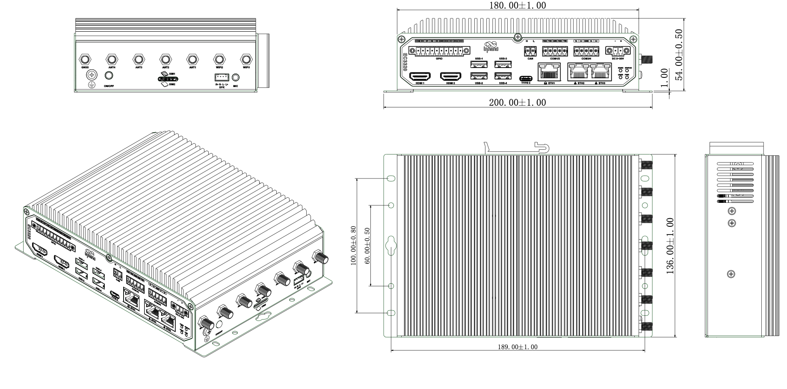

  

    

      
    

    

      拥抱边缘 AI，为工业数字化赋能
    

  

  

    

      EC3320 系列高性能 AI 边缘计算机
    

    

      

        
· RK3588算力平台

        
· 高可靠

      

      

        
· 丰富接口

        
· 云管理

      

    

  

# 1. 产品概述

**EC3320 是面向工业物联网的高性能 AI 边缘计算机，具备高算力、多接口、可扩展与云端运维能力。**

**产品特点：**
- **高性能平台:** RK3588 八核处理器，内置6TOPS NPU，支持主流AI框架
- **可扩展AI:** 支持 Hailo-8 M.2 模组扩展，最高可达 26TOPS 算力
- **接口丰富:** 3×GE、4×USB3.0、4DI/4DO、2×RS232、2×RS485、CAN、双HDMI
- **高可靠通信:** 有线/蜂窝/Wi-Fi 互备、双SIM切换、看门狗与链路自愈
- **云端管理:** 支持 DeviceLive 远程设备、应用与容器管理

## 核心技术指标

| 技术指标 | 规格 |
|---|---|
| 蜂窝网络 | 5G SA/NSA、LTE Cat6（按型号） |
| 云端管理 | DeviceLive |
| 远程运维 | HTTP / HTTPS / SSH |
| 升级方式 | 本地/远程固件升级 |
| 日志功能 | 本地/远程日志 |
| 数据采集协议（DSA） | DLT645、IEC101/104、DNP3.0、BACnet、CNC |
| 处理器 | 4×Cortex-A76 + 4×Cortex-A55（最高2.4GHz） |
| 内存 | 8GB RAM |
| 接口能力 | 3 × GE、2×RS232 + 2×RS485、4 × USB3.0、BLE 5.0 |
| 尺寸 | 180 × 136 × 54 mm |
| 供电 | DC 9~36V（防反接） |
| 工作环境与防护 | -20 ~ 60 ℃；IP40 |

# 2. 产品尺寸

  

    
    
正视图

  

  

    
    
接口图

  

  

    
    
侧视图

  

  

    
注意：

1.所有尺寸单位为毫米（mm）。

2.所有尺寸均为近似值，仅供参考。

3.图示尺寸不得用于生产加工。

4.尺寸需符合零件及制造公差要求。

5.尺寸如有变更，恕不另行通知。

  

# 3. 硬件规格

| 类别/参数 | 规格 |
|--------------------------|------|
| **硬件平台** | |
| CPU | Quad Cortex-A76 + Quad Cortex-A55，up to 2.4GHz |
| GPU | Quad-core Mali-G610 MC4 high-performance GPU |
| NPU | 6 TOPS |
| RAM | 8 GB |
| FLASH | 64 GB 板载 eMMC |
| **连接与接口** | |
| 以太网端口 | 3 × 10/100/1000Mbps 自适应 |
| IO口 | 4 × DI，4 × DO |
| 串口 | 2 × RS-232 + 2 × RS-485，工业端子 |
| CAN | 1 × CAN 2.0 |
| 按键 | 1 × Power，1 × Reset |
| SIM卡座 | 2 × Nano SIM |
| LED指示灯 | 1 × Power，1 × Status，1 × 4G/5G，1 × User |
| HDMI | 2 × HDMI 2.0（4K 60fps） |
| USB | 4 × USB 3.0 |
| TF | 支持 Micro SD |
| MIC | 1 × MIC |
| SPK | 1 × SPK |
| WiFi | Wi-Fi STA, 802.11ac/a/b/g/n, 2.4G/5G dual band |
| 蓝牙 | BLE 5.0 |
| GPS | 支持 GPS（需要蜂窝模组支持） |
| 扩展接口 | 1 × M.2 2242（用于 SATA3.0 SSD）； 1 × M.2（用于 Hailo-8 M.2 模组，up to 26TOPs computing power） |
| **电源与功耗** | |
| 输入电压 | DC 9~36V（防反接） |
| 电源接口 | 工业端子 |
| **机械规格** | |
| 产品尺寸 | 180 × 136 × 54 mm |
| 安装方式 | 导轨，壁挂 |
| 防护等级 | IP40 |
| 外壳与散热 | 上盖铝型材，其他钣金；无风扇设计 |
| 硬件看门狗 | 独立的软硬件看门狗 |
| TPM | TPM2.0 |
| **环境与认证** | |
| 存储温度 | -40 ~ 85 ℃ |
| 工作温度 | -20 ~ 60 ℃ |
| 环境湿度 | 5~95%（无凝霜） |
| 物理特性 | 防震 IEC60068-2-27 振动 IEC60068-2-6 跌落 IEC60068-2-32 |
| EMC指标 | EN61000-4-2，level 3，静电 EN61000-4-3，level 3，辐射电场 EN61000-4-4，level 3，脉冲电场 EN61000-4-5，level 3，浪涌 EN61000-4-6，level 3，传导骚扰 EN61000-4-8，&gt;level 2，工频磁场，水平方向/垂直方向 400A/m EN61000-4-12，level 3，振荡波抗扰度 |

# 4. 软件规格

| 类别/参数 | 规格 |
|--------------------------|------|
| **操作系统** | |
| 操作系统 | Linux |
| **网络特性** | |
| 网络制式 | 5G SA/NSA，LTE Cat6（注：分型号适配不同网络） |
| **安全性** | |
| Secure Boot | 支持 |
| **可靠性** | |
| 链路探测 | 多级链路检测，断线自动连接 |
| 内置看门狗 | 设备运行自检技术，设备运行故障自修复 |
| 备份机制 | 有线、蜂窝、Wi-Fi 互备份 |
| 双卡切换 | 支持双 SIM 卡 |
| **数据采集协议（DSA）** | |
| 工业协议 | Modbus RTU Master/Slave, Modbus TCP Master/Slave, EtherNet/IP, ISO on TCP, OPC UA Client/Server, Mitsubishi MC 3C/3E/3C OverTCP, Mitsubishi CPU Port, FINSUDP, HostLink, PPI |
| 电力协议 | DLT645-2007, IEC101/104, DNP3.0 |
| 其他协议 | BACnet, CNC |
| **网络管理** | |
| 配置方式 | WEB |
| 升级方式 | 支持专有升级机制，利用本地或远程方式进行固件升级 |
| 日志功能 | 支持本地系统日志、远程日志输出，重要日志掉电保存 |
| 远程管理 | 支持 DeviceLive 或 HTTP、HTTPS、SSH 等方式 |
| 平台功能 | 支持基于云的参数配置、容器管理、应用和固件管理，助您进行设备的远程管理和应用部署；支持远程设备访问、远程批量管理设备、远程批量管理AI边缘应用、远程容器化管理；集成数据发布服务，支持公有云、私有云、本地 SCADA 接入 |

# 5. 订购信息

## 型号规则

**Model code:** EC3320-\<WMNN\>-[XY]

\<WMNN\>: 蜂窝制式 & 频段  
[XY]: AI 扩展模组（可选）

## 产品型号

| 型号 | 区域 | \<WMNN\>: 蜂窝制式 & 频段 | [XY]: AI扩展 |
|------|------|---------------------------|--------------|
| EC3320-NRQ3 | 全球版 | 5G NR NSA/SA：n1/n2/n3/n5/n7/n8/n12/n20/n25/n28/n38/n40/n41/n48/n66/n71/n77/n78/n79 LTE FDD：B1/B2/B3/B5/B7/B8/B12(B17)/B13/B14/B18/B19/B20/B25/B26/B28/B29/B30/B32/B66/B71 LTE TDD：B34/B38/B39/B40/B41/B42/B48 LAA：B46 WCDMA：B1/B2/B3/B4/B5/B6/B8/B19 | 可选 |
| EC3320-FQ09 | 全球版 | 4G CAT6 LTE FDD：B1/B2/B3/B4/B5/B7/B8/B12/B13/B14/B17/B18/B19/B20/B25/B26/B28/B29/B30/B32/B66/B71 LTE TDD：B34/B38/B39/B40/B41/B42/B43/B46(LAA)/B48(CBRS) | 可选 |
| EC3320-EN00 | 无蜂窝模组 | 无蜂窝 | 可选 |

## AI 扩展模组（可选）

| [XY] PN码 | 特性 |
|-----------|------|
| - | 无扩展 AI 模组 |
| H8 | Hailo-8，M.2 Key B+M 2280 |

# 6. 联系我们

- **官网：** [映翰通官网](https://www.inhand.com.cn)
- **版权声明：** ©映翰通网络 保留所有权利
