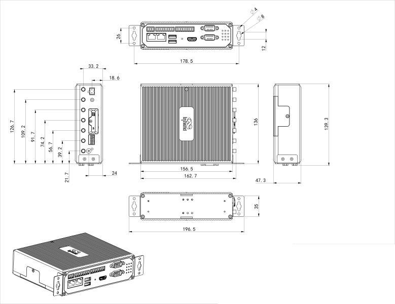
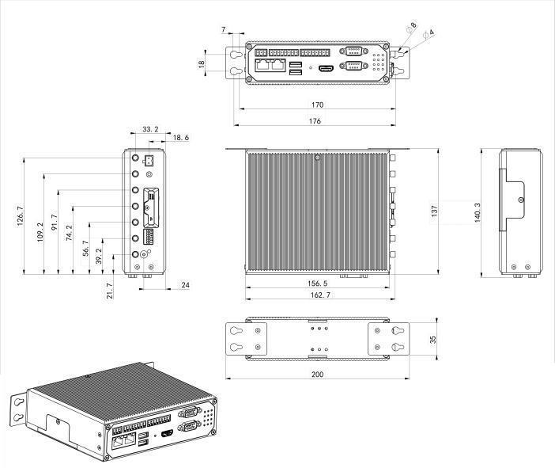

  

    

      
    

    

      拥抱边缘 AI，为工业数字化赋能
    

  

  

    

      EC942 系列轻量级 AI 边缘计算机
    

    

      

        
· 高安全性

        
· AI加速

      

      

        
· 云管理

        
· 高可靠性

      

    

  

# 1. 产品概述

**EC942 系列是面向工业物联网的轻量级 AI 加速边缘计算机，兼顾高性能计算、边缘智能与工业级可靠通信。**

**产品特点：**
- **AI加速:** 四核 Cortex-A55 @ 2.0GHz，4GB RAM + 16GB eMMC
- **开放平台:** Linux 发行版系统，支持 Docker 与二次开发
- **接口丰富:** 千兆网口、串口、USB、HDMI、mSATA，支持可选 I/O/CAN
- **安全可靠:** Secure Boot、TPM2.0、看门狗、双SIM、链路自愈
- **云端运维:** 支持 DeviceLive 远程设备、容器和应用管理

## 核心技术指标

| 技术指标 | 规格 |
|---|---|
| 蜂窝网络 | 5G SA/NSA、LTE Cat4/Cat6 |
| 网络接入 | APN、VPDN |
| 接入认证 | CHAP/PAP/MS-CHAP/MS-CHAPV2 |
| 数据采集协议（DSA） | DLT645、IEC101/104、DNP3.0、BACnet、CNC |
| 远程管理 | DeviceLive 远程管理 |
| 操作系统 | Yocto/Linux（Debian 10，Kernel 4.19） |
| 处理器 | Quad-core Cortex-A55 @ 2.0GHz |
| 内存与存储 | 4GB RAM + 16GB eMMC |
| 接口能力 | 2 × GE、2×RS-232/485/422（DB9）、2 × Micro SIM、BLE 4.2 |
| 尺寸与重量 | 47.3 × 162.7 × 148.3 mm；810 g |
| 供电与功耗 | DC 12~48V；8W |
| 工作环境与防护 | -20 ~ 70 ℃；IP30 |

# 2. 产品尺寸

  

    
    
正视图

  

  

    
    
接口图

  

  

  

    
    
侧视图

  

  

    
注意：

1.所有尺寸单位为毫米（mm）。

2.所有尺寸均为近似值，仅供参考。

3.图示尺寸不得用于生产加工。

4.尺寸需符合零件及制造公差要求。

5.尺寸如有变更，恕不另行通知。

  

# 3. 硬件规格

| 类别/参数 | 规格 |
|--------------------------|------|
| **硬件平台** | |
| CPU | Quad-core Cortex-A55 @ 2.0GHz |
| GPU | Mali-G52 2EE |
| NPU | RKNN, 1TOPS |
| RAM | 4GB |
| FLASH | 16GB eMMC |
| **连接与接口** | |
| 以太网端口 | 2 × 10/100/1000Mbps 以太网端口 |
| IO口（选配）| 4 × DI，4 × DO |
| 串口 | 2 × RS-232/485/422，DB9形式 |
| CAN（选配） | CAN 2.0A/B |
| 按键 | 针孔式复位按键 |
| SIM卡座 | 2 × Micro SIM |
| 天线接头 | 由选配无线功能对应天线接口（Wi-Fi/GPS/蜂窝） |
| LED指示灯 | 4G/5G，信号强度指示灯（3颗：L1,L2,L3），SIM1，SIM2，User1，User2，PWR，STATUS，WARN，Error |
| 扩展接口 | 1 × mSATA |
| HDMI | 1 × HDMI 2.0 |
| USB | USB 2.0，2 × TypeA，1 × TypeC |
| TF | 支持 Micro SD |
| WiFi（选配） | STA，802.11ac/a/b/g/n，2.4G/5G双频 |
| 蓝牙（选配） | BLE 4.2（选配） |
| GNSS（选配） | 支持 GPS、北斗、格洛纳斯定位（选配） |
| **电源与功耗** | |
| 输入电压 | DC 12-48V，防反接保护 |
| 电源接口 | 工业端子 |
| 待机功率 |  120mA-200mA@12V |
| 峰值功率 |  320mA @ 12.0V |
| 工作功率 | 150mA-320mA@12V |
| 工作功耗 | 8W |
| **机械规格** | |
| 产品尺寸 | 47.3 × 162.7 × 148.3 mm |
| 产品重量 | 810g |
| 安装方式 | 导轨，壁挂 |
| 防护等级 | IP30 |
| 外壳与散热 | 金属外壳，无风扇设计 |
| 硬件看门狗 | 支持 |
| TPM（选配） | TPM2.0 |
| **环境与认证** | |
| 存储温度 | -40 ~ 85 ℃ |
| 工作温度 | -20 ~ 70 ℃ |
| 环境湿度 | 5~95%（无凝霜） |
| 物理特性 | 防震 IEC60068-2-27 振动 IEC60068-2-6 跌落 IEC60068-2-32 |
| EMC指标 | EN61000-4-2，level 3，静电 EN61000-4-3，level 3，辐射电场 EN61000-4-4，level 3，脉冲电场 EN61000-4-5，level 3，浪涌 EN61000-4-6，level 3，传导骚扰 EN61000-4-8，&gt;level 2，工频磁场，水平方向/垂直方向 400A/m EN61000-4-12，level 3，振荡波抗扰度 |
| 认证 | CE、FCC、IC、PTCRB、Verizon Wireless、AT&T |

# 4. 软件规格

| 类别/参数 | 规格 |
|--------------------------|------|
| **操作系统** | |
| 操作系统 | Yocto/Linux（Debian 10，Kernel 4.19） |
| 文件系统 | 完整的 Debian Core 根文件系统 |
| 包管理器 | Debian 软件包管理器 |
| **网络特性** | |
| 网络接入 | APN、VPDN |
| 接入认证 | CHAP/PAP/MS-CHAP/MS-CHAPV2 |
| 网络制式 | 5G SA/NSA，LTE Cat4，LTE Cat6（注：分型号适配不同网络） |
| WAN协议 | 支持静态IP、DHCP |
| LAN协议 | ARP、Ethernet |
| **安全性** | |
| Secure Boot | 支持 |
| Trust Zone | 支持 |
| 数据安全 | VPN |
| **可靠性** | |
| 链路探测 | 多级链路检测，断线自动连接 |
| 内置看门狗 | 设备运行自检技术，设备运行故障自修复 |
| 备份机制 | 有线、蜂窝、Wi-Fi 互备份 |
| 双卡切换 | 支持双SIM卡故障切换/双SIM卡备份 |
| **数据采集协议（DSA）** | |
| 工业协议 | Modbus RTU Master/Slave, Modbus TCP Master/Slave, EtherNet/IP, ISO on TCP, OPC UA Client/Server, Mitsubishi MC 3C/3E/3C OverTCP, Mitsubishi CPU Port, FINSUDP, HostLink, PPI |
| 电力协议 | DLT645-2007, IEC101/104, DNP3.0 |
| 其他协议 | BACnet, CNC |
| Docker | 支持） |
| **网络管理** | |
| 配置方式 | HTTP、HTTPS、Telnet、SSH |
| 升级方式 | 支持专有升级机制，利用本地或远程方式进行固件升级 |
| 日志功能 | 支持本地系统日志、远程日志输出，重要日志掉电保存 |
| 远程管理 | 支持 DeviceLive 或 HTTP、HTTPS、Telnet、SSH 等方式 |
| 平台功能 | 支持基于云的参数配置、容器管理、应用和固件管理， 助您进行设备的远程管理和应用部署 |

# 5. 订购信息

## 型号规则

**Model code:** EC942-\<B/H\>-\<WMNN\>-B-[X]

\<B/H\>: WiFi/GPS/CAN/TPM 与 I/O 能力（B=无，H=支持）  
\<WMNN\>: 无线通讯类型 & 模块  
[X]: 操作系统选项（可选）

## 产品型号

| 型号 | 区域 | \<B/H\> | \<WMNN\>: 无线通讯类型 & 模块 | [X] |
|------|------|---------|-------------------------------|-----|
| EC942-B-LQA8-B | 中国 | 无 | LTE CAT4 LTE-FDD: B1/B3/B5/B8 LTE-TDD: B34/B38/B39/B40/B41 WCDMA: B1/B8 TD-SCDMA: B34/B39 CDMA: BC0 GSM: 900/1800MHz | 默认 |
| EC942-H-LQA8-B | 中国 | 支持 | LTE CAT4 LTE-FDD: B1/B3/B5/B8 LTE-TDD: B34/B38/B39/B40/B41 WCDMA: B1/B8 TD-SCDMA: B34/B39 CDMA: BC0 GSM: 900/1800MHz | 默认 |
| EC942-B-NRQ1-B | 中国 | 无 | 5G NR NSA: n78/n79 5G NR SA: n1/n3/n5/n8/n28/n41/n77/n78/n79 LTE-FDD: B1/B3/B5/B8 LTE-TDD: B34/B38/B39/B40/B41 WCDMA: B1/B8 | 默认 |
| EC942-H-NRQ1-B | 中国 | 支持 | 5G NR NSA: n78/n79 5G NR SA: n1/n3/n5/n8/n28/n41/n77/n78/n79 LTE-FDD: B1/B3/B5/B8 LTE-TDD: B34/B38/B39/B40/B41 WCDMA: B1/B8 | 默认 |
| EC942-B-NRQ3-B | 全球（除中国） | 无 | 5G NR NSA/SA: n1/n2/n3/n5/n7/n8/n12/n20/n25/n28/n38/n40/n41/n48/n66/n71/n77/n78/n79 LTE FDD: B1/B2/B3/B5/B7/B8/B12(B17)/B13/B14/B18/B19/B20/B25/B26/B28/B29/B30/B32/B66/B71 LTE TDD: B34/B38/B39/B40/B41/B42/B48 LAA: B46 WCDMA: B1/B2/B3/B4/B5/B6/B8/B19 | 默认 |
| EC942-H-NRQ3-B | 全球（除中国） | 支持 | 5G NR NSA/SA: n1/n2/n3/n5/n7/n8/n12/n20/n25/n28/n38/n40/n41/n48/n66/n71/n77/n78/n79 LTE FDD: B1/B2/B3/B5/B7/B8/B12(B17)/B13/B14/B18/B19/B20/B25/B26/B28/B29/B30/B32/B66/B71 LTE TDD: B34/B38/B39/B40/B41/B42/B48 LAA: B46 WCDMA: B1/B2/B3/B4/B5/B6/B8/B19 | 默认 |
| EC942-B-FQ58-B | 欧洲&亚太 | 无 | LTE CAT4 LTE-FDD: B1/B3/B7/B8/B20/B28A LTE-TDD: B38/B40/B41 WCDMA: B1/B8 GSM: B3/B8 | 默认 |
| EC942-H-FQ58-B | 欧洲&亚太 | 支持 | LTE CAT4 LTE-FDD: B1/B3/B7/B8/B20/B28A LTE-TDD: B38/B40/B41 WCDMA: B1/B8 GSM: B3/B8 | 默认 |
| EC942-B-FQ38-B | 北美 | 无 | LTE CAT4 LTE-FDD: B2/B4/B5/B12/B13/B14/B66/B71 WCDMA: B2/B4/B5 | 默认 |
| EC942-H-FQ38-B | 北美 | 支持 | LTE CAT4 LTE-FDD: B2/B4/B5/B12/B13/B14/B66/B71 WCDMA: B2/B4/B5 | 默认 |
| EC942-B-EN00-B | 全球无蜂窝 | 无 | 无蜂窝 | 默认 |
| EC942-H-EN00-B | 全球无蜂窝 | 支持 | 无蜂窝 | 默认 |

## 操作系统选项（可选）

| [X] PN码 | 特性 |
|----------|------|
| — | IEOS（默认） |
| D | Debian Linux OS |

• IEOS（ InHand Edge Operating System ）：映翰通面向物联网ARM平台边缘计算机的基于发行版Linux构建的操作系统，帮助客户实现安全、
稳定的工业边缘智能应用。IEOS包含web配置、拨号、路由、防火墙、VPN、云管理等映翰通开发的边缘应用。
 • Debian Linux OS：不包含映翰通边缘应用的Debian OS。

# 6. 联系我们

- **官网：** [映翰通官网](https://www.inhand.com.cn)
- **版权声明：** ©映翰通网络 保留所有权利
