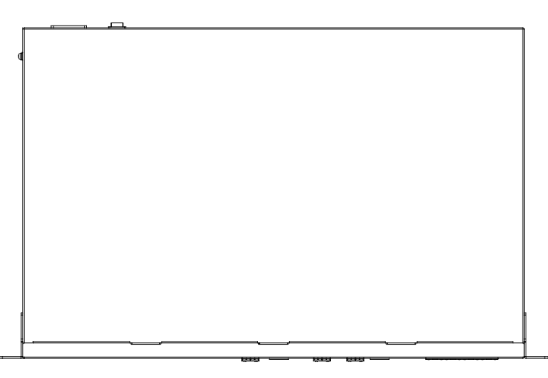
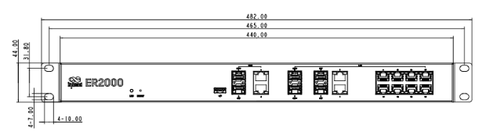
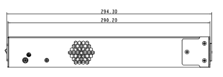

  

    

      
    

    

      智能管理，无忧连接
    

  

  

    

      ER2000 企业级路由器
    

    

      

        
· 企业级

        
· 高性能

      

      

        
· 云管理

        
· SD-WAN

      

    

  

## 1. 产品概述

**ER2000 是映翰通针对商业分支、企业办公等场景推出的基于云管理的 SD-WAN 企业级路由器，具备高性能数据处理能力，支持大规模数据传输和复杂网络环境下的稳定运行，为企业业务联网提供可靠、便捷的中心端网络接入。**

**产品特点：** 
- **高性能中心接入：** 整机最高转发速率 6 Gbps，具备上千分支站点接入能力，支持 1000+ 客户端
- **SD-WAN Hub：** 支持分支与总部间快速组建 SD-WAN 网络，Hub-Spoke 与 Spoke-Spoke 流量灵活调度
- **小星云管家：** 零接触部署、批量配置升级、多维度可视化仪表盘，极简运维
- **多种流量策略：** 策略路由、流量整形，IPsec、L2TP、VXLAN、GRE 等 VPN，黑白名单、域名过滤
- **负载均衡与故障转移：** 自动检测故障节点，流量动态重分配，保障网络连续性

## 核心技术指标

| 技术指标 | 规格 |
| --- | --- |
| 蜂窝网络 | 无（有线中心端路由） |
| 云管理 | 小星云管家 |
| VPN | IPsec VPN、L2TP VPN、VXLAN、GRE |
| SD-WAN | 支持 SD-WAN（Hub） |
| Wi-Fi | 不支持 |
| 网络协议 | IPv4、IPv6 |
| 整机吞吐量 | 6 Gbps |
| IPsec 吞吐量 | 1 Gbps |
| 以太网接口 | WAN：1 × 10G SFP+ + 1 × GbE SFP + 2 × GbE RJ45（PoE）；LAN：2 × 10G SFP+ + 2 × GbE Combo + 8 × GbE RJ45（PoE） |
| SIM 卡 | 不支持 |
| 供电与功耗 | 100–240 V AC，50/60 Hz，2 A；≤ 200 W |
| 工作温度与防护 | -10 °C ~ +50 °C，IP20 |

## 2. 产品尺寸

  

    
    
正视图

  

  

    
    
接口图

  

  

    
    
侧视图

  

  

    
注意：

    
1. 所有尺寸单位为毫米（mm）。

    
2. 尺寸（长 × 宽 × 高）：440 × 290 × 44 mm。

    
3. 所有尺寸均为近似值，仅供参考。

    
4. 图示尺寸不得用于生产加工。

  

## 3. 硬件规格

| 类别/参数 | 规格 |
| --- | --- |
| **性能指标** | |
| 型号 | ER2000 |
| 吞吐量 | 6 Gbps |
| VPN 吞吐量 | 1 Gbps |
| VPN 条目数 | 500+ |
| 推荐终端数 | 1000+ |
| RAM | 4 GB DDR4 |
| Flash | 8 GB eMMC |
| **接口** | |
| 以太网 WAN | 1 × 10G SFP+，1 × GbE SFP，2 × GbE RJ45（PoE） |
| 以太网 LAN | 2 × 10G SFP+，2 × GbE Combo，8 × GbE RJ45（PoE） |
| PoE | 10 × PoE 输出，802.3at，150 W |
| USB | 1 × USB 3.0 |
| 复位 | 1 × 硬件复位键 |
| LED | 1 × LED 指示灯 |
| 电源开关 | 1 × 电源开关键 |
| **电源** | |
| 供电 | 100–240 V AC，50/60 Hz，2 A |
| 功耗 | ≤ 200 W |
| **机械** | |
| 尺寸 (长 × 宽 × 高) | 440 × 290 × 44 mm |
| 外壳 | 金属 |
| 安装方式 | 挂耳机架安装 |
| **环境** | |
| 工作温度 | -10 °C ~ +50 °C |
| 储存温度 | -40 °C ~ +85 °C |
| 湿度 | 95 % RH @ 40 °C |
| 防护等级 | IP20 |
| **认证** | |
| EMC | EMC 2 级 |
| 认证 | 计划中：CE、FCC、IC |

## 4. 软件规格

| 类别/参数 | 规格 |
| --- | --- |
| **云管理** | |
| 平台 | 小星云管家 |
| 功能 | 统一设备接入、零接触远程部署、批量升级配置下发、SD-WAN 组网、云连接远程维护、双因素身份认证 |
| 仪表盘 | 设备统计、联网状态、连接质量分析（延迟、丢包、吞吐率）、流量统计、接口状态、客户端统计分析、上行链路管理 |
| **网络特性** | |
| 接入方式 | 支持多条有线链路接入 |
| 拨号服务 | 支持 PPPoE |
| 智能链路 | 实时链路探测 |
| IP 协议 | IPv4、IPv6 |
| 网络协议 | VLAN、DHCP（Server/Client）、DHCP Snooping、DNS、DDNS、IP Passthrough、STP、ARP、ICMP |
| VPN | IPsec VPN、L2TP VPN、VXLAN、GRE*、Open VPN* |
| SD-WAN | 支持 SD-WAN 组网（Hub）；支持 500+ 分支站点接入 |
| 路由 | 静态路由、策略路由 |
| **安全** | |
| 防火墙 | 黑白名单过滤、域名过滤、TLS 加密传输、3 层规则、应用识别、NAT/端口转发、远程访问控制、802.1X |
| **可靠性** | |
| 流量整形 | 基于链路/IP/协议的流量整形 |
| 冗余 | VRRP* |
| 升级 | 支持计划升级 |
| 日志 | 支持运行日志、诊断日志 |
| 事件 | 支持用户登录、连接断开、设备重启等运行事件 |
| 告警 | 支持设备本地邮件告警；支持平台短信、邮件告警 |
| 诊断工具 | ICMP、抓包、Tracert |
| 负载均衡 | 负载均衡与故障转移 |

*带 * 的为开发中的特性

## 5. 订购信息

### 型号规则

**Model code:** ER2000-\<WMNN\>

- \<WMNN\>: 蜂窝模组

### 产品型号

<table style="width:100%;">
  <colgroup>
    <col style="width:22%;">
    <col style="width:10%;">
    <col style="width:68%;">
  </colgroup>
  <tr><th align="center">型号</th><th align="center">区域</th><th align="left">说明</th></tr>
  <tr><td align="center" style="white-space: nowrap;">ER2000-Plus</td><td align="center">全球</td><td align="left">整机吞吐量 6 Gbps，VPN 吞吐量 1 Gbps，支持 500+ 分支站点接入、1000+ 客户端接入；WAN：1 × 10G SFP+，1 × GbE SFP，2 × GbE RJ45（PoE）；LAN：2 × 10G SFP+，2 × GbE Combo，8 × GbE RJ45（PoE）</td></tr>
</table>

## 6. 联系我们

- **官网：** [映翰通官网](https://www.inhand.com.cn)
- **版权声明：** ©映翰通网络 保留所有权利
