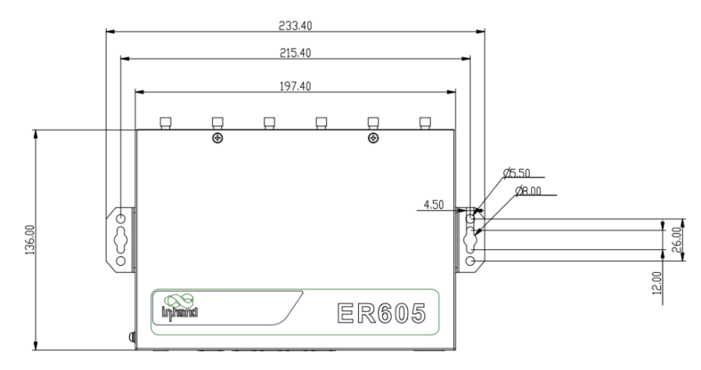
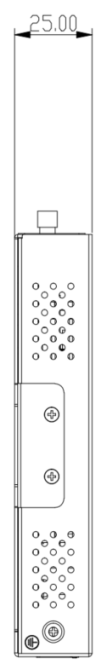
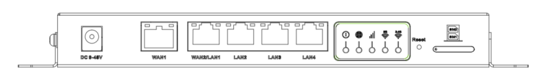

  

    

      
    

    

      智能管理，无忧连接
    

  

  

    

      ER605 边缘路由器
    

    

      

        
· 5G/4G

        
· 云管理

      

      

        
· 高性价比

        
· 千兆以太网

      

    

  

# 1. 产品概述

**ER605 是一款多功能的边缘接入路由器，支持 5G/4G 蜂窝和有线宽带接入，配备千兆网口和千兆 Wi-Fi，可支持各种数字终端的网络接入，以满足各类商业门店、企业办公的联网需求，确保不间断的数字化门店运营和生产力。**

**产品特点：** 
- **拥抱 5G：** 全球运营商 5G 网络接入，下行 2 Gbps，支持 SA/NSA 组网，可兼容 4G
- **多链路备份：** 多链路切换策略和双 SIM 设计，链路间备份和负载均衡，确保网络不中断
- **千兆接入：** 千兆以太网支持 WAN/LAN 或双 WAN，千兆 Wi-Fi 802.11 ac，最大带宽 1200 Mbps
- **SD-WAN：** 简单配置实现分支互访，多上行链路隧道，链路故障灵活转移
- **小星云管家：** 零接触部署、远程配置升级、可视化监控，网络尽在掌握

## 核心技术指标

|技术指标|规格|
| --- | --- |
| 蜂窝网络 | 5G/4G LTE，支持 SA/NSA |
| 云管理 | 小星云管家 |
| VPN | IPsec VPN、L2TP VPN、VXLAN、GRE*、OpenVPN* |
| SD-WAN | 支持 SD-WAN（Spoke） |
| Wi-Fi | 802.11 ac/a/b/g/n，2.4/5 GHz 双频，1200 Mbps |
| 网络协议 | IPv4、IPv6 |
| 整机吞吐量 | 450 Mbps |
| IPsec 吞吐量 | 30-50 Mbps |
| 以太网接口 | 5 × GbE，支持 WAN/LAN 切换、双 WAN |
| SIM 卡 | 双 Nano 4FF |
| 供电与功耗 | 12 V / 2 A DC，≤ 24 W |
| 工作温度与防护 | -10 °C ~ +50 °C，IP30 |

# 2. 产品尺寸

  

    
    
正视图

  

    

    
    
侧视图

  

  

    
    
接口图

  

  

    
注意：

    
1. 所有尺寸单位为毫米（mm）。

    
2. 尺寸（长 × 宽 × 高）：198 × 137 × 25 mm。

    
3. 所有尺寸均为近似值，仅供参考。

    
4. 图示尺寸不得用于生产加工。

  

# 3. 硬件规格

| 类别/参数 | 规格 |
| --- | --- |
| **性能指标** | |
| 吞吐量 | 450 Mbps |
| IPsec VPN 吞吐量 | 30–50 Mbps |
| 推荐用户数 | 50–100 |
| RAM | 256 MB |
| Flash | 128 MB |
| **接口** | |
| 蜂窝 | 5G 网络下行 2 Gbps，Sub-6（450 MHz–6 GHz）或 4G 网络 |
| 以太网 | 5 × GbE，支持 WAN/LAN 切换、双 WAN |
| SIM 卡 | 双 Nano 4FF |
| 复位 | 硬件复位键 |
| 天线 | 4G 型号：2 × 4G 天线 + 2 × Wi-Fi 天线；5G 型号：4 × 5G 天线 + 2 × Wi-Fi 天线（根据型号提供） |
| **Wi-Fi** | |
| 标准 | 802.11 ac/a/b/g/n，Wave MU-MIMO |
| 频段 | 2.4 GHz、5 GHz 双频并发 |
| 最大速率 | 1200 Mbps |
| 发射功率 | 2.4 GHz / 5 GHz：17 dBm |
| 天线增益 | ≤ 5 dBi |
| **电源** | |
| 供电 | 12 V / 2 A DC |
| 功耗 | ≤ 24 W |
| **指示灯** | |
| LED | 电源 / 网络 / 5G WiFi / 2.4G WiFi |
| **机械** | |
| 尺寸 (长 × 宽 × 高) | 198 × 137 × 25 mm |
| 重量 | 848 g |
| 外壳 | 金属 |
| 安装方式 | 壁挂、桌面 |
| 防护等级 | IP30 |
| **环境** | |
| 工作温度 | -10 °C ~ +50 °C |
| 储存温度 | -40 °C ~ +85 °C |
| 湿度 | 95 % RH @ 40 °C |
| **认证** | |
| 认证 | CE |
| EMC | EMC 2 级 |

# 4. 软件规格

| 类别/参数 | 规格 |
| --- | --- |
| **云管理** | |
| 平台 | 小星云管家 |
| 功能 | 统一设备接入、零接触远程部署、批量升级配置下发、SD-WAN 组网 Connector、远程维护、双因素身份认证 |
| 仪表盘 | 设备接入统计、连接状态、连接质量分析（延迟、丢包、吞吐率）、流量统计、蜂窝信号统计、接口状态、客户端统计分析、上行链路管理 |
| **网络特性** | |
| 接入方式 | 5G/4G、有线等多种链路 |
| 拨号服务 | 支持 PPPoE、蜂窝自动重拨、双 SIM 切换、APN 配置 |
| 智能链路 | 实时链路探测 |
| IP 协议 | IPv4、IPv6 |
| 网络协议 | VLAN、DHCP（Server/Client）、DHCP Snooping、DNS、DDNS、IP Passthrough、STP、ARP、ICMP |
| VPN | IPsec VPN、L2TP VPN、VXLAN、GRE*、OpenVPN* |
| SD-WAN | 支持 SD-WAN 功能（Spoke） |
| 路由 | 静态路由、OSPF*、BGP* |
| **Wi-Fi** | |
| 功能 | 支持多 SSID 模式、SSID VLAN 属性、SSID 隐藏、访客模式、自定义 Splash Portal |
| 加密方式 | WPA、WPA2、WPA-PSK、WPA2-PSK |
| **安全** | |
| 防火墙 | 3L 入站/出站规则、端口转发、SNAT、DNAT、远程访问控制、黑白名单过滤、域名过滤、Portal 认证、802.1X* |
| **可靠性** | |
| 流量整形 | 基于链路/IP/协议的流量整形 |
| 升级 | 支持计划升级 |
| 日志 | 支持运行日志、诊断日志 |
| 事件 | 支持用户登录、连接断开、设备重启等运行事件 |
| 告警 | 支持设备本地邮件告警；支持平台短信、邮件告警 |
| 诊断工具 | ICMP、抓包、Tracert |

# 5. 订购信息

## 型号规则

**Model code:** ER605-\<WMNN\>-\<WLAN/NA\>

- \<WMNN\>: 蜂窝模组
- \<WLAN/NA\>: Wi-Fi 或 NA（无 Wi-Fi）

## 产品型号

<table style="width:100%;">
  <colgroup>
    <col style="width:37%;">
    <col style="width:8%;">
    <col style="width:12%;">
    <col style="width:43%;">
  </colgroup>
  <tr><th align="center">型号</th><th align="center">区域</th><th align="center">蜂窝</th><th align="left">说明</th></tr>
  <tr><td align="center" style="white-space: nowrap;">ER605-NRQ2-&lt;WLAN/NA&gt;</td><td align="center">中国</td><td align="center">5G</td><td align="left">5G NR n1/3/5/8/28A/n38/40/41/77/78/79 LTE-FDD B1/3/5/8 LTE-TDD B34/38/39/40/41 WCDMA B1/B5/B8</td></tr>
  <tr><td align="center" style="white-space: nowrap;">ER605-NRF2-&lt;WLAN/NA&gt;</td><td align="center">中国</td><td align="center">5G</td><td align="left">5G NR n1/3/5/8/28/41/78/79 LTE-FDD B1/3/5/7/8 LTE-TDD B34/38/39/40/41 WCDMA B1/B5/B8</td></tr>
  <tr><td align="center" style="white-space: nowrap;">ER605-NRF4-&lt;WLAN/NA&gt;</td><td align="center">欧洲亚太</td><td align="center">5G</td><td align="left">5G NR n1/3/5/7/8/20/28/n38/40/41/66/71/77/78 LTE-FDD B1/3/5/7/8/20/28/66/71 LTE-TDD B38/40/41 WCDMA B1/B3/B5/B8</td></tr>
  <tr><td align="center" style="white-space: nowrap;">ER605-LQ20-&lt;WLAN/NA&gt;</td><td align="center">中国</td><td align="center">CAT4</td><td align="left">LTE-FDD B1/B3/B5/B8 LTE-TDD B34/B38/B39/B40/B41 WCDMA B1/B5/B8 GSM/EDGE B3/B8</td></tr>
  <tr><td align="center" style="white-space: nowrap;">ER605-FF39-&lt;WLAN/NA&gt;</td><td align="center">美国</td><td align="center">CAT6</td><td align="left">LTE-FDD B2/B4/B5/B7/B12/B13/B25/B26/B29/B30/B66 LTE-TDD B41/B42/B43/B46/B48 WCDMA B2/B4/B5</td></tr>
  <tr><td align="center" style="white-space: nowrap;">ER605-FQ58-&lt;WLAN/NA&gt;</td><td align="center">欧洲亚太</td><td align="center">CAT4</td><td align="left">LTE-FDD B1/B3/B5/B7/B8/B20/B28A LTE-TDD B38/B40/B41 WCDMA B1/B3/B5/B8</td></tr>
</table>

# 6. 联系我们

- **官网：** [映翰通官网](https://www.inhand.com.cn)
- **版权声明：** ©映翰通网络 保留所有权利
