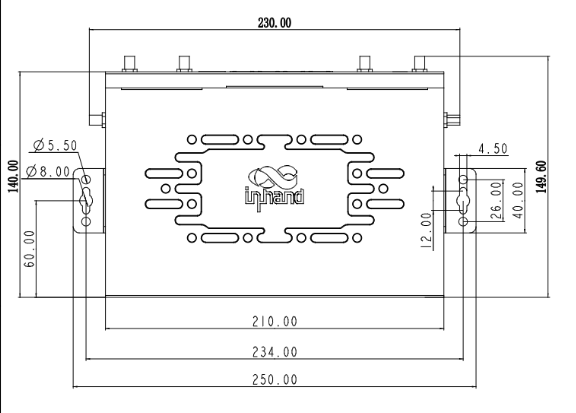
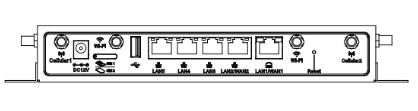
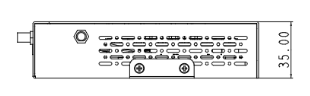



  

    

      
    

    

      连接每一个快乐的时刻
    

  

  

    

      ER815 边缘路由器
    

    

      

        
· 5G

        
· Wi-Fi6

      

      

        
· 云管理

        
· SD-WAN

      

    

  

# 1. 产品概述

**ER815 是一款高性能的 5G Wi-Fi 6 边缘路由器，通过多种 5G/4G 蜂窝或有线宽带选项将门店和办公室连接到网络，确保门店运营和生产力的持续性。ER815 配备 2.5GbE 端口和 3000 Mbps Wi-Fi 6 LAN 接入，可支持广泛的数字终端网络接入，提供卓越的网络性能和高可用性。**

**产品特点：** 
- **拥抱 5G：** 5G 模组最大速率 DL 2.4 Gbps、UL 900 Mbps，Sub-6（450 MHz–6 GHz），低时延高带宽
- **多链路备份：** 支持 5G 蜂窝和 2.5G WAN，链路间备份，双 SIM 自动切换至优质网络
- **2.5G + Wi-Fi 6：** 2.5GbE 端口，Wi-Fi 6 双频并发 3000 Mbps，满足连锁门店高性能需求
- **SD-WAN：** 跨区域一键组网，支持 IPsec、L2TP、GRE 等 VPN，部署便捷
- **小星云管家：** 零接触部署、批量配置升级、可视化监控，网络尽在掌握

## 核心技术指标

<table style="width:100%;">
  <colgroup>
    <col style="width:20%;">
    <col style="width:80%;">
  </colgroup>
  <tr><th align="left">技术指标</th><th align="left">规格</th></tr>
  <tr><td style="white-space: nowrap;">蜂窝网络</td><td>5G/4G；双 Nano 4FF，eSIM 可选；5G 下行最高 2.4 Gbps（Sub-6）</td></tr>
  <tr><td style="white-space: nowrap;">云管理</td><td>小星云管家</td></tr>
  <tr><td style="white-space: nowrap;">VPN</td><td>IPsec、L2TP、VXLAN、GRE*、OpenVPN*</td></tr>
  <tr><td style="white-space: nowrap;">网络特性</td><td>多链路、PPPoE、双 SIM/APN、SD-WAN（Spoke）</td></tr>
  <tr><td style="white-space: nowrap;">Wi-Fi</td><td>Wi-Fi 6 双频，3000 Mbps</td></tr>
  <tr><td style="white-space: nowrap;">安全</td><td>3L 防火墙、NAT、802.1X</td></tr>
  <tr><td style="white-space: nowrap;">吞吐量/用户</td><td>1 Gbps；IPsec 300 Mbps；推荐 150–200 用户</td></tr>
  <tr><td style="white-space: nowrap;">以太网</td><td>WAN 1×2.5G + 1×GbE；LAN 3×GbE（可切换 4×LAN）</td></tr>
  <tr><td style="white-space: nowrap;">尺寸与重量</td><td>210 × 140 × 35 mm；1.25 kg</td></tr>
  <tr><td style="white-space: nowrap;">供电与功耗</td><td>12 V / 2 A DC；≤ 18 W</td></tr>
  <tr><td style="white-space: nowrap;">工作温度与防护</td><td>工作 -10 °C ~ +50 °C；储存 -40 °C ~ +85 °C；5% ~ 95% RH；IP20</td></tr>
  <tr><td style="white-space: nowrap;">认证</td><td>FCC、IC、PTCRB、AT&T、Verizon、T-Mobile；EMC 2 级</td></tr>
</table>

# 2. 产品尺寸

  

    
    
正视图

  

  

    
    
接口图

  

  

    
    
侧视图

  

  

    
注意：

    
1. 所有尺寸单位为毫米（mm）。

    
2. 尺寸（长 × 宽 × 高）：210 × 140 × 35 mm。

    
3. 所有尺寸均为近似值，仅供参考。

    
4. 图示尺寸不得用于生产加工。

  

# 3. 硬件规格

| 类别/参数 | 规格 |
| --- | --- |
| **性能指标** | |
| 吞吐量 | 1 Gbps |
| IPsec VPN 吞吐量 | 300 Mbps |
| 推荐用户数 | 150–200 |
| RAM | 512 MB |
| Flash | 8 GB |
| **接口** | |
| 蜂窝 | 5G DL 2.4 Gbps、UL 900 Mbps，Sub-6（450 MHz–6 GHz）或 4G 网络 |
| 以太网 | WAN：1 × 2.5G + 1 × GbE；LAN：3 × GbE（或 WAN 1 × 2.5G；LAN 4 × GbE），支持 WAN/LAN 切换 |
| SIM 卡 | 双 Nano 4FF，eSIM 可选 |
| 复位 | Pinhole 复位键 |
| 天线 | 4G 型号：2 × SMA + 2 × RP-SMA Wi-Fi；5G 型号：4 × SMA + 2 × RP-SMA Wi-Fi（根据型号提供） |
| **Wi-Fi** | |
| 标准 | 802.11 ax/ac/a/b/g/n |
| 频段 | 2.4 GHz、5 GHz 双频并发 |
| 最大速率 | 3000 Mbps |
| 发射功率 | 2.4 GHz：16 dBm；5 GHz：17 dBm |
| 天线增益 | ≤ 5 dBi |
| **电源** | |
| 供电 | 12 V / 2 A DC |
| 功耗 | ≤ 18 W |
| **指示灯** | |
| LED | 电源 / 网络 / 5G WiFi / 2.4G WiFi |
| **机械** | |
| 尺寸 (长 × 宽 × 高) | 210 × 140 × 35 mm |
| 重量 | 1.25 kg |
| 外壳 | 金属 |
| 安装方式 | 壁挂、桌面 |
| 防护等级 | IP20 |
| **环境** | |
| 工作温度 | -10 °C ~ +50 °C |
| 储存温度 | -40 °C ~ +85 °C |
| 湿度 | 5 % ~ 95 % RH（非凝露） |
| **认证** | |
| 认证 | FCC、IC、PTCRB、AT&T、Verizon、T-Mobile |
| EMC | EMC 2 级 |

# 4. 软件规格

| 类别/参数 | 规格 |
| --- | --- |
| **云管理** | |
| 平台 | 小星云管家 |
| 功能 | 统一设备接入、零接触远程部署、批量升级配置下发、SD-WAN 组网、云连接远程终端维护、双因素身份认证 |
| 仪表盘 | 设备统计、联网状态、连接质量分析（延迟、丢包、吞吐率）、流量统计、蜂窝信号统计、接口状态、客户端统计分析、上行链路管理 |
| **网络特性** | |
| 接入方式 | 5G/4G、有线等多种链路 |
| 拨号服务 | 支持 PPPoE、蜂窝自动重拨、双 SIM 切换、APN 配置 |
| 智能链路 | 实时链路探测 |
| IP 协议 | IPv4、IPv6 |
| 网络协议 | VLAN、DHCP（Server/Client）、DHCP Snooping、DNS、URL Filtering、DDNS、Fixed Address allocation、IP Passthrough、STP、ARP、ICMP |
| VPN | IPsec VPN、L2TP VPN、VXLAN、GRE*、OpenVPN* |
| SD-WAN | 支持 SD-WAN 组网 |
| 路由 | 静态路由 |
| **Wi-Fi** | |
| 功能 | 支持多 SSID 模式、SSID VLAN 属性、SSID 隐藏、访客模式、自定义 Splash Portal |
| 加密方式 | WPA、WPA2、WPA-PSK、WPA2-PSK、WPA3* |
| **安全** | |
| 防火墙 | 3L 入站/出站规则、端口转发、SNAT、DNAT、远程访问控制、黑白名单过滤、域名过滤、Portal 认证、802.1X |
| **可靠性** | |
| 流量整形 | 基于链路/IP/协议的流量整形 |
| 升级 | 支持计划升级 |
| 日志 | 支持运行日志、诊断日志 |
| 事件 | 支持用户登录、连接断开、设备重启等运行事件 |
| 告警 | 支持设备本地邮件告警；支持平台短信、邮件告警 |
| 诊断工具 | ICMP、抓包、Tracert |

# 5. 订购信息

## 型号规则

**Model code:** ER815-\<WMNN\>-\<WLAN/NA\>

- \<WMNN\>: 蜂窝模组
- \<WLAN/NA\>: Wi-Fi 或 NA（无 Wi-Fi）

## 产品型号

<table style="width:100%;">
  <colgroup>
    <col style="width:42%;">
    <col style="width:8%;">
    <col style="width:10%;">
    <col style="width:40%;">
  </colgroup>
  <tr><th align="center">型号</th><th align="center">区域</th><th align="center">蜂窝</th><th align="left">说明</th></tr>
  <tr><td align="center" style="white-space: nowrap;">ER815-NRQ2-&lt;WLAN/NA&gt;</td><td align="center">中国</td><td align="center">5G</td><td align="left">5G NR n1/n3/n5/n8/n28A/n41/n77/n78/n79 LTE-FDD B1/B3/B5/B8 LTE-TDD B34/B38/B39/B40/B41 WCDMA B1/B5/B8 WLAN: AX3000</td></tr>
  <tr><td align="center" style="white-space: nowrap;">ER815-NRQ3-&lt;WLAN/NA&gt;</td><td align="center">全球</td><td align="center">5G</td><td align="left">5G NR n1/n2/n3/n5/n7/n8/n12/n13/n14/n18/n20/n25/n26/n28/n29/n30/n38/n40/n41/n48/n66/n70/n71/n75/n76/n77/n78/n79 LTE-FDD B1/B2/B3/B4/B5/B7/B8/B12/B13/B14/B17/B18/B19/B20/B25/B26/B28/B29/B30/B32/B66/B71 LTE-TDD B34/B38/B39/B40/B41/B42/B43/B48 WCDMA B1/B2/B4/B5/B8/B19 WLAN: AX3000</td></tr>
  <tr><td align="center" style="white-space: nowrap;">ER815-NRQ4-&lt;WLAN/NA&gt;</td><td align="center">欧洲亚太</td><td align="center">5G</td><td align="left">5G NR n1/n3/n5/n7/n8/n20/n28/n38/n40/n41/n66/n77/n78 LTE-FDD B1/B3/B5/B7/B8/B20/B28/B66 LTE-TDD B38/B40/B41 WCDMA B1/B2/B5/B8 WLAN: AX3000</td></tr>
  <tr><td align="center" style="white-space: nowrap;">ER815-EN00-&lt;WLAN/NA&gt;</td><td align="center">—</td><td align="center">无蜂窝</td><td align="left">—</td></tr>
</table>

# 6. 联系我们

- **官网：** [映翰通官网](https://www.inhand.com.cn)
- **版权声明：** ©映翰通网络 保留所有权利
