

  

    

      
    

    

      即插即用，无忧连接
    

  

  

    

      ES220 系列非网管交换机
    

    

      

        
· 高性价比

        
· 千兆以太网

      

      

        
· PoE

        
· 二层

      

    

  

# 1. 产品概述

**ES220 系列专为连锁分支机构和中小企业网络场景打造，是一款高性价比的非网管交换机解决方案。该系列提供 5 口和 9 口型号选择，最多支持 8 个 PoE 供电端口，灵活满足商业门店和小型办公环境中局域网设备的接入需求。**

**产品特点：** 
- **即插即用：** 非网管设计，免配置，插入电源和网线即可自动运行
- **高性价比：** 有效降低部署成本，覆盖多样化设备接入场景
- **PoE 供电：** 部分型号支持 PoE，1 根网线实现数据和供电，免去单独布设电源线
- **一键 VLAN：** 部分型号支持一键 VLAN，1–4 端口相互隔离并同时与 5 端口相通，防止广播风暴
- **紧凑小巧：** 小尺寸设计，桌面放置或壁挂安装，适应多种部署场景

# 核心技术指标

|技术指标|规格|
| --- | --- |
| 类型 | 二层非网管，即插即用 |
| 交换容量 | 10 Gbps（5 口）/ 16 Gbps（8/9 口） |
| 转发 / MAC | 存储转发；2K |
| PoE | 4P-1T：52 W；8P-1T：110 W（802.3 af/at）；5T/8T 无 |
| 一键 VLAN | ES220-4P-1T：1–4 口与 5 口互通隔离 |
| 千兆电口 | 5 / 8 / 9 口，10/100/1000 Mbps，Auto MDI/MDIX |
| 电源 | 非 PoE：5 V / 1 A DC；PoE：55 V DC |
| 尺寸 (W × D × H) | 84 × 47.8 × 25.6 mm ~ 178 × 104 × 26 mm（因型号而异） |
| 结构 / 安装 | 金属外壳、无风扇；桌面 / 壁挂 |
| 环境 / 认证 | 工作 0 °C ~ +40 °C；10%~90% RH；CE、FCC；质保 1 年 |

# 2. 产品尺寸

ES220-5T

  

    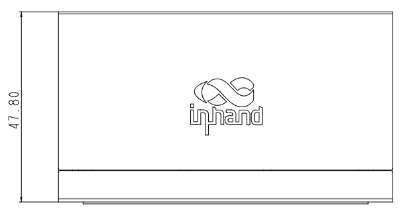
    
正视图

  

  

    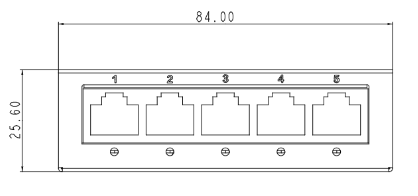
    
接口图

  

  

    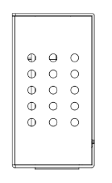
    
侧视图

  

ES220-4P-1T

  

    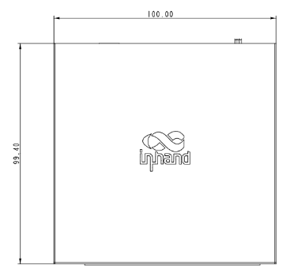
    
正视图

  

  

    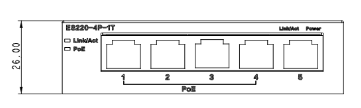
    
接口图

  

  

    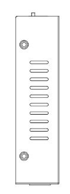
    
侧视图

  

ES220-8T

  

    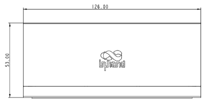
    
正视图

  

  

    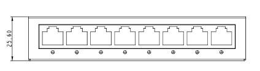
    
接口图

  

  

    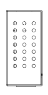
    
侧视图

  

ES220-8P-1T

  

    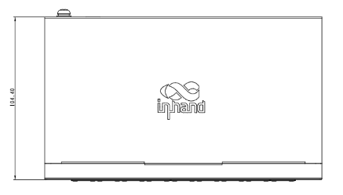
    
正视图

  

  

    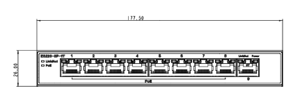
    
接口图

  

  

    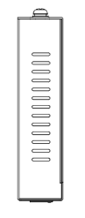
    
侧视图

  

# 3. 硬件规格

| 类别/参数 | ES220-5T | ES220-4P-1T | ES220-8T | ES220-8P-1T |
| --- | --- | --- | --- | --- |
| **硬件性能** | | | | |
| 交换容量 | 10 Gbps | 10 Gbps | 16 Gbps | 16 Gbps |
| MAC 地址表 | 2K | 2K | 2K | 2K |
| 传输方式 | 存储转发 | 存储转发 | 存储转发 | 存储转发 |
| **接口** | | | | |
| 以太网 | 5 × 10/100/1000 Mbps | 5 × 10/100/1000 Mbps | 8 × 10/100/1000 Mbps | 9 × 10/100/1000 Mbps |
| PoE | 不支持 | 1–4 口 802.3 af/at，整机 52 W | 不支持 | 1–8 口 802.3 af/at，整机 110 W |
| 极性翻转 | Auto MDI/MDIX | Auto MDI/MDIX | Auto MDI/MDIX | Auto MDI/MDIX |
| 一键 VLAN | — | 1–4 口相互隔离并同时与 5 口相通 | — | — |
| **电源** | | | | |
| 电源输入 | 5 V / 1 A DC | 55 V / 1.3 A DC | 5 V / 1 A DC | 55 V / 2.55 A DC |
| **指示灯** | | | | |
| LED | 电源、网口 | 电源、网口、PoE | 电源、网口 | 电源、网口、PoE |
| **机械** | | | | |
| 外壳 | 全金属外壳 | 全金属外壳 | 全金属外壳 | 全金属外壳 |
| 散热 | 无风扇散热 | 无风扇散热 | 无风扇散热 | 无风扇散热 |
| 尺寸 (mm) | 84 × 47.8 × 25.6 | 100 × 99.4 × 26 | 126 × 53 × 25.6 | 178 × 104 × 26 |
| 安装方式 | 桌面放置、壁挂安装 | 桌面放置、壁挂安装 | 桌面放置、壁挂安装 | 桌面放置、壁挂安装 |
| **环境** | | | | |
| 工作温度 | 0 °C ~ +40 °C | 0 °C ~ +40 °C | 0 °C ~ +40 °C | 0 °C ~ +40 °C |
| 储存温度 | -10 °C ~ +70 °C | -10 °C ~ +70 °C | -10 °C ~ +70 °C | -10 °C ~ +70 °C |
| 湿度 | 10 % ~ 90 % | 10 % ~ 90 % | 10 % ~ 90 % | 10 % ~ 90 % |
| **认证** | | | | |
| 认证 | CE、FCC | CE、FCC | CE、FCC | CE、FCC |
| 质保 | 1 年 | 1 年 | 1 年 | 1 年 |

# 4. 软件规格

ES220 系列为非网管交换机，支持即插即用，无需配置。部分型号支持一键 VLAN 功能，通过简单切换即可实现局域网隔离。

# 5. 订购信息

## 型号规则

**Model code:** ES220-\<T\>-\<P\>

- \<T\>: 千兆电口数量
- \<P\>: PoE 端口标识

## 产品型号

<table style="width:100%;">
  <colgroup>
    <col style="width:18%;">
    <col style="width:82%;">
  </colgroup>
  <tr><th align="center">型号</th><th align="left">说明</th></tr>
  <tr><td align="center" style="white-space: nowrap;">ES220-5T</td><td align="left">二层 5 网口非网管交换机，支持 5 个 1000BASE-T 端口</td></tr>
  <tr><td align="center" style="white-space: nowrap;">ES220-4P-1T</td><td align="left">二层 5 网口非网管交换机，支持 5 个 1000BASE-T 端口，1–4 口支持 802.3 af/at PoE，最大供电功率 52 W</td></tr>
  <tr><td align="center" style="white-space: nowrap;">ES220-8T</td><td align="left">二层 8 网口非网管交换机，支持 8 个 1000BASE-T 端口</td></tr>
  <tr><td align="center" style="white-space: nowrap;">ES220-8P-1T</td><td align="left">二层 9 网口非网管交换机，支持 9 个 1000BASE-T 端口，1–8 口支持 802.3 af/at PoE，最大供电功率 110 W</td></tr>
</table>

# 6. 联系我们

- **官网：** [映翰通官网](https://www.inhand.com.cn)
- **版权声明：** ©映翰通网络 保留所有权利
