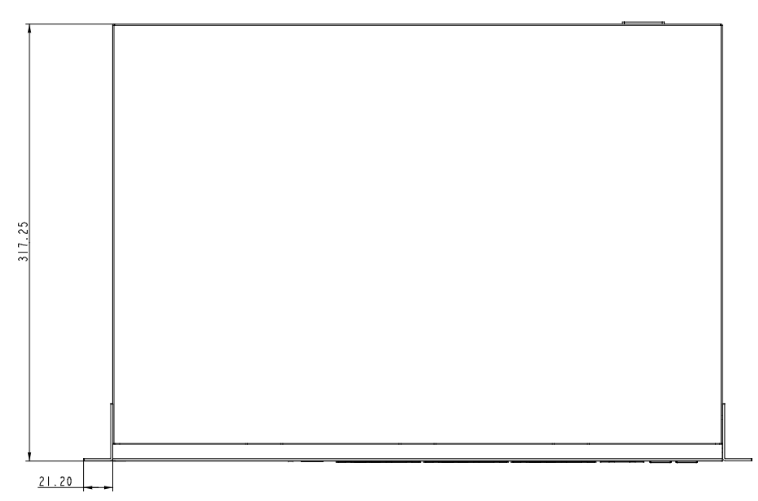
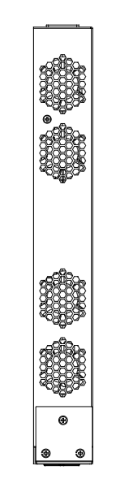
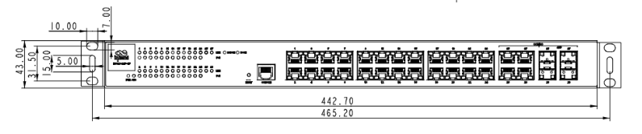

  

    

      
    

    

      强大连接，便捷管理
    

  

  

    

      ES620 企业级交换机
    

    

      

        
· 8×GbE

        
· 高性能

      

      

        
· 云管理

        
· 2×SFP

      

    

  

# 1. 产品概述

**ES620 交换机配备 8 个千兆网口和 2 个千兆光口，支持云管理，具备卓越的数据处理能力，能够在海量数据传输和复杂网络环境下稳定运行，为企业业务联网提供可靠、便捷的网络接入。其海量的接入能力非常适用于酒店、园区、宿舍等场景。**

**产品特点：** 
- **8 电 + 2 光：** 8 × GbE RJ45 + 2 × SFP，支持多终端接入，适合中小门店等连锁场景
- **高性能转发：** 交换容量 20 Gbps，包转发率 29.7 Mpps，高效处理大规模数据流量
- **小星云管家：** 零接触部署、批量配置升级、多维度可视化仪表盘，集中管理
- **尺寸小巧：** 171 × 98 × 27 mm，桌面放置或狭小空间安装，易部署
- **配置简单：** 图形化界面，配置简单易懂，无需专业 IT 技能即可掌握

## 核心技术指标

|技术指标|规格|
| --- | --- |
| 云管理平台 | 小星云管家 |
| 部署与运维 | 零接触部署、批量配置升级、远程维护 |
| 安全机制 | 双因素认证 |
| 网络协议 | IPv4 |
| 二层网络特性 | VLAN、STP、RSTP、端口管理、流量控制 |
| 交换性能 | 交换容量 20 Gbps，包转发率 29.7 Mpps |
| 接口配置 | 8 × GbE RJ45，2 × SFP，1 × Console |
| 存储资源 | RAM 128 MB，Flash 16 MB |
| 供电与功耗 | 100-240 V AC；12 W |
| 机械与环境 | 171 × 98 × 27 mm；IP20；0 °C ~ +45 °C |

# 2. 产品尺寸

  

    
    
正视图

  

    

    
    
侧视图

  

  

    
    
接口图

  

  

    
注意：

    
1. 所有尺寸单位为毫米（mm）。

    
2. 尺寸（长 × 宽 × 高）：171 × 98 × 27 mm。

    
3. 所有尺寸均为近似值，仅供参考。

    
4. 图示尺寸不得用于生产加工。

  

# 3. 硬件规格

| 类别/参数 | 规格 |
| --- | --- |
| **性能指标** | |
| 型号 | ES620 |
| 交换容量 | 20 Gbps |
| 包转发速率 | 29.7 Mpps |
| RAM | 128 MB |
| Flash | 16 MB |
| **接口** | |
| 以太网 | 8 × GbE RJ45，2 × SFP |
| Console | 1 × Console |
| 复位 | 硬件复位键 |
| **指示灯** | |
| LED | 1 × 电源灯，1 × 系统灯，10 × 链路状态 |
| **电源** | |
| 供电 | 100–240 V AC |
| 功耗 | 12 W |
| **机械** | |
| 尺寸 (长 × 宽 × 高) | 171 × 98 × 27 mm |
| 外壳 | 金属 |
| 安装方式 | 桌面式 |
| **环境** | |
| 工作温度 | 0 °C ~ +45 °C |
| 储存温度 | -40 °C ~ +70 °C |
| 湿度 | 95 % RH @ 40 °C |
| 防护等级 | IP20 |
| **认证** | |
| EMC | EMC 2 级 |
| 认证 | 计划中：CE、FCC、IC |

# 4. 软件规格

| 类别/参数 | 规格 |
| --- | --- |
| **云管理** | |
| 平台 | 小星云管家 |
| 功能 | 统一设备接入、零接触远程部署、批量升级配置下发、云连接远程维护、双因素身份认证 |
| 仪表盘 | 设备统计、联网状态、连接质量分析（延迟、丢包、吞吐率）、流量统计、接口状态、客户端统计分析 |
| **网络特性** | |
| IP 协议 | IPv4 |
| 网络服务 | VLAN、STP、RSTP、端口管理、流量控制、802.1X*、PoE 管理、链路聚合*、环路检测*、广播风暴* |
| MAC 地址 | 8K |
| **维护** | |
| 升级 | 支持计划升级 |
| 日志 | 支持运行日志、诊断日志 |
| 事件 | 支持用户登录、连接断开、设备重启等运行事件 |
| 告警 | 支持设备本地邮件告警；支持平台短信、邮件告警 |
| 诊断工具 | ICMP、抓包、Tracert |

*带 * 的为开发中的特性

# 5. 订购信息

## 型号规则

**Model code:** ES620-\<WMNN\>

- \<WMNN\>: 蜂窝模组

## 产品型号

<table style="width:100%;">
  <colgroup>
    <col style="width:28%;">
    <col style="width:10%;">
    <col style="width:62%;">
  </colgroup>
  <tr><th align="center">型号</th><th align="center">区域</th><th align="left">说明</th></tr>
  <tr><td align="center" style="white-space: nowrap;">ES620-8T-2S</td><td align="center">全球</td><td align="left">整机交换容量 20 Gbps，包转发率 29.7 Mpps，8 × 千兆网口，2 × SFP，二层云管理交换机</td></tr>
</table>

# 6. 联系我们

- **官网：** [映翰通官网](https://www.inhand.com.cn)
- **版权声明：** ©映翰通网络 保留所有权利
