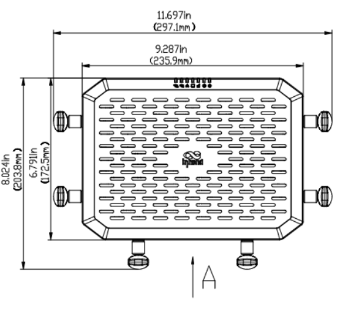
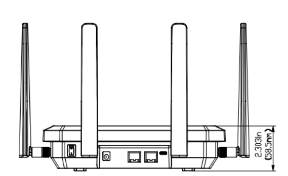
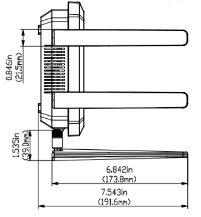

  

    

      
    

    

      即时 5G 连接，从这里开始
    

  

  

    

      FWA02 5G 路由器
    

    

      

        
· 5G

        
· Wi-Fi 6

      

      

        
· 云管理

        
· 外置天线

      

    

  

# 1. 产品概述

**FWA02 路由器提供全球范围内的 5G 连接，确保您无论身处城市中心、郊区，抑或是偏远农村，都能享受方便、可靠和安全的互联网接入。即插即用的高速 5G FWA02 让您即时接入高速互联的世界。**

**产品特点：** 
- **极速 5G：** 下行 4.76 Gbps、上行 1.25 Gbps，兼容 LTE Cat 19，5G/4G 环境均可高速接入
- **持久在线：** 5G/有线链路备份、蜂窝故障转移、双 SIM 自动切换，可选 eSIM
- **安全可靠：** 多维度防火墙、VPN 组网、访问控制、Wi-Fi 认证，有效解决网络安全隐患
- **云管一体：** 小星云管家零接触部署、可视化监控、集中管理，规模化部署分布式站点
- **Wi-Fi 6：** 2.4/5.8 GHz 双频，3600 Mbps 并发，802.11 ax/ac/b/g/n

## 核心技术指标

|技术指标|规格|
| --- | --- |
| 蜂窝网络 | 5G SA/NSA、LTE Cat 19；5G 下行/上行 4.76 / 1.25 Gbps |
| 云管理 | 小星云管家 |
| VPN | IPSec、L2TP |
| 网络特性 | IPv4/IPv6、VLAN、DHCP、DNS/DDNS、策略路由、链路备份 |
| Wi-Fi | Wi-Fi 6，2.4/5.8 GHz，3600 Mbps |
| 安全 | 防火墙、端口映射/转发、MAC 过滤、Wi-Fi 认证 |
| 以太网 / SIM | 2 × 2.5 GbE（WAN/LAN）；1 × eSIM + 2 × Nano（热插拔） |
| 尺寸 / 重量 | 236 × 172.5 × 58.5 mm；1 kg |
| 供电 / 功耗 | 12 V / 2 A DC；≤ 15 W |
| 环境 / 认证 | -10 °C ~ +50 °C；IP20；FCC、IC、PTCRB、Verizon、T-Mobile、CE；质保 3 年 |

# 2. 产品尺寸

  

    
    
正视图

  

  

    
    
接口图

  

  

    
    
侧视图

  

  

    
注意：

    
1. 所有尺寸单位为毫米（mm）。

    
2. 尺寸（长 × 宽 × 高）：236 × 172.5 × 58.5 mm。

    
3. 所有尺寸均为近似值，仅供参考。

    
4. 图示尺寸不得用于生产加工。

  

# 3. 硬件规格

| 类别/参数 | 规格 |
| --- | --- |
| **性能指标** | |
| 防火墙吞吐量 | 2 Gbps |
| 推荐用户数 | 220（128 个 Wi-Fi 客户端） |
| **接口** | |
| 以太网 | 2 × 2.5 GbE RJ45，支持 WAN/LAN 切换，双 WAN |
| USB | 1 × Type-C，USB 2.0，支持主/从模式 |
| SIM 卡 | 1 × eSIM，2 × Nano SIM，支持热插拔 |
| 复位 | 硬件 Reset 按钮 |
| 电源开关 | 1 × 船型电源开关 |
| 信号灯 | System, Cellular, Signal, WAN, LAN, Wi-Fi |
| 天线 | 6 × 外置 Sub-6 天线，4 × 内置 Wi-Fi 天线（NATM 型号：4 × 外置 Sub-6 天线） |
| **蜂窝** | |
| 蜂窝速率 | 5G SA/NSA：4.76 Gbps (DL) / 1.25 Gbps (UL)；4G CAT19：1.6 Gbps (DL) / 200 Mbps (UL) |
| 蜂窝频段 | 617–5925 MHz |
| 天线增益 | 617–894 MHz：2 dBi；1700–5000 MHz：4.11 dBi |
| **Wi-Fi** | |
| 频段 | 2.4 GHz、5.8 GHz |
| 并发带宽 | 3600 Mbps |
| 标准协议 | 802.11 ax/ac/b/g/n，Wi-Fi 6 |
| 天线频段 | 2400–2500 MHz；5000–5800 MHz |
| 天线增益 | 2400–2500 MHz：4.17 dBi；5000–5800 MHz：4.56 dBi |
| **电源** | |
| 供电接口 | 圆形插孔，12 V / 2 A |
| 功耗 | ≤ 15 W |
| **机械** | |
| 尺寸 (长 × 宽 × 高) | 236 × 172.5 × 58.5 mm |
| 重量 | 1 kg |
| 安装方式 | 壁挂、桌面 |
| **环境** | |
| 工作温度 | -10 °C ~ +50 °C |
| 贮藏温度 | -40 °C ~ +85 °C |
| 湿度 | 5 % ~ 95 % RH（无凝结） |
| **防护** | |
| 防护等级 | IP20 |
| **物理特性** | |
| 防震 | IEC 60068-2-27 |
| 抗振 | IEC 60068-2-6 |
| 防跌落 | IEC 60068-2-32 |
| **认证与保修** | |
| 认证 | FCC、IC、PTCRB、Verizon、T-Mobile、CE |
| 保修 | 3 年 |

# 4. 软件规格

| 类别/参数 | 规格 |
| --- | --- |
| **云管理** | |
| 平台 | 小星云管家 |
| 管理能力 | 集中式管理平台；简单直观的可视化界面；用户友好的管理模式 |
| 运维 | 批量升级和管理 |
| **上行链路** | |
| 网络接入 | 支持 4G/5G 蜂窝接入，支持以太网接入等多种网络接入方式 |
| 拨号服务 | 支持 PPPoE，蜂窝自动重拨，双 SIM 切换，APN 配置 |
| Smart Link | 链路备份 |
| 链路备份（续） | 多链路分组负载均衡；实时检测链路延迟、抖动和丢包情况；支持调整上行链路优先级 |
| **告警监控** | |
| 仪表盘 | 设备信息，接口状态，流量统计 |
| 链路监控 | 监控上行链路的延迟、抖动、丢包和吞吐量 |
| 蜂窝信号 | 实时监控蜂窝信号强度、RSSI、RSRP、RSRQ、SINR 等 |
| 数据安全 | 系统日志，诊断日志，设备事件记录，邮件告警 |
| **网络特性** | |
| IP 协议 | IPv4 / IPv6 |
| IP 应用 | VLAN，DHCP 服务器/客户端，DNS，DDNS，固定地址分配，IP 穿透 |
| Wi-Fi | 802.11 ax/ac/b/g/n，Wi-Fi 6，AP 模式 |
| 流量策略 | 策略路由，流量整形 |
| 网络自恢复 | 内置软、硬件看门狗，实现部分设备故障自愈，保持设备高可用 |
| VPN | IPSec VPN，L2TP VPN |
| **安全** | |
| 防火墙 | 访问控制，端口映射，端口转发，MAC 地址过滤；基于 MAC、IP、端口和协议的防火墙过滤 |
| Wi-Fi 安全 | 多种认证方式 |
| **远程维护** | |
| 远程访问控制 | 支持 Web UI / CLI 远程访问和控制 |
| 云连接 | 终端远程维护，监控设备 |
| 网络诊断 | Ping，路由跟踪，抓包等工具；支持诊断日志 |
| 配置备份 | 支持配置导入、导出 |

# 5. 订购信息

## 型号规则

**Model code:** FWA02-\<WMNN\>

\<WMNN\>: 类型 & 模组

## 产品型号

<table style="width:100%;">
  <colgroup>
    <col style="width:18%;">
    <col style="width:27%;">
    <col style="width:55%;">
  </colgroup>
  <tr><th align="center">型号</th><th align="center">区域</th><th align="left">频段</th></tr>
  <tr><td align="center" style="white-space: nowrap;">FWA02-NAVA</td><td align="center">北美 Verizon</td><td align="left">5G Sub-6 n2/5/7/12/14/25/30/41/48/66/71/77/78 LTE FDD B2/4/5/7/12/13/14/17/25/26/29/30/66/71 LTE TDD B41/46/48</td></tr>
  <tr><td align="center" style="white-space: nowrap;">FWA02-NATM</td><td align="center">北美 T-Mobile</td><td align="left">5G Sub-6 n25/41/66/71 LTE FDD B2/4/5/12/66/71 LTE TDD B41 LAA B46</td></tr>
  <tr><td align="center" style="white-space: nowrap;">FWA02-EUNR</td><td align="center">欧洲/澳大利亚/亚太</td><td align="left">5G Sub-6 n1/3/5/7/8/20/28/38/40/41/71/77/78/79 LTE FDD B1/3/5/7/8/20/28/32/71 LTE TDD B38/40/41/42/43</td></tr>
</table>

# 6. 联系我们

- **官网：** [映翰通官网](https://www.inhand.com.cn)
- **版权声明：** ©映翰通网络 保留所有权利
