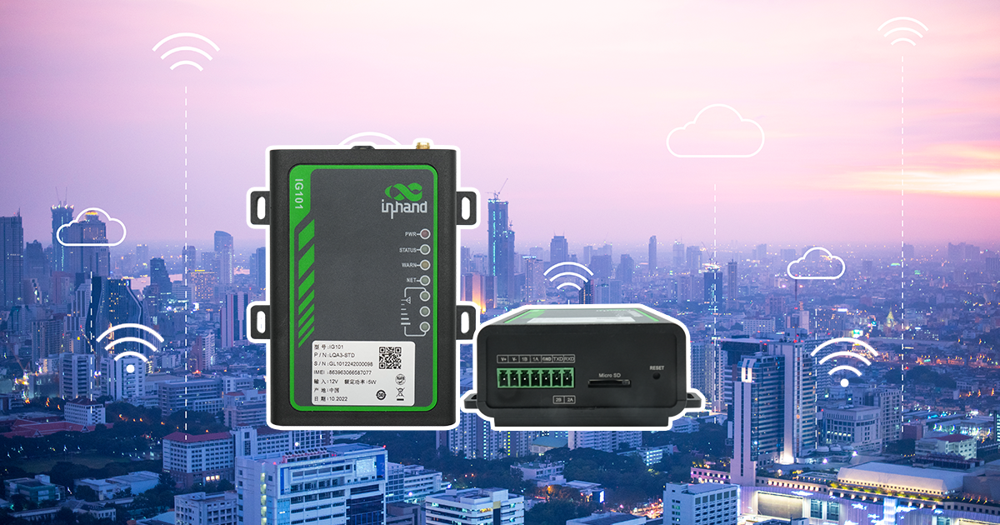
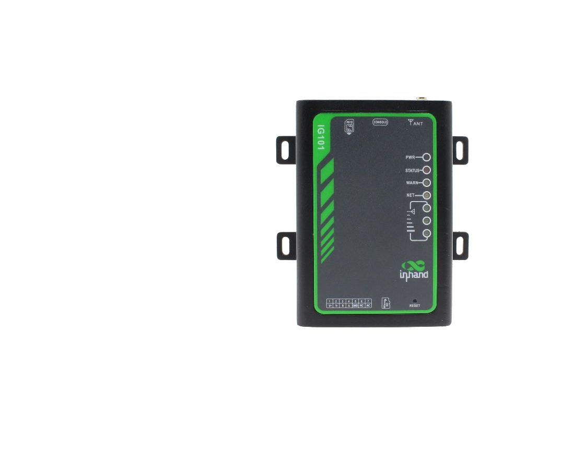

  

    

      
    

    

      紧凑型边缘网关，工业可靠，低成本设备联网
    

  

  

    

      IG101 系列边缘网关
    

    

      

        
· Modbus 转 MQTT

        
· 云管理

      

      

        
· 工业接口

        
· 边缘计算

      

    

  

# 1. 产品概述

**IG101 系列是映翰通面向工业物联网推出的紧凑型边缘网关，支持 4G 接入、工业串口采集与云端管理。**

**产品特点：**
- **紧凑易部署:** 小尺寸结构，导轨/挂耳安装，适配现场快速部署
- **边缘采集能力:** 支持标准 Modbus RTU 转 MQTT，支持透明传输
- **可靠在线:** 多级链路检测与看门狗机制保障数据传输连续性
- **安全稳定:** 工业级电源与 EMC 设计，适应恶劣现场环境
- **云端运维:** 支持 DeviceManager 平台批量配置、监控与升级

## 核心技术指标

|技术指标|规格|
|---|---|
|蜂窝网络|LTE Cat1|
|网络接入与认证|APN、VPDN；CHAP/PAP/MS-CHAP|
|工业协议|Modbus RTU|
|远程管理|支持 InHand DM 网管云平台|
|可靠性|心跳检测、断线自动重连、内置看门狗|
|处理器与存储|ARM Cortex-A5；RAM 4MB；FLASH 8MB|
|接口能力|1 × RS-485，1 × RS-232（工业端子）；SIM ×1（1.8V/3V）|
|供电与功耗|DC 7~38V；待机 23mA@12V，工作 29mA@12V，峰值 48mA@12V|
|机械规格|76 × 108 × 37.5 mm；导轨/挂耳安装；IP30|
|工作环境|-20 ~ 70 ℃；5 ~ 95%（无凝霜）|
|EMC等级|EN61000-4-2/-3/-4/-5/-6/-8/-12，level 3|

# 2. 产品尺寸 & 端子定义

  

    
    
正视图

  

    

    
    
侧视图

  

  

    
    
接口图

  

  

    
注意：

    
1.所有尺寸单位为毫米（mm）。

    
2.所有尺寸均为近似值，仅供参考。

    
3.图示尺寸不得用于生产加工。

    
4.尺寸需符合零件及制造公差要求。

    
5.尺寸如有变更，恕不另行通知。

  

## 7pin 端子定义

<table style="width:78%;">
  <colgroup>
    <col style="width:15%;">
    <col style="width:23%;">
    <col style="width:62%;">
  </colgroup>
  <tr><th align="center">引脚</th><th align="center">定义</th><th align="left">说明</th></tr>
  <tr><td align="center">1</td><td align="center">V+</td><td>电源正极</td></tr>
  <tr><td align="center">2</td><td align="center">V-</td><td>电源负极</td></tr>
  <tr><td align="center">3</td><td align="center">B</td><td>串口1的RS-485-</td></tr>
  <tr><td align="center">4</td><td align="center">A</td><td>串口1的RS-485+</td></tr>
  <tr><td align="center">5</td><td align="center">GND</td><td>信号地</td></tr>
  <tr><td align="center">6</td><td align="center">TXD</td><td>串口RS232通信发送</td></tr>
  <tr><td align="center">7</td><td align="center">RXD</td><td>串口RS232通信接收</td></tr>
</table>

# 3. 硬件规格

| 类别/参数 | 规格 |
|--------------------------|------|
| **CPU与存储** | |
| CPU | ARM Cortex-A5 |
| RAM | 4MB |
| FLASH | 8MB |
| **连接与接口** | |
| 串口 | 1 × RS-485，1 × RS-232（工业端子） |
| 复位按键 | 针孔式复位按键 |
| SIM卡座 | SIM ×1（1.8V/3V） |
| LED指示灯 | PWR、NET、STATUS、WARN、信号强度（3颗） |
| **电源与功耗** | |
| 输入电压 | DC 7~38V，防反接保护 |
| 电源接口 | 工业端子 |
| 待机功耗 | 23mA@12V |
| 工作功耗 | 29mA@12V |
| 峰值功耗 | 48mA@12V |
| **机械规格** | |
| 产品尺寸 | 76 × 108 × 37.5 mm |
| 安装方式 | 导轨、挂耳 |
| 防护等级 | IP30 |
| 外壳与散热 | 塑料外壳 |
| **环境与认证** | |
| 存储温度 | -40 ~ 85 ℃ |
| 工作温度 | -20 ~ 70 ℃ |
| 环境湿度 | 5 ~ 95%（无凝霜） |
| 物理特性 | 防震 IEC60068-2-27  振动 IEC60068-2-6  跌落 IEC60068-2-32 |
| EMC指标 | EN61000-4-2，level 3，静电   EN61000-4-3，level 3，辐射电场 EN61000-4-4，level 3，脉冲电场 EN61000-4-5，level 3，浪涌 EN61000-4-6，level 3，传导骚扰抗扰度 EN61000-4-8，>level 3，工频磁场水平方向/垂直方向 400A/m EN61000-4-12，level 3，震荡波抗绕度 |

# 4. 软件规格

| 类别/参数 | 规格 |
|--------------------------|------|
| **操作系统** | |
| 操作系统 | FreeRTOS |
| **网络特性** | |
| 网络接入 | APN、VPDN |
| 接入认证 | CHAP/PAP/MS-CHAP |
| 网络制式 | LTE Cat1 |
| IP应用 | ICMP、DNS、TCP/UDP、TCP Server |
| **安全性** | |
| 用户管理 | 支持分级管理权限 |
| **可靠性** | |
| 链路探测 | 心跳检测、断线自动重连 |
| 内置看门狗 | 设备自检与故障自恢复 |
| **开放式平台与数据采集协议（DSA）** | |
| Python二次开发 | 支持定制化开发 |
| DSA协议引擎 | 支持标准 MQTT，对接第三方云平台 |
| 工业协议 | Modbus RTU |
| **网络管理** | |
| 配置方式 | 配置工具 |
| 升级方式 | 支持本地与远程升级 |
| 日志功能 | 本地日志、远程日志、重要日志掉电保存 |
| 配置备份 | 支持配置导入/导出 |
| 远程管理 | 支持 InHand DM 网管云平台 |
| 网络诊断 | Ping |

# 5. 订购信息

## 型号规则

**Model code:** IG101-\<WMNN\>-\<IO/NA\>

\<WMNN\>: 无线通讯类型 & 模块  
\<IO/NA\>: 接口组合（标准版为串口接口）

## 产品型号

| 型号 | 区域 | \<WMNN\>: 无线通讯类型 & 模块 | 网口 | 串口 | I/O |
|------|------|-------------------------------|------|------|-----|
| IG101-LQA3-STD | 中国 | LTE CAT1 LTE-FDD: B1/B3/B5/B8 LTE-TDD: B34/B38/B39/B40/B41 GSM: B3/B5/B8 | 无 | 1×RS485 + 1×RS232 | 无 |
| IG101-FQ53-STD | EMEA | LTE CAT1 LTE-FDD: B1/B3/B5/B7/B8/B20/B28 LTE-TDD: B38/B40/B41 GSM: B2/B3/B5/B8 | 无 | 1×RS485 + 1×RS232 | 无 |

# 6. 联系我们

- **官网：** [映翰通官网](https://www.inhand.com.cn)
- **版权声明：** ©映翰通网络 保留所有权利
