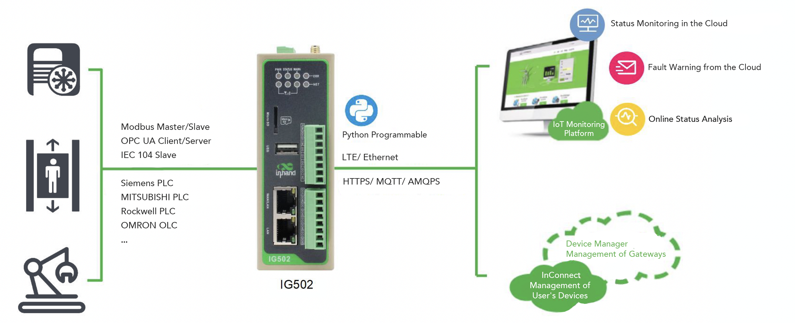

  

    

      
    

    

      极简型边缘网关，超高性价比，助力工业数字化
    

  

  

    

      IG502-LITE 系列边缘网关
    

    

      

        
· 多网络接入

        
· 云管理

      

      

        
· 内置DSA

        

      

    

  

# 1. 产品概述

**IG502-LITE 是面向工业物联网推出的极简型边缘网关，支持4G接入、边缘数据处理和云端管理。**

**产品特点：**
- **高性价比接入:** 提供4G与有线接入能力，满足基础工业联网需求
- **可靠在线:** 多级链路检测 + 软硬件看门狗，保障通信连续性
- **边缘处理能力:** 支持 Python 二次开发，支持 DSA 零代码/低代码部署
- **协议集成丰富:** 支持 80+ 工业协议，快速实现采集、处理与上云
- **云端统一管理:** 支持 DeviceLive、InConnect、iSCADA 远程管理

## 核心技术指标

|技术指标|规格|
|---|---|
|蜂窝网络|LTE Cat1|
|网络接入|APN、VPDN|
|接入认证|CHAP/PAP|
|数据安全|防火墙、OpenVPN、IPSec VPN|
|边缘开发|支持 Python 二次开发|
|云端运维|DeviceLive、InConnect、iSCADA|
|CPU|ARM Cortex-A8 @300MHz|
|内存与存储|512MB RAM，8GB eMMC|
|以太网接口|2 × 10/100Mbps|
|供电与功耗|12~48V DC（防反接），230mA@12V|
|工作温度|-20 ~ 70 ℃|
|防护等级|IP30|

# 2. 产品尺寸 & 端子定义

  

    
    
正视图

  

  

    
    
侧视图

  

  

    
    
接口图

  

  
  

    
注意：

1.所有尺寸单位为毫米（mm）。

2.所有尺寸均为近似值，仅供参考。

3.图示尺寸不得用于生产加工。

4.尺寸需符合零件及制造公差要求。

5.尺寸如有变更，恕不另行通知。

  

## 7pin 端子定义

<table style="width:78%;">
  <colgroup>
    <col style="width:15%;">
    <col style="width:23%;">
    <col style="width:62%;">
  </colgroup>
  <tr><th align="center">引脚</th><th align="center">定义</th><th align="left">说明</th></tr>
  <tr><td align="center">1</td><td align="center">V+</td><td>电源正极</td></tr>
  <tr><td align="center">2</td><td align="center">V-</td><td>电源负极</td></tr>
  <tr><td align="center">3</td><td align="center">TXD或1A</td><td>串口RS232发送或第一路RS485+</td></tr>
  <tr><td align="center">4</td><td align="center">RXD或1B</td><td>串口RS232接收或第一路RS485-</td></tr>
  <tr><td align="center">5</td><td align="center">GND</td><td>串口RS232信号地</td></tr>
  <tr><td align="center">6</td><td align="center">2A</td><td>第二路RS485+</td></tr>
  <tr><td align="center">7</td><td align="center">2B</td><td>第二路RS485-</td></tr>
</table>

# 3. 硬件规格

| 类别/参数 | 规格 |
|--------------------------|------|
| **CPU与存储** | |
| CPU | ARM Cortex-A8 @300MHz |
| RAM | 512MB |
| FLASH | 8GB eMMC |
| **连接与接口** | |
| 以太网端口 | 2 × 10/100Mbps |
| 串口 | RS485×1 + RS232×1，或 RS485×2（见订购信息） |
| 复位按键 | 针孔式复位按键 ×1 |
| SIM卡座 | 标准 SIM x1，单卡 |
| 天线接头 | 4G: SMA×1 |
| LED指示灯 | PWR、STATUS、WARN、ERR、信号强度（3颗）、LTE |
| **电源与功耗** | |
| 输入电压 | 12~48V DC（防反接） |
| 电源接口 | 工业端子 |
| 工作功耗 | 230mA@12V |
| **机械规格** | |
| 产品尺寸 | 110 × 127 × 35 mm |
| 产品重量 | 390 g |
| 安装方式 | 挂耳、导轨 |
| 防护等级 | IP30 |
| 外壳与散热 | 金属，无风扇散热 |
| RTC | 支持（纽扣电池备份） |
| 硬件看门狗 | 支持 |
| **环境与认证** | |
| 存储温度 | -40 ~ 85 ℃ |
| 工作温度 | -20 ~ 70 ℃ |
| 环境湿度 | 5~95%（无凝霜） |
| 物理特性 | 防震 IEC60068-2-27  振动 IEC60068-2-6  跌落 IEC60068-2-32 |
| EMC指标 | EN61000-4-2，level 3，静电   EN61000-4-3，level 3，辐射电场 EN61000-4-4，level 3，脉冲电场 EN61000-4-5，level 3，浪涌 EN61000-4-6，level 3，传导骚扰抗扰度 EN61000-4-8，>level 2，工频磁场抗扰度，水平方向/垂直方向 400A/m EN61000-4-12，level 3，震荡波抗绕度 |

# 4. 软件规格

| 类别/参数 | 规格 |
|--------------------------|------|
| **操作系统** | |
| 操作系统 | 定制版 Linux |
| **网络特性** | |
| 网络接入 | APN、VPDN |
| 接入认证 | CHAP/PAP |
| 网络制式 | LTE Cat1 |
| WAN协议 | 静态IP、DHCP |
| LAN协议 | ARP、Ethernet |
| IP应用 | ICMP、DNS、TCP/UDP、TCPServer、DHCP |
| IP路由 | 静态路由 |
| **安全性** | |
| 用户管理 | 支持多级管理权限 |
| 网络安全 | 防火墙 |
| 数据安全 | OpenVPN、IPSec VPN |
| **可靠性** | |
| 链路探测 | 心跳检测与断线自动连接 |
| 内置看门狗 | 支持设备故障自恢复 |
| **开放式平台与数据采集协议（DSA）** | |
| Python二次开发 | 支持 Python |
| 接入云平台 | 支持AWS、Azure、阿里等云平台 |
| 工业协议 | Modbus RTU/TCP、EtherNet/IP、OPC UA、Mitsubishi MC/CPU、FINS、HostLink、PPI 等 |
| 电力协议 | DLT645-2007、IEC101/104、DNP3.0 |
| 其他协议 | BACnet、CNC 等 |
| 最大采集点数 | 500 |
| **网络管理** | |
| 配置方式 | Web 配置页面 |
| 升级方式 | Web 升级、DM 平台远程升级 |
| 日志功能 | 本地/远程日志，重要日志掉电保存 |
| 配置备份 | 配置导入与导出 |
| 远程管理 | DeviceLive、InConnect |

# 5. 订购信息

## 型号规则

**Model code:** IG502-LITE-\<WMNN\>-\<D485/NA\>

\<WMNN\>: 无线通讯类型 & 模块

## 产品型号

| 型号 | 区域 | 无线制式 | 网口 | 串口 |
|------|------|---------|------|------|
| IG502-LITE-LQA3 | 中国 | LTE-FDD B1/B3/B5/B8；LTE-TDD B34/B38/B39/B40/B41 | 2 × 10/100Mbps | RS232 ×1 + RS485 ×1 |
| IG502-LITE-LQA3-D485 | 中国 | LTE-FDD B1/B3/B5/B8；LTE-TDD B34/B38/B39/B40/B41 | 2 × 10/100Mbps | RS485 ×2 |

# 6. 联系我们

- **官网：** [映翰通官网](https://www.inhand.com.cn)
- **版权声明：** ©映翰通网络 保留所有权利
