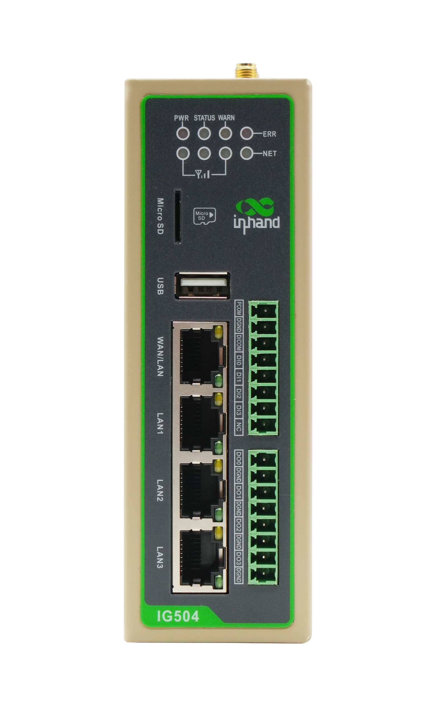
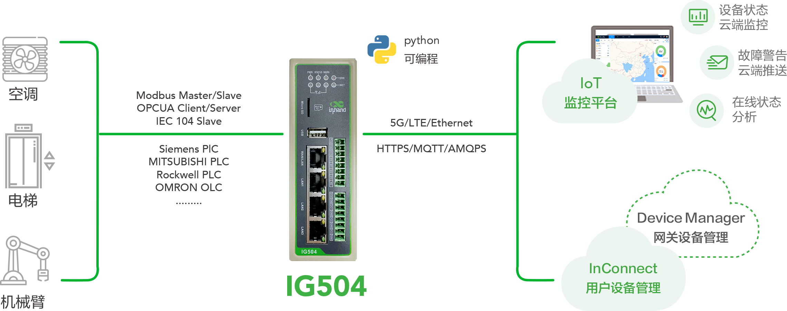

  

    

      
    

    

      多网口边缘网关，接口丰富，专为开发人员设计
    

  

  

    

      IG504 系列边缘网关
    

    

      

        
· 多网络接入

        
· 接口丰富

      

      

        
· 云管理

        
· 内置DSA

      

    

  

# 1. 产品概述

**InGateway504（IG504）是面向工业物联网的多网口高性价比边缘网关，支持采集、处理、上云与远程运维。**

**产品特点：**
- **多网络接入:** 支持5G/4G、以太网、可选Wi-Fi，满足复杂组网
- **接口丰富:** 4路以太网、双串口、USB、TF，可选4DI+4DO
- **边缘计算能力:** ARM Cortex-A8 + Python 开发，支持DSA快速部署
- **协议覆盖广:** 支持80+工业与电力协议，便于对接PLC/SCADA/云平台
- **云端运维:** 支持DeviceLive、InConnect、iSCADA的统一管理

## 核心技术指标

|技术指标|规格|
|---|---|
|蜂窝网络|5G SA/NSA（仅中国）、LTE Cat1、LTE Cat4|
|网络接入|APN、VPDN|
|接入认证|CHAP/PAP|
|数据安全|防火墙、OpenVPN、IPSec VPN|
|边缘开发|支持 Python 二次开发|
|云端运维|DeviceLive、InConnect、iSCADA|
|CPU|ARM Cortex-A8|
|内存与存储|512MB RAM，8GB eMMC|
|以太网接口|4 × 10/100Mbps|
|供电与功耗|12~48V DC（防反接），250mA@12V|
|工作温度|-20 ~ 70 ℃|
|防护等级|IP30|

# 2. 产品尺寸 & 端子定义

  

    
    
正视图

  

  

    
    
侧视图

  

  

    
    
接口图

  

  

    
注意：

1.所有尺寸单位为毫米（mm）。

2.所有尺寸均为近似值，仅供参考。

3.图示尺寸不得用于生产加工。

4.尺寸需符合零件及制造公差要求。

5.尺寸如有变更，恕不另行通知。

  

## 7pin 端子定义

<table style="width:78%;">
  <colgroup>
    <col style="width:15%;">
    <col style="width:23%;">
    <col style="width:62%;">
  </colgroup>
  <tr><th align="center">引脚</th><th align="center">定义</th><th align="left">说明</th></tr>
  <tr><td align="center">1</td><td align="center">V+</td><td>电源正极</td></tr>
  <tr><td align="center">2</td><td align="center">V-</td><td>电源负极</td></tr>
  <tr><td align="center">3</td><td align="center">TXD或1A</td><td>串口RS232发送或第一路RS485+</td></tr>
  <tr><td align="center">4</td><td align="center">RXD或1B</td><td>串口RS232接收或第一路RS485-</td></tr>
  <tr><td align="center">5</td><td align="center">GND</td><td>串口RS232信号地</td></tr>
  <tr><td align="center">6</td><td align="center">2A</td><td>第二路RS485+</td></tr>
  <tr><td align="center">7</td><td align="center">2B</td><td>第二路RS485-</td></tr>
</table>

## I/O定义

<table style="width:78%;">
  <colgroup>
    <col style="width:15%;">
    <col style="width:23%;">
    <col style="width:62%;">
  </colgroup>
  <tr><th align="center">引脚</th><th align="center">定义</th><th align="left">说明</th></tr>
  <tr><td align="center">1</td><td align="center">PCOM</td><td>干接点接入端</td></tr>
  <tr><td align="center">2</td><td align="center">DGND</td><td>干接点接地端</td></tr>
  <tr><td align="center">3</td><td align="center">DICOM</td><td>输入公共端</td></tr>
  <tr><td align="center">4</td><td align="center">DI0</td><td>数字量/脉冲输入0号接口</td></tr>
  <tr><td align="center">5</td><td align="center">DI1</td><td>数字量/脉冲输入1号接口</td></tr>
  <tr><td align="center">6</td><td align="center">DI2</td><td>数字量/脉冲输入2号接口</td></tr>
  <tr><td align="center">7</td><td align="center">DI3</td><td>数字量/脉冲输入3号接口</td></tr>
  <tr><td align="center">8</td><td align="center">NC</td><td>无</td></tr>
  <tr><td align="center">9</td><td align="center">DO0</td><td>数字量/脉冲输出0号接口</td></tr>
  <tr><td align="center">10</td><td align="center">DGND</td><td>接地端</td></tr>
  <tr><td align="center">11</td><td align="center">DO1</td><td>数字量/脉冲输出1号接口</td></tr>
  <tr><td align="center">12</td><td align="center">DGND</td><td>接地端</td></tr>
  <tr><td align="center">13</td><td align="center">DO2</td><td>数字量/脉冲输出2号接口</td></tr>
  <tr><td align="center">14</td><td align="center">DGND</td><td>接地端</td></tr>
  <tr><td align="center">15</td><td align="center">DO3</td><td>数字量/脉冲输出3号接口</td></tr>
  <tr><td align="center">16</td><td align="center">DGND</td><td>接地端</td></tr>
</table>

**DI 输入规格：**
- 4路数字量/脉冲输入 DI，2路干接点控制接口
- 干接点状态 "1"：闭合；干接点状态 "0"：断开
- 湿接点状态 "1"：+10 ~ +30V / -30 ~ -1V；
- 湿接点状态 "0"：0 ~ +3V / -3 ~ 0V
- 隔离：3000VDC
- 支持脉冲信号计数器功能，最高支持 100Hz 脉冲信号（32位计数器 + 1位溢出标记）

**DO 输出规格：**
- 3路数字量/脉冲输出 DO（DO0-DO2），1路数字量输出隔离
- 隔离：3000VDC

# 3. 硬件规格

| 类别/参数 | 规格 |
|--------------------------|------|
| **CPU与存储** | |
| CPU | ARM Cortex-A8 |
| RAM | 512MB |
| FLASH | 8GB eMMC |
| **连接与接口** | |
| 以太网端口 | 4 × 10/100Mbps |
| 串口 | RS485×1 + RS232×1 或 RS485×2 |
| IO口（可选） | 最高支持 4×DI + 4×DO |
| 复位按键 | 针孔式复位按键 ×1 |
| SIM卡座 | 标准SIM卡槽x2，抽屉式 |
| 天线接头 | 4G: SMA×1（北美4G: SMA×2）；Wi-Fi: SMA×1；GPS: SMA×1 |
| LED指示灯 | PWR、STATUS、WARN、ERR、信号强度（3颗）、LTE |
| USB | USB 2.0 ×1 |
| TF | Micro SD，最高 32GB |
| WiFi（可选） | 802.11 b/g/n，2.4G |
| GPS（可选） | 支持 GPS 定位 |
| **电源与功耗** | |
| 输入电压 | 12~48V DC（防反接） |
| 电源接口 | 工业端子 |
| 工作功耗 | 250mA@12V |
| **机械规格** | |
| 产品尺寸 | 113 × 133 × 45 mm |
| 产品重量 | 587 g |
| 安装方式 | 挂耳、导轨 |
| 防护等级 | IP30 |
| 外壳与散热 | 金属，无风扇散热 |
| 硬件看门狗 | 支持 |
| **环境与认证** | |
| 存储温度 | -40 ~ 85 ℃ |
| 工作温度 | -20 ~ 70 ℃ |
| 环境湿度 | 5~95%（无凝霜） |
| 物理特性 | 防震 IEC60068-2-27  振动 IEC60068-2-6  跌落 IEC60068-2-32 |
| EMC指标 | EN61000-4-2，level 3，静电   EN61000-4-3，level 3，辐射电场 EN61000-4-4，level 3，脉冲电场 EN61000-4-5，level 3，浪涌 EN61000-4-6，level 3，传导骚扰抗扰度 EN61000-4-8，>level 2，工频磁场抗扰度，水平方向/垂直方向 400A/m EN61000-4-12，level 3，震荡波抗绕度 |
| 认证 | CE、FCC、CB、PTCRB、IC、VZW、RCM、AT&T |

# 4. 软件规格

| 类别/参数 | 规格 |
|--------------------------|------|
| **操作系统** | |
| 操作系统 | 定制版 Linux |
| **网络特性** | |
| 网络接入 | APN、VPDN |
| 接入认证 | CHAP/PAP |
| 网络制式 | 5G SA/NSA（仅中国）、LTE Cat1、LTE Cat4 |
| WAN协议 | 静态IP、DHCP |
| LAN协议 | ARP、Ethernet |
| IP应用 | ICMP、DNS、TCP/UDP、TCPServer、DHCP |
| IP路由 | 静态路由 |
| **安全性** | |
| 用户管理 | 支持多级管理权限 |
| 网络安全 | 防火墙 |
| 数据安全 | OpenVPN、IPSec VPN |
| **可靠性** | |
| 链路探测 | 心跳检测与断线自动连接 |
| 内置看门狗 | 支持设备故障自恢复 |
| 双卡切换 | 支持双SIM 链路切换 |
| **开放式平台与数据采集协议（DSA）** | |
| Python二次开发 | 支持 Python |
| 云平台对接 | AWS、Azure、阿里云等 |
| 工业协议 | Modbus RTU/TCP、EtherNet/IP、OPC UA、Mitsubishi MC/CPU、FINS、HostLink、PPI 等 |
| 电力协议 | DLT645-2007、IEC101/104、DNP3.0 |
| 其他协议 | BACnet、CNC 等 |
| **网络管理** | |
| 配置方式 | Web 配置页面 |
| 升级方式 | Web 升级、DM 平台远程升级 |
| 日志功能 | 本地/远程日志，重要日志掉电保存 |
| 配置备份 | 配置导入与导出 |
| 远程管理 | DeviceLive、InConnect |

# 5. 订购信息

## 型号规则

**Model code:** IG504-\<WMNN\>-\<D/NA\>-\<IO/NA\>-\<W/NA\>-\<G/NA\>

\<WMNN\>: 无线通讯类型 & 模块  
\<D/NA\>: 串口形态（D485为双RS485）  
\<IO/NA\>: I/O扩展  
\<W/NA\>: Wi-Fi  
\<G/NA\>: GPS

## 产品型号

| 型号 | 区域 | 无线制式 | 以太网 | 串口形态 | \<IO/NA\> | \<W/NA\> | \<G/NA\> |
|------|------|----------|--------|----------|-----------|----------|----------|
| IG504-LQA3 | 中国 | CAT1（B1/B3/B5/B8 + B34/38/39/40/41） | 4×FE | RS232×1 + RS485×1 | 无 | 无 | 无 |
| IG504-LQA3-IO | 中国 | CAT1（B1/B3/B5/B8 + B34/38/39/40/41） | 4×FE | RS232×1 + RS485×1 | 4DI+4DO | 无 | 无 |
| IG504-LQA3-W-G | 中国 | CAT1（B1/B3/B5/B8 + B34/38/39/40/41） | 4×FE | RS232×1 + RS485×1 | 无 | 支持 | 支持 |
| IG504-LQA3-IO-W-G | 中国 | CAT1（B1/B3/B5/B8 + B34/38/39/40/41） | 4×FE | RS232×1 + RS485×1 | 4DI+4DO | 支持 | 支持 |
| IG504-LQA3-D485-IO-W-G | 中国 | CAT1（B1/B3/B5/B8 + B34/38/39/40/41） | 4×FE | RS485×2 | 4DI+4DO | 支持 | 支持 |
| IG504-NRQ1 | 中国 | 5G NR + LTE/WCDMA | 4×FE | RS232×1 + RS485×1 | 无 | 无 | 无 |
| IG504-NRQ1-D485 | 中国 | 5G NR + LTE/WCDMA | 4×FE | RS485×2 | 无 | 无 | 无 |
| IG504-FQ33 | 北美 | CAT1（B2/4/5/12/13/25/26） | 4×FE | RS232×1 + RS485×1 | 无 | 无 | 无 |
| IG504-FQ33-IO | 北美 | CAT1（B2/4/5/12/13/25/26） | 4×FE | RS232×1 + RS485×1 | 4DI+4DO | 无 | 无 |
| IG504-FQ33-W-G | 北美 | CAT1（B2/4/5/12/13/25/26） | 4×FE | RS232×1 + RS485×1 | 无 | 支持 | 支持 |
| IG504-FQ33-IO-W-G | 北美 | CAT1（B2/4/5/12/13/25/26） | 4×FE | RS232×1 + RS485×1 | 4DI+4DO | 支持 | 支持 |
| IG504-FQ33-D485-IO-W-G | 北美 | CAT1（B2/4/5/12/13/25/26） | 4×FE | RS485×2 | 4DI+4DO | 支持 | 支持 |
| IG504-FF53 | 欧洲/亚太 | CAT1（B1/3/7/8/20/28） | 4×FE | RS232×1 + RS485×1 | 无 | 无 | 无 |
| IG504-FF53-IO | 欧洲/亚太 | CAT1（B1/3/7/8/20/28） | 4×FE | RS232×1 + RS485×1 | 4DI+4DO | 无 | 无 |
| IG504-FF53-W-G | 欧洲/亚太 | CAT1（B1/3/7/8/20/28） | 4×FE | RS232×1 + RS485×1 | 无 | 支持 | 支持 |
| IG504-FF53-IO-W-G | 欧洲/亚太 | CAT1（B1/3/7/8/20/28） | 4×FE | RS232×1 + RS485×1 | 4DI+4DO | 支持 | 支持 |
| IG504-FF53-D485-IO-W-G | 欧洲/亚太 | CAT1（B1/3/7/8/20/28） | 4×FE | RS485×2 | 4DI+4DO | 支持 | 支持 |
| IG504-FQ58 | 欧洲/亚太/泰国 | CAT4（含TH变体） | 4×FE | RS232×1 + RS485×1 | 无 | 无 | 无 |
| IG504-FQ58-IO | 欧洲/亚太/泰国 | CAT4（含TH变体） | 4×FE | RS232×1 + RS485×1 | 4DI+4DO | 无 | 无 |
| IG504-FQ58-W-G | 欧洲/亚太/泰国 | CAT4（含TH变体） | 4×FE | RS232×1 + RS485×1 | 无 | 支持 | 支持 |
| IG504-FQ58-IO-W-G | 欧洲/亚太/泰国 | CAT4（含TH变体） | 4×FE | RS232×1 + RS485×1 | 4DI+4DO | 支持 | 支持 |
| IG504-FQ58-D485-IO-W-G | 欧洲/亚太/泰国 | CAT4（含TH变体） | 4×FE | RS485×2 | 4DI+4DO | 支持 | 支持 |
| IG504-FQ78 | 澳洲/拉美 | CAT4（B1/2/3/4/5/7/8/28，B40） | 4×FE | RS232×1 + RS485×1 | 无 | 无 | 无 |
| IG504-FQ78-IO | 澳洲/拉美 | CAT4（B1/2/3/4/5/7/8/28，B40） | 4×FE | RS232×1 + RS485×1 | 4DI+4DO | 无 | 无 |
| IG504-FQ78-W-G | 澳洲/拉美 | CAT4（B1/2/3/4/5/7/8/28，B40） | 4×FE | RS232×1 + RS485×1 | 无 | 支持 | 支持 |
| IG504-FQ78-IO-W-G | 澳洲/拉美 | CAT4（B1/2/3/4/5/7/8/28，B40） | 4×FE | RS232×1 + RS485×1 | 4DI+4DO | 支持 | 支持 |
| IG504-FQ78-D485-IO-W-G | 澳洲/拉美 | CAT4（B1/2/3/4/5/7/8/28，B40） | 4×FE | RS485×2 | 4DI+4DO | 支持 | 支持 |
| IG504-EN00 | 全球无蜂窝 | 无 | 4×FE | RS232×1 + RS485×1 | 无 | 无 | 无 |
| IG504-EN00-IO | 全球无蜂窝 | 无 | 4×FE | RS232×1 + RS485×1 | 4DI+4DO | 无 | 无 |
| IG504-EN00-W-G | 全球无蜂窝 | 无 | 4×FE | RS232×1 + RS485×1 | 无 | 支持 | 支持 |
| IG504-EN00-IO-W-G | 全球无蜂窝 | 无 | 4×FE | RS232×1 + RS485×1 | 4DI+4DO | 支持 | 支持 |
| IG504-EN00-D485-IO-W-G | 全球无蜂窝 | 无 | 4×FE | RS485×2 | 4DI+4DO | 支持 | 支持 |

# 6. 联系我们

- **官网：** [映翰通官网](https://www.inhand.com.cn)
- **版权声明：** ©映翰通网络 保留所有权利
