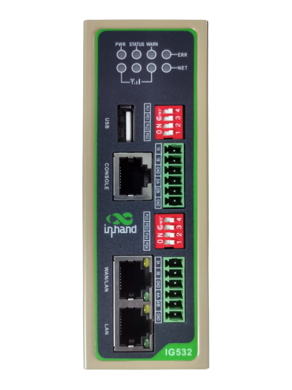
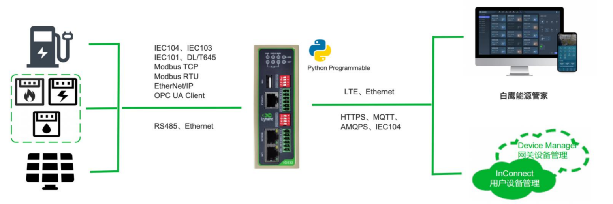

  

    

      
    

    

      多串口边缘网关，打破数据壁垒，为工业数字化赋能
    

  

  

    

      IG532 系列边缘网关
    

    

      

        
· 多网络接入

        
· LoRa自组网

      

      

        
· 云管理

        
· 内置DSA

      

    

  

# 1. 产品概述

**InGateway532（IG532）是面向工业物联网推出的多串口边缘网关，支持4×RS485、LoRa自组网和蜂窝联网。**

**产品特点：**
- **多串口采集:** 支持 4×RS485，满足多设备并行接入
- **LoRa组网:** 可选 LoRa 自组网，支持远距离、低功耗无线传输
- **边缘计算:** ARM Cortex-A8 + Python 开发，内置 DSA 服务
- **协议丰富:** 支持80+工业与电力协议，快速实现采集和上云
- **云端管理:** 支持 Device Manager 与 InConnect 平台远程运维

## 核心技术指标

|技术指标|规格|
|---|---|
|蜂窝网络|LTE Cat1、LTE Cat4（支持 5G 型号）|
|网络接入|APN、VPDN|
|接入认证|CHAP/PAP|
|数据安全|防火墙、OpenVPN、IPSec VPN|
|边缘开发|支持 Python 二次开发|
|云端管理|DeviceLive、InConnect、iSCADA|
|CPU|ARM Cortex-A8 @1GHz|
|内存与存储|512MB RAM，8GB eMMC|
|串口能力|4 × RS485|
|供电与功耗|12~48V DC（防反接），250mA@12V|
|工作温度|-25 ~ 70 ℃|
|防护等级|IP30|

# 2. 产品尺寸

  

    
    
正视图

  

  

    
    
侧视图

  

  

    
    
接口图

  

    
注意：

1.所有尺寸单位为毫米（mm）。

2.所有尺寸均为近似值，仅供参考。

3.图示尺寸不得用于生产加工。

4.尺寸需符合零件及制造公差要求。

5.尺寸如有变更，恕不另行通知。

# 3. 硬件规格

| 类别/参数 | 规格 |
|--------------------------|------|
| **CPU与存储** | |
| CPU | ARM Cortex-A8 @1GHz |
| RAM | 512MB |
| FLASH | 8GB eMMC |
| **连接与接口** | |
| 以太网端口 | 2 × 10/100Mbps |
| 串口 | 4 × RS485 |
| 复位按键 | 针孔式复位按键 ×1 |
| SIM卡座 | 2x  抽屉式卡座 |
| 天线接头 | 4G: SMA×1；Lora×1 |
| LoRa（选配） | 可选支持LoRa |
| 加密芯片（选配） | 国家密码局审核的硬件加密芯片，支持国密SM1/2/3/4算法 |
| LED指示灯 | PWR、STATUS、WARN、ERR、信号强度（3颗）、LTE |
| USB | USB 2.0 ×1 |
| TF | Micro SD |
| **LoRa无线参数** | |
| 通信频段 | 470MHz -510MHz |
| 室内/市区通信距离 | 1km |
| 户外/视距通信距离 | 5km |
| 发射功率 | -9dBm-22dBm，可调 |
| 通信理论速率 | 0.15Kbps-46.8Kbps |
| 灵敏度 | -140dBm |
| 信道 | 80 |
| **电源与功耗** | |
| 输入电压 | 12~48V DC（防反接） |
| 电源接口 | 工业端子 |
| 工作功耗 | 250mA@12V |
| **机械规格** | |
| 产品尺寸 | 120 × 142 × 43 mm |
| 安装方式 | 挂耳、导轨 |
| 防护等级 | IP30 |
| 外壳 | 金属 |
| **环境与认证** | |
| 存储温度 | -40 ~ 85 ℃ |
| 工作温度 | -25 ~ 70 ℃ |
| 环境湿度 | 5~95%（无凝霜） |
| 物理特性 | 防震 IEC60068-2-27  振动 IEC60068-2-6  跌落 IEC60068-2-32 |
| EMC指标 | EN61000-4-2，level 3，静电   EN61000-4-3，level 3，辐射电场 EN61000-4-4，level 3，脉冲电场 EN61000-4-5，level 3，浪涌 EN61000-4-6，level 3，传导骚扰抗扰度 EN61000-4-8，>level 3，工频磁场水平方向/垂直方向 400A/m EN61000-4-12，level 3，震荡波抗绕度 |

# 4. 软件规格

| 类别/参数 | 规格 |
|--------------------------|------|
| **操作系统** | |
| 操作系统 | 定制版 Linux |
| **网络特性** | |
| 网络接入 | APN、VPDN |
| 接入认证 | CHAP/PAP/MS-CHAP/MS-CHAPV2 |
| 网络制式 | LTE Cat1、LTE Cat4 |
| WAN协议 | 静态IP、DHCP、PPPoE |
| LAN协议 | ARP、Ethernet |
| IP应用 | ICMP、DNS、TCP/UDP、TCPServer、DHCP |
| IP路由 | 静态路由 |
| **安全性** | |
| 用户管理 | 支持多级管理权限 |
| 网络安全 | 全状态包检测（SPI）、防范拒绝服务（DoS）攻击 过滤多播/Ping数据包、访问控制列表（ACL） NAT、PAT、DMZ、端口映射、虚拟服务器 |
| 其他技术 | 支持国网加密的IEC 101通讯 |
| **可靠性** | |
| 链路探测 | 心跳检测与断线自动连接 |
| 内置看门狗 | 支持设备故障自恢复 |
| 双卡切换 | 支持 |
| **开放式平台与数据采集协议（DSA）** | |
| Python二次开发 | 支持 Python |
| 云平台对接 | AWS、Azure、阿里云等 |
| 工业协议 | Modbus RTU/TCP、EtherNet/IP、OPC UA、Mitsubishi MC/CPU、FINS、HostLink、PPI 等 |
| 电力协议 | DLT645-2007、IEC101/104、DNP3.0 |
| 其他协议 | BACnet、CNC 等 |
| **网络管理** | |
| 配置方式 | 本地或远程HTTPS、Telnet、SSH方式 |
| 升级方式 | 本地或远程WEB, DM、TFTP、FTP、SFTP server  |
| 日志功能 | 本地/远程日志，重要日志掉电保存 |
| 配置备份 | 配置导入与导出 |
| 远程管理 | DeviceManager、InConnect |
| 网络诊断 | Ping、Traceroute、Sniffer(网络抓包工具) |

# 5. 订购信息

## 型号规则

**Model code:** IG532-\<WMNN\>-\<LRAS/空\>-\<SEC/空\>

\<WMNN\>: 无线通讯类型 & 模块  
\<LRAS/空\>: LoRa 自组网支持  
\<SEC/空\>: 国密芯片支持

## 产品型号

| 型号 | 区域 | 无线制式 | 网口 | 串口 | LoRa | 国密 |
|------|------|---------|------|------|------|------|
| IG532-LQA3 | 中国 CAT1 | LTE-FDD B1/B3/B5/B8；LTE-TDD B34/B38/B39/B40/B41；GSM 900/1800 | 2×FE | 4×RS485 | 无 | 无 |
| IG532-LQA3-LRAS | 中国 CAT1 | LTE-FDD B1/B3/B5/B8；LTE-TDD B34/B38/B39/B40/B41；GSM 900/1800 | 2×FE | 4×RS485 | 支持 | 无 |
| IG532-LQA3-SEC | 中国 CAT1 | LTE-FDD B1/B3/B5/B8；LTE-TDD B34/B38/B39/B40/B41；GSM 900/1800 | 2×FE | 4×RS485 | 无 | 支持 |
| IG532-LQA8 | 中国 CAT4 | LTE FDD/TDD + TD-SCDMA + WCDMA + CDMA + GSM | 2×FE | 4×RS485 | 无 | 无 |
| IG532-LQA8-LRAS | 中国 CAT4 | LTE FDD/TDD + TD-SCDMA + WCDMA + CDMA + GSM | 2×FE | 4×RS485 | 支持 | 无 |
| IG532-NRQ1 | 中国 5G NR | 5G NSA/SA + LTE + WCDMA | 2×FE | 4×RS485 | 无 | 无 |
| IG532-NRQ1-LRAS | 中国 5G NR | 5G NSA/SA + LTE + WCDMA | 2×FE | 4×RS485 | 支持 | 无 |
| IG532-EN00 | 全球无蜂窝 | 无 | 2×FE | 4×RS485 | 无 | 无 |
| IG532-EN00-LRAS | 全球无蜂窝 | 无 | 2×FE | 4×RS485 | 支持 | 无 |

# 6. 联系我们

- **官网：** [映翰通官网](https://www.inhand.com.cn)
- **版权声明：** ©映翰通网络 保留所有权利
