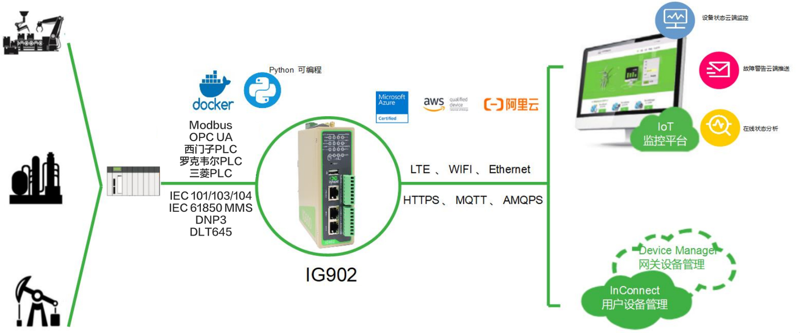

  

    

      
    

    

      高性能边缘网关，打破数据壁垒，让工业数字化更便捷高效
    

  

  

    

      IG902 系列边缘网关
    

    

      

        
· 多网络接入

        
· 边缘计算

      

      

        
· 云管理

        
· DSA

      

    

  

# 1. 产品概述

**InGateway902（IG902）是面向工业物联网推出的高性能边缘网关，支持多网络接入、边缘计算与云端运维。**

**产品特点：**
- **多网络接入:** 支持4G/Wi-Fi/GbE，支持双SIM备份
- **接口丰富:** 千兆以太网、串口、IO、USB、Micro SD，适配复杂现场
- **高性能计算:** ARM Cortex-A8 1GHz，1GB DDR3，支持Python和Docker
- **协议覆盖广:** 支持80+工业与电力协议，支持DSA零代码/低代码部署
- **云端管理:** 支持DeviceLive、InConnect远程管理与批量运维

## 核心技术指标

|技术指标|规格|
|---|---|
|蜂窝网络|LTE Cat4（部分区域型号支持 LTE Cat6）|
|网络接入|APN、VPDN|
|接入认证|CHAP/PAP/MS-CHAP/MS-CHAPV2|
|VPN与安全|IPSec VPN、GRE、L2TP、OPENVPN、防火墙、CA|
|边缘计算|支持 Python 二次开发与 Docker|
|远程管理|DeviceLive、InConnect、iSCADA|
|CPU|ARM Cortex-A8 @1GHz|
|内存与存储|512MB RAM，8GB eMMC|
|以太网接口|2 × 10/100/1000Mbps|
|供电与安装|12~48V DC（防反接）；壁挂、导轨|
|工作温度|-25 ~ 70 ℃|
|防护等级|IP30|

# 2. 产品尺寸 & 端子定义

  

    
    
正视图

  

  

    
    
侧视图

  

  

    
    
接口图

  

  
注意：

1.所有尺寸单位为毫米（mm）。

2.所有尺寸均为近似值，仅供参考。

3.图示尺寸不得用于生产加工。

4.尺寸需符合零件及制造公差要求。

5.尺寸如有变更，恕不另行通知。

## 7pin 端子定义

<table style="width:78%;">
  <colgroup>
    <col style="width:15%;">
    <col style="width:23%;">
    <col style="width:62%;">
  </colgroup>
  <tr><th align="center">引脚</th><th align="center">定义</th><th align="left">说明</th></tr>
  <tr><td align="center">1</td><td align="center">V+</td><td>电源正极</td></tr>
  <tr><td align="center">2</td><td align="center">V-</td><td>电源负极</td></tr>
  <tr><td align="center">3</td><td align="center">TXD</td><td>串口RS232发送</td></tr>
  <tr><td align="center">4</td><td align="center">RXD</td><td>串口RS232接收</td></tr>
  <tr><td align="center">5</td><td align="center">GND</td><td>串口RS232信号地</td></tr>
  <tr><td align="center">6</td><td align="center">A</td><td>串口RS485+</td></tr>
  <tr><td align="center">7</td><td align="center">B</td><td>串口RS485-</td></tr>
</table>

## I/O定义

<table style="width:78%;">
  <colgroup>
    <col style="width:15%;">
    <col style="width:23%;">
    <col style="width:62%;">
  </colgroup>
  <tr><th align="center">引脚</th><th align="center">定义</th><th align="left">说明</th></tr>
  <tr><td align="center">1</td><td align="center">PCOM</td><td>干接点接入端</td></tr>
  <tr><td align="center">2</td><td align="center">DGND</td><td>干接点接地端</td></tr>
  <tr><td align="center">3</td><td align="center">DICOM</td><td>输入公共端</td></tr>
  <tr><td align="center">4</td><td align="center">DI0</td><td>数字量/脉冲输入0号接口</td></tr>
  <tr><td align="center">5</td><td align="center">DI1</td><td>数字量/脉冲输入1号接口</td></tr>
  <tr><td align="center">6</td><td align="center">DI2</td><td>数字量/脉冲输入2号接口</td></tr>
  <tr><td align="center">7</td><td align="center">DI3</td><td>数字量/脉冲输入3号接口</td></tr>
  <tr><td align="center">8</td><td align="center">NC</td><td>无</td></tr>
  <tr><td align="center">9</td><td align="center">DO0</td><td>数字量/脉冲输出0号接口</td></tr>
  <tr><td align="center">10</td><td align="center">DGND</td><td>接地端</td></tr>
  <tr><td align="center">11</td><td align="center">DO1</td><td>数字量/脉冲输出1号接口</td></tr>
  <tr><td align="center">12</td><td align="center">DGND</td><td>接地端</td></tr>
  <tr><td align="center">13</td><td align="center">DO2</td><td>数字量/脉冲输出2号接口</td></tr>
  <tr><td align="center">14</td><td align="center">DGND</td><td>接地端</td></tr>
  <tr><td align="center">15</td><td align="center">DO3</td><td>数字量/脉冲输出3号接口</td></tr>
  <tr><td align="center">16</td><td align="center">DGND</td><td>接地端</td></tr>
</table>

**DI 输入规格：**
- 干接点状态 "1"：闭合；
- 干接点状态 "0"：断开
- 湿接点状态 "1"：+10 ~ +30V / -30 ~ -10V
- 湿接点状态 "0"：0 ~ +3V / -3 ~ 0V
- 隔离：3000VDC
- 支持脉冲信号计数器功能，最高支持 100Hz 脉冲信号

**DO 输出规格：**
- 隔离：3000VDC

# 3. 硬件规格

| 类别/参数 | 规格 |
|--------------------------|------|
| **CPU与存储** | |
| CPU | ARM Cortex-A8 @1GHz |
| RAM | 512MB |
| FLASH | 8GB eMMC |
| **连接与接口** | |
| 以太网端口 | 2 × 10/100/1000Mbps |
| 串口 | RS485×1 + RS232×1 |
| IO口 | 最高支持 4×DI + 4×DO |
| 复位按键 | 针孔式复位按键 ×1 |
| SIM卡座 | 2x 抽屉式卡座 |
| LED指示灯 | POWER, STATUS, WARN, ERROR, MODEM, SIM1, SIM2, TF(扩展卡), PYTHON, USER1, USER2, WIFI, GPS, 信号指示灯 |
| USB | USB 2.0 ×1 |
| TF | Micro SD，最高 32GB |
| WiFi（可选） | 频段: 支持2.4G和5G 协议标准: IEEE 802.11 ac/a/b/g/n 安全特性: 开放系统、共享密钥、WPA/WPA2认证，WEP/TKIP/AES加密 工作模式: AP、Client工作模式 |
| GPS（可选） | 支持 GPS 定位和北斗定位 |
| **电源与功耗** | |
| 输入电压 | 12~48V DC（防反接） |
| 电源接口 | 可插拔工业端子接驳 |
| **机械规格** | |
| 产品尺寸（W × D × H） | 141 × 113 × 45 mm |
| 产品重量 | 626 g |
| 安装方式 | 壁挂、导轨 |
| 防护等级 | IP30 |
| 外壳与散热 | 金属，无风扇散热 |
| RTC | 支持, 超级电容供电 |
| 硬件看门狗 | 支持 |
| **环境与认证** | |
| 存储温度 | -40 ~ 85 ℃ |
| 工作温度 | -25 ~ 70 ℃ |
| 环境湿度 | 5~95%（无凝霜） |
| 物理特性 | 防震 IEC60068-2-27  振动 IEC60068-2-6  跌落 IEC60068-2-32 |
| EMC指标 | EN61000-4-2，level 3，静电   EN61000-4-3，level 3，辐射电场 EN61000-4-4，level 3，脉冲电场 EN61000-4-5，level 3，浪涌 EN61000-4-6，level 3，传导骚扰抗扰度 EN61000-4-8，>level 3，工频磁场水平方向/垂直方向 400A/m EN61000-4-12，level 3，震荡波抗绕度 |
| 认证 | CE、FCC、PTCRB、RCM、IC、IMDA、AT&T、MIC&JATE、MSIP、EAC、ANATEL、UKCA |

# 4. 软件规格

| 类别/参数 | 规格 |
|--------------------------|------|
| **操作系统** | |
| 操作系统 | 定制版 Linux |
| **网络特性** | |
| 网络接入 | APN、VPDN |
| 接入认证 | CHAP/PAP/MS-CHAP/MS-CHAPV2 |
| 网络制式 | LTE Cat4 |
| LAN协议 | ARP、Ethernet |
| IP应用 | Ping、Traceroute、DHCP服务器/中继/客户端、DNS中继、动态域名、DDNS 、Telnet、SSH、HTTPS、TFTP、FTP、SFTP |
| IP路由 | 静态路由 |
| **安全性** | |
| 用户管理 | 支持多级管理权限 |
| 网络安全 | 防火墙-全状态包检测（SPI）、防范拒绝服务（DoS）攻击 过滤多播/Ping数据包、访问控制列表（ACL） NAT、PAT、DMZ、端口映射、虚拟服务器 |
| 数据安全 | IPSec VPN、GRE、L2TP、OPENVPN、CA(可自动申请) |
| AAA本地认证 | Radius、Tacacs+、LDAP |
| **可靠性** | |
| 链路探测 | 心跳检测与断线自动连接 |
| 内置看门狗 | 支持设备故障自恢复 |
| 双卡切换 | 支持 |
| 备份机制 |VRRP，接口备份 |
| **开放式平台与数据采集协议（DSA）** | |
| Python二次开发 | 支持 Python和Docker |
| 云平台对接 | AWS、Azure、阿里云等 |
| 工业协议 | Modbus RTU/TCP、EtherNet/IP、OPC UA、Mitsubishi MC/CPU、FINS、HostLink、PPI 等 |
| 电力协议 | DLT645-2007、IEC101/104、DNP3.0 |
| 其他协议 | BACnet、CNC 等 |
| **网络管理** | |
| 配置方式 | 本地或远程HTTPS、SSH方式 |
| 升级方式 | 本地或远程WEB、DeviceLive、TFTP、FTP、SFTP server |
| 日志功能 | 本地或远程日志输出，日志掉电保存 |
| 配置备份 | 配置导入与导出 |
| 远程管理 | DeviceLive |
| 网络诊断 | Ping、Traceroute、Sniffer(网络抓包工具) |

# 5. 订购信息

## 型号规则

**Model code:** IG902-\<H\>-\<WMNN\>-\<IO/空\>-\<DW/空\>-\<G/空\>

\<H\>: 版本标识  
\<WMNN\>: 无线通讯类型 & 模块  
\<IO/空\>: IO 扩展  
\<DW/空\>: WLAN  
\<G/空\>: GPS

## 产品型号

| 型号 | 区域 | \<WMNN\>: 无线通讯类型 & 模块 | \<IO/空\>: IO | \<DW/空\>: WLAN | \<G/空\>: GPS |
|------|------|-------------------------------|---------------|-----------------|---------------|
| IG902-H-LQA8 | 中国 | LTE CAT4 LTE-FDD: B1/B3/B5/B8 LTE-TDD: B34/B38/B39/B40/B41 TD-SCDMA: B34/B39 WCDMA: B1/B8 CDMA: BC0；GSM: 900/1800MHz | 无 | 无 | 无 |
| IG902-H-LQA8-DW-G | 中国 | LTE CAT4 LTE-FDD: B1/B3/B5/B8 LTE-TDD: B34/B38/B39/B40/B41 TD-SCDMA: B34/B39 WCDMA: B1/B8 CDMA: BC0；GSM: 900/1800MHz | 无 | 支持 | 支持 |
| IG902-H-LQA8-IO-DW-G | 中国 | LTE CAT4 LTE-FDD: B1/B3/B5/B8 LTE-TDD: B34/B38/B39/B40/B41 TD-SCDMA: B34/B39 WCDMA: B1/B8 CDMA: BC0；GSM: 900/1800MHz | 支持 | 支持 | 支持 |
| IG902-H-FQ58 | 欧洲及亚太 | LTE CAT4 LTE-FDD: B1/B2/B3/B5/B7/B8/B20 LTE-TDD: B38/B40/B41 UMTS(DC-HSPA+): B1/B5/B8 GSM: B3/B8 | 无 | 无 | 无 |
| IG902-H-FQ58-DW-G | 欧洲及亚太 | LTE CAT4 LTE-FDD: B1/B2/B3/B5/B7/B8/B20 LTE-TDD: B38/B40/B41 UMTS(DC-HSPA+): B1/B5/B8 GSM: B3/B8 | 无 | 支持 | 支持 |
| IG902-H-FQ58-IO-DW-G | 欧洲及亚太 | LTE CAT4 LTE-FDD: B1/B2/B3/B5/B7/B8/B20 LTE-TDD: B38/B40/B41 UMTS(DC-HSPA+): B1/B5/B8 GSM: B3/B8 | 支持 | 支持 | 支持 |
| IG902-H-FQ39 | 北美 | LTE CAT6 LTE-FDD: B2/B4/B5/B13/B17 UMTS(DC-HSPA+): B2/B5 | 无 | 无 | 无 |
| IG902-H-FQ39-DW-G | 北美 | LTE CAT6 LTE-FDD: B2/B4/B5/B13/B17 UMTS(DC-HSPA+): B2/B5 | 无 | 支持 | 支持 |
| IG902-H-FQ39-IO-DW-G | 北美 | LTE CAT6 LTE-FDD: B2/B4/B5/B13/B17 UMTS(DC-HSPA+): B2/B5 | 支持 | 支持 | 支持 |
| IG902-H-FQ78 | 澳洲及拉美 | LTE CAT4 LTE-FDD: B1/B2/B3/B4/B5/B7/B8/B28 LTE-TDD: B40 UMTS(DC-HSPA+): B1/B2/B5/B8 EDGE/GPRS/GSM: 850/900/1800/1900MHz | 无 | 无 | 无 |
| IG902-H-FQ78-DW-G | 澳洲及拉美 | LTE CAT4 LTE-FDD: B1/B2/B3/B4/B5/B7/B8/B28 LTE-TDD: B40 UMTS(DC-HSPA+): B1/B2/B5/B8 EDGE/GPRS/GSM: 850/900/1800/1900MHz | 无 | 支持 | 支持 |
| IG902-H-FQ78-IO-DW-G | 澳洲及拉美 | LTE CAT4 LTE-FDD: B1/B2/B3/B4/B5/B7/B8/B28 LTE-TDD: B40 UMTS(DC-HSPA+): B1/B2/B5/B8 EDGE/GPRS/GSM: 850/900/1800/1900MHz | 支持 | 支持 | 支持 |
| IG902-H-FQ88 | 日本 | LTE CAT4 LTE FDD: B1/B3/B8/B18/B19/B26 LTE TDD: B41 WCDMA: B1/B6/B8/B19 | 无 | 无 | 无 |
| IG902-H-FQ88-DW-G | 日本 | LTE CAT4 LTE FDD: B1/B3/B8/B18/B19/B26 LTE TDD: B41 WCDMA: B1/B6/B8/B19 | 无 | 支持 | 支持 |
| IG902-H-FQ88-IO-DW-G | 日本 | LTE CAT4 LTE FDD: B1/B3/B8/B18/B19/B26 LTE TDD: B41 WCDMA: B1/B6/B8/B19 | 支持 | 支持 | 支持 |
| IG902-H-FQ98 | 韩国 | LTE CAT4 LTE FDD: B1/B3/B5/B7/B8/B20 LTE TDD: B38/B40/B41 WCDMA: B1/B5/B8 EDGE/GSM: B3/B8 | 无 | 无 | 无 |
| IG902-H-FQ98-DW-G | 韩国 | LTE CAT4 LTE FDD: B1/B3/B5/B7/B8/B20 LTE TDD: B38/B40/B41 WCDMA: B1/B5/B8 EDGE/GSM: B3/B8 | 无 | 支持 | 支持 |
| IG902-H-FQ98-IO-DW-G | 韩国 | LTE CAT4 LTE FDD: B1/B3/B5/B7/B8/B20 LTE TDD: B38/B40/B41 WCDMA: B1/B5/B8 EDGE/GSM: B3/B8 | 支持 | 支持 | 支持 |
| IG902-H-EN00 | 全球（无蜂窝） | 无 | 无 | 无 | 无 |
| IG902-H-EN00-DW-G | 全球（无蜂窝） | 无 | 无 | 支持 | 支持 |
| IG902-H-EN00-IO-DW-G | 全球（无蜂窝） | 无 | 支持 | 支持 | 支持 |

# 6. 联系我们

- **官网：** [映翰通官网](https://www.inhand.com.cn)
- **版权声明：** ©映翰通网络 保留所有权利
