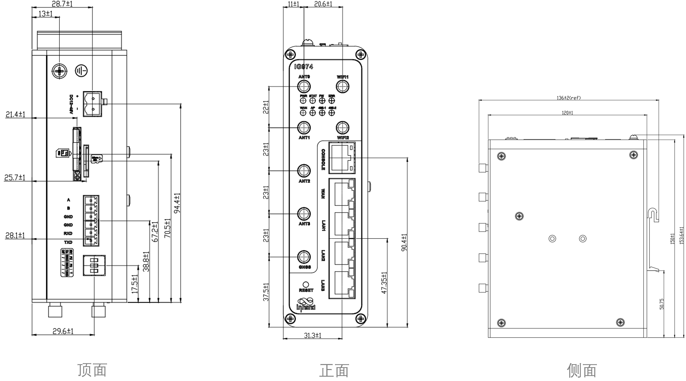
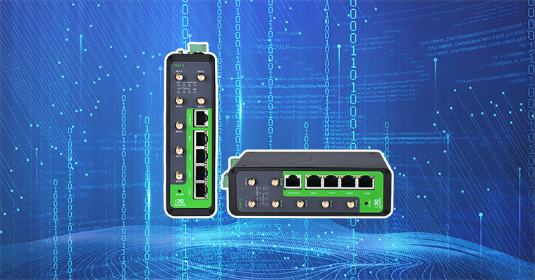
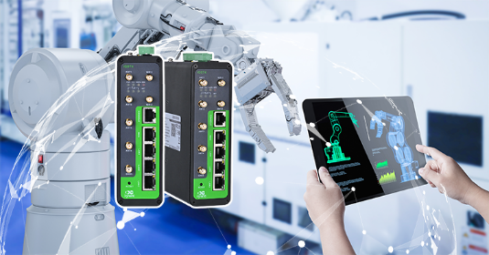

  

    

      
    

    

      工业化设计，安全可靠，助力企业数字化升级
    

  

  

    

      InGateway974 工业级 5G 边缘网关
    

    

      

        
· 边缘算力

        
· 接口丰富

      

      

        
· 云管理

        
· 内置DSA

      

    

  

# 1. 产品概述

**InGateway974（IG974）是面向工业物联网的新一代工业级 5G 边缘网关，具备高可靠连接、边缘计算和云端管理能力。**

**产品特点：**
- **高可靠通信:** 内嵌看门狗、链路检测与自动重连，保障业务连续
- **接口丰富:** 4×千兆网口、RS232/RS485、可选 Wi-Fi 与 GPS
- **边缘算力:** 四核 ARM Cortex-A7，支持 Python 与 Docker
- **工业设计:** IP30 金属机身，导轨安装，支持宽温宽压供电
- **云端运维:** 支持 Device Manager 和 InConnect 远程管理

## 核心技术指标

|技术指标|规格|
|---|---|
|蜂窝网络|5G Sub-6 SA/NSA、LTE FDD/TDD、WCDMA（依型号）|
|网络接入|APN、VPDN|
|接入认证|CHAP/PAP/MS-CHAP/MS-CHAPV2|
|边缘开发|支持 Python 二次开发|
|工业协议|Modbus RTU/TCP、OPC UA Client、ISO on TCP 等|
|远程管理|支持 InHand Device Manager 与 InConnect 平台|
|CPU|ARM Cortex-A7 四核|
|内存与存储|1GB DDR3，8GB eMMC|
|以太网接口|4 × 10/100/1000Mbps（1WAN + 3LAN）|
|供电与电源|DC 12~48V，工业端子|
|工作温度|-20 ~ 70 ℃|
|防护等级|IP30|

# 2. 产品尺寸

  
注意：

1.所有尺寸单位为毫米（mm）。

2.所有尺寸均为近似值，仅供参考。

3.图示尺寸不得用于生产加工。

4.尺寸需符合零件及制造公差要求。

5.尺寸如有变更，恕不另行通知。

  

    
    
正视图

  

  

    
    
侧视图

  

  

    
    
接口图

  

# 3. 硬件规格

| 类别/参数 | 规格 |
|--------------------------|------|
| **CPU与存储** | |
| CPU | ARM Cortex-A7 四核 |
| RAM | 1GB DDR3 |
| FLASH | 8GB eMMC |
| **连接与接口** | |
| 以太网端口 | 4 × 10/100/1000Mbps（1WAN + 3LAN） |
| 串口 | RS232 × 1，RS485 × 1（工业端子） |
| 复位按键 | 针孔式复位按键 × 1 |
| SIM卡座 | SIM × 1（支持 1.8V / 3V） |
| 天线接头 | 5G 天线 × 4，Wi-Fi 天线 × 2 |
| LED指示灯 |  PWR, STATUS,WARN, ERR,信号强度指示灯（3颗）,  NET |
| WiFi（可选） | 2.4G/5G，802.11 ac/a/b/g/n，支持 AP/STA |
| GPS（可选） | 支持GPS和北斗定位 |
| **电源与功耗** | |
| 输入电压 | DC 12~48V |
| 电源接口 | 工业端子 |
| 待机功耗 | 500mA@12VDC |
| 工作功耗 | 650mA@12VDC |
| 峰值功耗 | 650mA@12VDC |
| 电源保护 | 防反接、过流保护 |
| **机械规格** | |
| 安装方式 | 导轨安装 |
| 防护等级 | IP30 |
| 外壳与散热 | 金属结构 |
| **环境与认证** | |
| 存储温度 | -40 ~ 85 ℃ |
| 工作温度 | -20 ~ 70 ℃ |
| 环境湿度 | 5 ~ 95%（无凝霜） |
| 物理特性 | 防震 IEC60068-2-27  振动 IEC60068-2-6  跌落 IEC60068-2-32 |
| EMC指标 | EN61000-4-2，level 4，静电   EN61000-4-3，level 4，辐射电场 EN61000-4-4，level 4，脉冲电场 EN61000-4-5，level 4，浪涌 EN61000-4-6，level 4，传导骚扰抗扰度 EN61000-4-8，level 4，工频磁场 EN61000-4-12，level 4，震荡波抗绕度 |
| 认证 | CE、FCC、PTCRB、IC、Verizon、AT&T |

# 4. 软件规格

| 类别/参数 | 规格 |
|--------------------------|------|
| **操作系统** | |
| 操作系统 | 定制 Linux |
| **网络特性** | |
| 网络接入 | APN、VPDN |
| 接入认证 | CHAP/PAP/MS-CHAP/MS-CHAPV2 |
| 网络制式 | 5G Sub-6 SA/NSA、LTE FDD/TDD、WCDMA（依型号） |
| WAN协议 | 静态 IP、DHCP |
| LAN协议 | ARP、Ethernet |
| IP应用 | IPv4、ICMP、DNS、TCP、UDP、TCPServer、DHCP |
| IP路由 | 静态路由 |
| 网络诊断 | Ping、Traceroute |
| **安全性** | |
| 用户管理 | 支持多级用户管理 |
| 数据安全 | OpenVPN、IPSec VPN |
| **可靠性** | |
| 链路探测 | 心跳检测、断线自动连接 |
| 内置看门狗 | 支持设备故障自恢复 |
| **开放式平台与数据采集协议（DSA）** | |
| Python二次开发 | 支持 Python |
| Docker | 支持 Docker 容器 |
| 云平台对接 | AWS、Azure、阿里云等 |
| 工业协议 | Modbus RTU/TCP、OPC UA Client、ISO on TCP 等 |
| **网络管理** | |
| 配置方式 | Web 配置 |
| 升级方式 | 支持专有升级机制，利用本地或远程方式进行固件升级 |
| 日志功能 | 支持本地系统日志、远程日志，重要日志掉电保存 |
| 配置备份 | 配置导入、配置导出 |
| 远程管理 | 支持InHand Device Manager网管云平台;支持InConnet平台; HTTP 、HTTPS、Telnet 、SSH等方式； |

# 5. 订购信息

## 型号规则

**Model code:** IG974-\<WMNN\>-\<W\>-\<G\>

\<WMNN\>: 无线通讯类型 & 模块  
\<W\>: WLAN  
\<G\>: GPS

## 产品型号

| 型号 | 区域 | \<WMNN\>: 无线通讯类型 & 模块 | \<W\>: WLAN | \<G\>: GPS |
|------|------|-------------------------------|-------------|-----------|
| IG974-LQA8 | 中国 | LTE CAT4 LTE-FDD: B1/B3/B5/B8 LTE-TDD: B34/B38/B39/B40/B41 TD-SCDMA: B34/B39 WCDMA: B1/B8 CDMA: BC0 GSM: 900/1800MHz | 无 | 无 |
| IG974-LQA8-W-G | 中国 | LTE CAT4 LTE-FDD: B1/B3/B5/B8 LTE-TDD: B34/B38/B39/B40/B41 TD-SCDMA: B34/B39 WCDMA: B1/B8 CDMA: BC0 GSM: 900/1800MHz | 支持 | 支持 |
| IG974-NRQ0 | 全球（北美除外） | 5G NR NSA: n38*/n41/n71/n77/n78/n79 5G NR SA: n1/n2/n3/n5/n7/n8/n12/n20/n25/n28*/n38/n40/n41/n48/n66/n71/n77/n78/n79 LTE-FDD: B1/B2/B3/B4/B5/B7/B8/B12/B13/B14/B17/B18/B19/B20/B25/B26/B28/B29/B30/B32/B66/B71 LTE-TDD: B34/B38/B39/B40/B41/B42/B43/B48 WCDMA: B1/B2/B3/B4/B5/B8/B19 | 无 | 无 |
| IG974-NRQ0-W-G | 全球（北美除外） | 5G NR NSA: n38*/n41/n71/n77/n78/n79 5G NR SA: n1/n2/n3/n5/n7/n8/n12/n20/n25/n28*/n38/n40/n41/n48/n66/n71/n77/n78/n79 LTE-FDD: B1/B2/B3/B4/B5/B7/B8/B12/B13/B14/B17/B18/B19/B20/B25/B26/B28/B29/B30/B32/B66/B71 LTE-TDD: B34/B38/B39/B40/B41/B42/B43/B48 WCDMA: B1/B2/B3/B4/B5/B8/B19 | 支持 | 支持 |
| IG974-EN00 | 无蜂窝 | 无 | 无 | 无 |
| IG974-EN00-W-G | 无蜂窝 | 无 | 支持 | 支持 |

# 6. 联系我们

- **官网：** [映翰通官网](https://www.inhand.com.cn)
- **版权声明：** ©映翰通网络 保留所有权利
