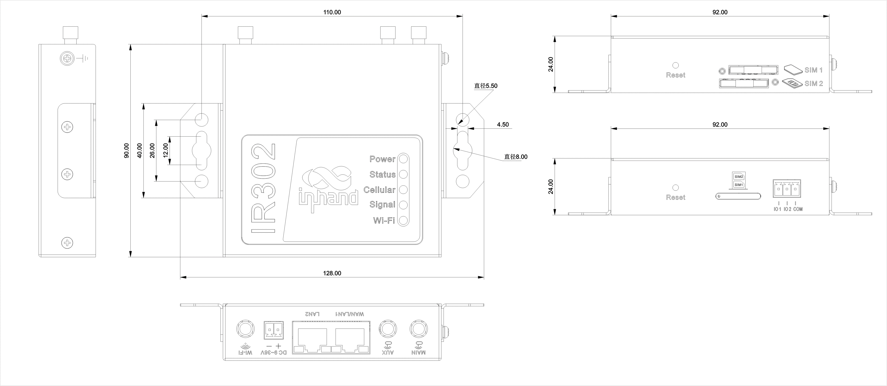
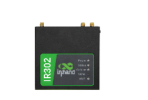
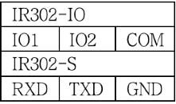

  

    

      
    

    

      经济型工业路由器，4G接入，云管理与安全防护
    

  

  

    

      InRouter302 工业路由器
    

    

      

        
· 4G

        
· Wi-Fi

      

      

        
· 云管理

        
· 安全

      

    

  

# 1. 产品概述

**InRouter302（IR302）系列是一款面向工业与商业物联网场景的经济型无线路由器，集成4G、Wi-Fi与VPN能力。**

**产品特点：**
- **便捷接入:** 支持蜂窝、有线和Wi-Fi多种接入方式，组网灵活
- **可靠通信:** 支持双SIM切换、VRRP及多级链路检测机制
- **安全加固:** 支持SPI防火墙、ACL、DoS防护和多种VPN协议
- **云端运维:** 支持Device Manager云平台远程批量管理
- **工业设计:** 支持导轨/挂耳安装，IP30防护，宽温宽压运行

## 核心技术指标

| 技术指标 | 规格 |
|----------|------|
| 蜂窝网络 | LTE CAT4/CAT1（按型号） |
| 双卡与高可用 | 支持 2 × Nano SIM，支持 VRRP 热备份、双卡切换与链路探测 |
| VPN 与数据安全 | 支持 IPSec（IKEv1/IKEv2）、L2TP、PPTP、GRE、OpenVPN、WireGuard、ZeroTier |
| 网络特性 | 支持 APN/VPDN、CHAP/PAP；Static IP/DHCP/PPPoE；IPv4、DDNS、IP Passthrough；静态路由与 NAT |
| 安全防护 | SPI 状态检测、DoS 防护、ACL、内容过滤、端口映射、虚拟 IP 映射、IP-MAC 绑定；支持 CA 证书 |
| Wi‑Fi（可选） | 2.4 GHz，802.11 b/g/n，最高 150 Mbps，发射功率 16 dBm ±2 dBm |
| 以太网接口 | 2 × 10/100 Mbps RJ45（WAN/LAN） |
| 串口与 I/O（可选） | 1 × RS232；2 × I/O（DI/DO 可配置） |
| 供电 | DC 9~36V，防过流、防反接，2PIN 工业端子 |
| 尺寸与重量 | 98.3 × 92 × 24 mm；约 259 g |
| 工作环境 | 工作温度 常规：-35 ~ 70 ℃；拓展：-40 ~ 75 ℃；湿度 5% ~ 95%（无凝霜） |
| 防护等级 | IP30 |

# 2. 产品尺寸

  

    
    
正视图

  

  

    
    
侧视图

  

  

    
    
接口图

  

  
注意：

  
1.所有尺寸单位为毫米（mm）。

  
2.所有尺寸均为近似值，仅供参考。

  
3.图示尺寸不得用于生产加工。

  
4.尺寸需符合零件及制造公差要求。

  
5.尺寸如有变更，恕不另行通知。

# 3. 硬件规格

| 类别/参数 | 规格 |
|--------------------------|------|
| **CPU与存储** | |
| CPU | 580 MHz |
| RAM | 128 MB DDR2 |
| Flash | 32 MB SPI |
| **连接与接口** | |
| 以太网端口 | 2 × 10/100 Mbps RJ45（WAN/LAN） |
| 电源接口 | DC 9~36V，防过流、防反接，2PIN工业端子 |
| I/O口（可选） | 2 × I/O（DI/DO可配置） |
| 串口（可选） | 1 × RS232 |
| 复位按键 | 针孔式复位按键 |
| SIM卡座 | 抽屉式卡座，支持 2 × Nano SIM |
| 天线接头 | 4G: 1 × SMA（北美型号为 2 × SMA）；Wi-Fi: 1 × RP-SMA |
| **WiFi** | |
| 无线频率 | 2.4 GHz |
| 最大传输速率 | 150 Mbps |
| 协议 | 802.11 b/g/n |
| 发射功率 | 802.11b: 16 dBm ±2 dBm (11 Mbps)； 802.11g: 16 dBm ±2 dBm (54 Mbps)；  802.11n@ 2.4 GHz: 16 dBm ±2 dBm (HT20 MCS7)；  802.11n@ 2.4 GHz: 16 dBm ±2 dBm (HT40 MCS7)； |
| 传输距离 | 视距约50米（受现场环境影响） |
| **设备功率** | |
| 待机功率 | 80~90 mA@12V |
| 工作功率 | 100~120 mA@12V |
| 峰值功率 | 190 mA@12V |
| **机械规格** | |
| 产品尺寸（W × D × H） | 98.3 × 92 × 24 mm |
| 产品重量 | 259 g |
| 安装方式 | 挂耳、导轨 |
| 防护等级 | IP30 |
| **环境与认证** | |
| 存储温度 | -40 °C ~ +85 °C |
| 工作温度 | 常规：-35 ~ 70 ℃ 拓展：-40 ~ 75 ℃ |
| 环境湿度 | 5% ~ 95%（无凝霜） |
| 物理特性 | 防震 IEC60068-2-27  振动 IEC60068-2-6  跌落 IEC60068-2-32 |
| EMC指标 | EN61000-4-2，level 2，静电   EN61000-4-3，level 2，辐射电场  EN61000-4-4，level 2，脉冲电场 EN61000-4-5，level 2，浪涌 EN61000-4-6，level 2，传导骚扰抗扰度 EN61000-4-8，>level 2，工频磁场抗绕度，水平方向/垂直方向 400A/m EN61000-4-12，level 2，震荡波抗绕度 |
| 认证 | CE, CB, UKCA, E-MARK, FCC, IC, PTCRB, AT&T, Verizon, RCM, CCC, EAC&FAC, UL, ANATEL, MIC&JATE, IEC 62443-4-2, EN 18031, NOM, IFETEL, ICASA |

# 4. 软件规格

| 类别/参数 | 规格 |
|--------------------------|------|
| **网络特性** | |
| 网络接入 | APN, VPDN |
| 接入认证 | CHAP/PAP |
| 网络制式 | GSM/GPRS/EDGE, UMTS/HSPA+/EVDO/TD-SCDMA, TDD LTE/FDD LTE |
| WAN协议 | Static IP, DHCP, PPPoE |
| LAN协议 | ARP, Ethernet |
| IP应用 | IPv4, Ping, Trace, DHCP Server/Relay/Client, DNS relay, DDNS, Telnet, IP Passthrough |
| IP路由 | 静态路由 |
| NAT功能 | NAT地址转换 |
| **安全性** | |
| 网络安全 | SPI状态检测、DoS防护、ACL、内容过滤、端口映射、虚拟IP映射、IP-MAC绑定 |
| 数据安全 | PPTP, L2TP, GRE, IPSec (IKEv1/IKEv2), OpenVPN, WireGuard, ZeroTier |
| CA证书 | 支持 CA 证书 |
| **可靠性** | |
| 链路探测 | 发送心跳包探测，断线自动连接 |
| 内置看门狗 | 支持 |
| 备份功能 | VRRP热备份 |
| 双卡切换 | 支持 |
| **WLAN** | |
| 工作模式 | AP/Client（Wi-Fi 选配） |
| 安全特性 | WPA/WPA2；WEP/TKIP/AES |
| **智能化** | |
| DTU功能 | TCP/UDP透传 |
| 网桥 | Modbus RTU转Modbus TCP |
| **网络管理** | |
| 配置方式 | Telnet/Web/SSH/Console |
| 升级方式 | Web与Device Manager升级 |
| 日志功能 | 本地/远程/串口日志 |
| 短信功能 | 远程状态查询、配置、重启；按需拨号中的短信激活 |
| 按需拨号 | 数据/短信激活 |
| 网管功能 | Device Manager平台批量管理 |
| 简单网络管理功能 | SNMP v1/v2c/v3，SNMP TRAP |
| 流量管理 | 流量阈值、统计 |
| 告警功能 | 流量告警；系统重启、LAN上下线、SIM故障告警 |
| 维护工具 | Ping、路由跟踪、网络测试、抓包 |
| 状态查询 | 系统状态，Modem状态，网络连接状态，路由状态 |

# 5. 订购信息

## 型号规则

**Model code:** IR302-\<WMNN\>-\<WLAN/NA\>-\<IO/S/NA\>

\<WMNN\>: 无线通讯类型 & 模块  
\<WLAN/NA\>: Wi-Fi（NA为无Wi-Fi）  
\<IO/S/NA\>: Serial/IO

## 产品型号

| 型号 | 区域 | \<WMNN\>: 无线通讯类型 & 模块 | \<WLAN/NA\>: Wi-Fi | \<IO/S/NA\>: Serial/IO |
|------|------|------------------------------|--------------------|------------------------|
| IR302-LQ28-\<WLAN/NA\>-S | 中国 | LTE CAT4 FDD: B1/B3/B5/B8 TDD: B34/B38/B39/B40/B41 WCDMA: B1/B8 TD-SCDMA: B34/B39 EVDO/CDMA: BC0 GSM: B3/B8 | WLAN 或 NA | S: 1×RS232 |
| IR302-LQ28-\<WLAN/NA\>-S-L | 中国 | LTE CAT4 FDD: B1/B3/B5/B8 TDD: B34/B38/B39/B40/B41 WCDMA: B1/B5/B8 GSM/EDGE: B3/B8 | WLAN 或 NA | S: 1×RS232 |
| IR302-FQ58-\<WLAN/NA\>-\<IO/S\> | 欧洲、亚太 | LTE CAT4 FDD: B1/B3/B7/B8/B20/B28A WCDMA: B1/B8 GSM: B3/B8 | WLAN 或 NA | IO: 2×IO；S: 1×RS232 |
| IR302-FQ58-\<WLAN/NA\>-\<IO/S\>-L | 欧洲、亚太、澳洲 | LTE CAT4 FDD: B1/B3/B5/B7/B8/B20/B28 TDD: B38/B40/B41 WCDMA: B1/B5/B8 GSM/EDGE: B3/B8 | WLAN 或 NA | IO: 2×IO；S: 1×RS232 |
| IR302-FQ53-\<WLAN/NA\> | 欧洲、中东、非洲 | LTE CAT1 FDD: B1/B3/B7/B8/B20/B28 WCDMA: B1/B8 GSM/EDGE: B3/B8 | WLAN 或 NA | — |
| IR302-FQ38-\<WLAN/NA\>-\<IO/S\> | 北美 | LTE CAT4 FDD: B2/B4/B5/B12/B13/B14/B66/B71 WCDMA: B2/B4/B5 | WLAN 或 NA | IO: 2×IO；S: 1×RS232 |
| IR302-FQ33-\<WLAN/NA\>-\<IO/S\> | 北美 | LTE CAT1 FDD: B2/B4/B5/B12/B13/B25/B26 WCDMA: B2/B4/B5 | WLAN 或 NA | IO: 2×IO；S: 1×RS232 |
| IR302-FQ78-\<WLAN/NA\>-\<IO/S\> | 澳洲、拉丁美洲 | LTE CAT4 FDD: B1/B2/B3/B4/B5/B7/B8/B28 TDD: B40 WCDMA: B1/B2/B5/B8 GSM: B2/B3/B5/B8 | WLAN 或 NA | IO: 2×IO；S: 1×RS232 |
| IR302-FQ88-\<WLAN/NA\>-S | 日本 | LTE CAT4 FDD: B1/B3/B8/B18/B19/B26 TDD: B41 WCDMA: B1/B6/B8/B19 | WLAN 或 NA | S: 1×RS232 |
| IR302-EN00-WLAN | 全球 | 无蜂窝 | WLAN | NA |
| IR302-EN00-WLAN-S-485 | 全球 | 无蜂窝 | WLAN | S: 1×RS485 |
| IR302-FQ58-S-485 | 欧洲、亚太 | LTE CAT4 FDD: B1/B3/B7/B8/B20/B28A WCDMA: B1/B8 GSM: B3/B8 | NA | S: 1×RS485 |
| IR302-FQ68-\<WLAN/NA\>-S | 拉丁美洲 | LTE CAT4 FDD: B1/B2/B3/B4/B5/B7/B8/B28/B66 TDD: B40 WCDMA: B1/B2/B4/B5/B8 GSM: B2/B3/B5/B8 | WLAN 或 NA | S: 1×RS232 |

# 6. 联系我们

- **官网：** [映翰通官网](https://www.inhand.com.cn)
- **版权声明：** ©映翰通网络 保留所有权利
