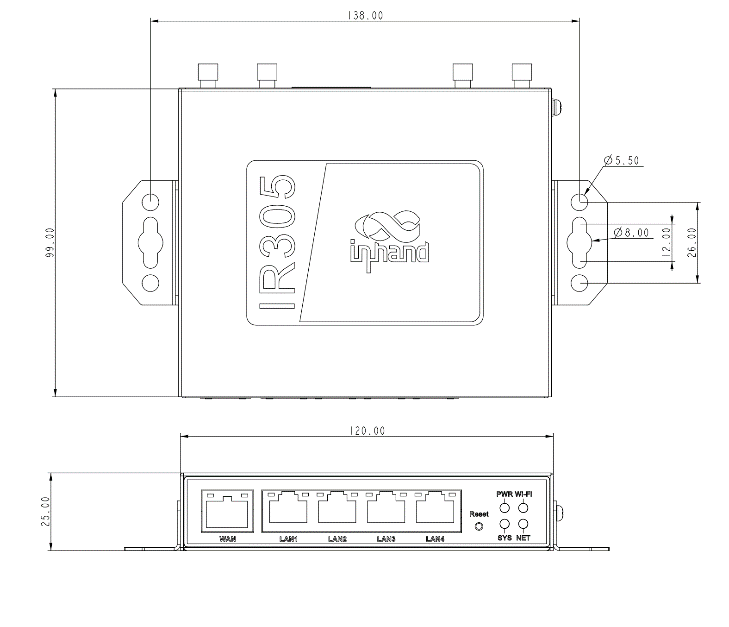
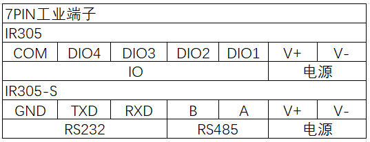
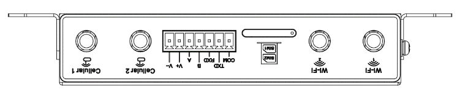

  

    

      
    

    

      5G经济型多网口蜂窝路由器，安全互联与云端运维
    

  

  

    

      InRouter305 工业路由器
    

    

      

        
· 5G/4G

        
· Wi-Fi

      

      

        
· 云管理

        
· 工业接口

      

    

  

# 1. 产品概述

**InRouter305（IR305）系列是一款面向工业与商业物联网场景的经济型多网口蜂窝路由器，集成5G/4G、Wi-Fi与VPN能力。**

**产品特点：**
- **多样接入:** 支持蜂窝、有线和Wi-Fi接入，适配复杂网络环境
- **高可用连接:** 双SIM切换、VRRP与多层链路检测保障在线
- **安全防护:** 多种VPN协议、SPI防火墙、访问控制与证书机制
- **云端管理:** 支持Device Manager平台，便捷远程运维与批量管理
- **工业扩展:** 五网口设计，支持串口/IO/GNSS等灵活型号组合

## 核心技术指标

|技术指标|规格|
|---------|------|
|蜂窝网络|5G NR（SA/NSA）或 LTE（按型号）；双 Nano SIM|
|VPN|IPSec、PPTP、L2TP、GRE、DMVPN、OpenVPN、WireGuard|
|Wi-Fi（可选）|2.4 GHz，IEEE 802.11 b/g/n，最高 300 Mbps|
|防火墙与访问控制|SPI 状态检测、DoS 防护、ACL、内容过滤、端口/IP 映射、IP-MAC 绑定等|
|云管理与网管|Device Manager 平台；SNMP v1/v2c/v3，SNMP TRAP|
|动态路由与高可用|静态路由、OSPF；VRRP、链路在线检测、双 SIM 切换、内嵌看门狗|
|以太网接口|5 × 10/100 Mbps RJ45，支持 WAN/LAN/VLAN，1.5KV 网络隔离变压保护|
|串口与 I/O（可选）|1×RS232+1×RS485 或 4×IO（按型号）|
|供电|DC 9~36 V，防过流/防反接，2PIN 工业端子|
|尺寸与重量|120 × 99 × 25 mm；354 g|
|工作温度|-20 °C ~ +70 °C|
|防护等级|IP30|

# 2. 产品尺寸

  

    
    
正视图

  

  

    
    
侧视图

  

  

    
    
接口图

  

    
注意：

    
1.所有尺寸单位为毫米（mm）。

    
2.所有尺寸均为近似值，仅供参考。

    
3.图示尺寸不得用于生产加工。

    
4.尺寸需符合零件及制造公差要求。

    
5.尺寸如有变更，恕不另行通知。

# 3. 硬件规格

| 类别/参数 | 规格 |
|--------------------------|------|
| **CPU与存储** | |
| CPU | 580 MHz |
| RAM | 128 MB DDR2 |
| Flash | 64 MB SPI |
| **连接与接口** | |
| 以太网端口 | 5 × 10/100 Mbps RJ45，支持 WAN/LAN/VLAN，1.5KV 网络隔离变压保护 |
| 电源接口 | DC 9~36V，防过流/防反接，2PIN 工业端子 |
| I/O口（可选） | 4 × IO（DI/DO 可配置） |
| 串口（可选） | 1 × RS232 + 1 × RS485 |
| 复位按键 | 针孔式复位按键 |
| SIM卡座 | 抽屉式卡座 ×1，支持 2 × Nano SIM |
| 天线接头 | 5G: SMA ×2；4G: SMA ×1（北美 4G 型号为 SMA ×2）；Wi-Fi: RP-SMA ×2 |
| 接地端子 | 支持 |
| LED指示灯 | Power, Status, Cellular, Wi-Fi |
| GNSS（可选） | 部分型号支持（参见订购信息 \<G/NA\>） |
| **WiFi** | |
| 无线频率 | 2.4 GHz |
| 最大传输速率 | 300 Mbps |
| 协议 | IEEE 802.11 b/g/n |
| 发射功率 | 802.11b: 16 dBm ±2 dBm (11 Mbps)； 802.11g: 16 dBm ±2 dBm (54 Mbps)； 802.11n@2.4 GHz: 16 dBm ±2 dBm (HT20 MCS7)； 802.11n@2.4 GHz: 16 dBm ±2 dBm (HT40 MCS7) |
| 传输距离 | 视距约 50 米（受现场环境影响） |
| **设备功率** | |
| 待机功率 | 120~200 mA@12V |
| 工作功率 | 150~320 mA@12V |
| 峰值功率 | 320 mA@12V |
| **机械规格** | |
| 产品尺寸（W × D × H） | 120 × 99 × 25 mm |
| 产品重量 | 354 g |
| 安装方式 | 挂耳、导轨 |
| 防护等级 | IP30 |
| 外壳与散热 | 金属壳，无风扇散热 |
| **环境与认证** | |
| 存储温度 | -40~85 ℃ |
| 工作温度 | -20~70 ℃ |
| 环境湿度 | 5~95%（无凝霜） |
| 物理特性 | 防震 IEC60068-2-27 振动 IEC60068-2-6 跌落 IEC60068-2-32 |
| EMC指标 | EN61000-4-2，level 3，静电 EN61000-4-3，level 3，辐射电场 EN61000-4-4，level 3，脉冲电场 EN61000-4-5，level 3，浪涌 EN61000-4-6，level 3，传导骚扰抗扰度 EN61000-4-8，>level 2，工频磁场抗绕度，水平方向/垂直方向 400A/m EN61000-4-12，level 3，震荡波抗绕度 |
| 认证 | CE, CB, UKCA, E-MARK, FCC, IC, PTCRB, AT&T, Verizon, T-mobile, Anatel |

# 4. 软件规格

| 类别/参数 | 规格 |
|--------------------------|------|
| **网络特性** | |
| 网络接入 | APN、VPDN |
| 接入认证 | CHAP/PAP |
| 网络制式 | GSM/GPRS/EDGE、UMTS/HSPA+/EVDO/TD-SCDMA、TDD LTE/FDD LTE、5G NR（SA/NSA） |
| WAN协议 | PPP、PPPoE、DHCP |
| LAN协议 | ARP、Ethernet |
| IP应用 | Ping、Trace、DHCP Server/Relay/Client、DNS relay、DDNS、Telnet |
| IP路由 | 静态路由、OSPF 动态路由 |
| NAT功能 | NAT 地址转换 |
| **安全性** | |
| 网络安全 | SPI 状态检测、DoS 防护、ACL、内容过滤、端口映射、虚拟 IP 映射、IP-MAC 绑定 |
| 数据安全 | PPTP、L2TP、GRE、IPSec VPN、DMVPN、OpenVPN、WireGuard |
| CA证书 | 支持数字证书 CA |
| **可靠性** | |
| 链路探测 | 链路在线检测 |
| 内置看门狗 | 内嵌看门狗 |
| 热备份机制 | 支持VRRP 热备份机制 |
| 双卡切换 | 双 SIM 切换 |
| **WLAN** | |
| 工作模式 | AP/Client/WDS（Wi-Fi 选配） |
| 安全特性 | WPA/WPA2；WEP/TKIP/AES |
| **智能化** | |
| DTU功能 | TCP/UDP 透明传输，DCTCP/DCUDP 模式 |
| 网桥 | Modbus RTU 转 Modbus TCP |
| **网络管理** | |
| QoS管理 | 支持带宽限制，IP 限速 |
| 配置方式 | Telnet/Web/SSH/Console |
| 升级方式 | Web 与 DM（Device Manager）升级 |
| 日志功能 | 本地/远程/串口日志 |
| 短信功能 | 短信激活；远程状态查询、重启 |
| 网管功能 | Device Manager 平台 |
| 简单网络管理功能 | SNMP v1/v2c/v3，SNMP TRAP |
| 流量管理 | 流量阈值、统计 |
| 告警功能 | 统计告警；系统重启、LAN 端口上下线、SIM 故障告警 |
| 维护工具 | Ping、路由跟踪、网速测试 |
| 状态查询 | 系统、Modem、网络连接、路由状态 |

# 5. 订购信息

## 型号规则

**Model code:** IR305-\<WMNN\>-\<WLAN/NA\>-\<S/NA\>-\<G/NA\>

\<WMNN\>: 无线通讯类型 & 模块  
\<WLAN/NA\>: Wi-Fi  
\<S/NA\>: 串口/IO  
\<G/NA\>: GNSS

## 产品型号

| 型号 | 区域 | \<WMNN\>: 无线通讯类型 & 模块 | \<WLAN/NA\>: Wi-Fi | \<S/NA\>: 串口/IO | \<G/NA\>: GNSS |
|------|------|------------------------------|--------------------|------------------|----------------|
| IR305-NRQ2-\<WLAN/NA\>-\<S/NA\> | 中国 | 5G NR NSA: n41/n78/n79 5G NR SA: n1/n28*/n41/n77/n78/n79 LTE-FDD: B1/B3/B5/B8 LTE-TDD: B34/B38/B39/B40/B41 WCDMA: B1/B5/B8 | WLAN 或 NA | S: 1×RS232+1×RS485；NA: 4×IO | — |
| IR305-LQ20-\<WLAN/NA\>-\<S/NA\> | 中国 | CAT4 FDD: B1/B3/B5/B8 TDD: B34/B38/B39/B40/B41 WCDMA: B1/B5/B8 GSM: B3/B8 | WLAN 或 NA | S: 1×RS232+1×RS485；NA: 4×IO | — |
| IR305-FQ58-\<WLAN/NA\>-\<S/NA\>-\<G/NA\> | 欧洲/亚太 | CAT4 FDD: B1/B3/B7/B8/B20/B28A TDD: B38/B40/B41 WCDMA: B1/B8 GSM: B3/B8 | WLAN 或 NA | S: 1×RS232+1×RS485；NA: 4×IO | G 或 NA |
| IR305-FQ53-\<WLAN/NA\>-\<S/NA\> | 欧洲/亚太 | CAT1 FDD: B1/B3/B7/B8/B20/B28A WCDMA: B1/B8 | WLAN 或 NA | S: 1×RS232+1×RS485；NA: 4×IO | — |
| IR305-FF38-\<WLAN/NA\>-\<S/NA\>-\<G/NA\> | 北美（Verizon/AT&T/T-Mobile） | CAT4 FDD: B2/B4/B5/B12/B13/B17/B66/B71 WCDMA: B2/B4/B5 | WLAN 或 NA | S: 1×RS232+1×RS485；NA: 4×IO | G 或 NA |
| IR305-FQ33-\<WLAN/NA\>-\<S/NA\> | 北美（Verizon/AT&T） | CAT1 FDD: B2/B4/B5/B12/B13/B25/B26 WCDMA: B2/B4/B5 | WLAN 或 NA | S: 1×RS232+1×RS485；NA: 4×IO | — |
| IR305-FQ78-\<WLAN/NA\>-\<S/NA\> | 澳洲/拉美 | CAT4 FDD: B1/B2/B3/B4/B5/B7/B8/B28 TDD: B40 WCDMA: B1/B2/B5/B8 GSM: B2/B3/B5/B8 | WLAN 或 NA | S: 1×RS232+1×RS485；NA: 4×IO | — |
| IR305-EN00-\<WLAN/NA\>-\<S/NA\> | 全球 | 无蜂窝 | WLAN 或 NA | S: 1×RS232+1×RS485；NA: 4×IO | — |

# 6. 联系我们

- **官网：** [映翰通官网](https://www.inhand.com.cn)
- **版权声明：** ©映翰通网络 保留所有权利
