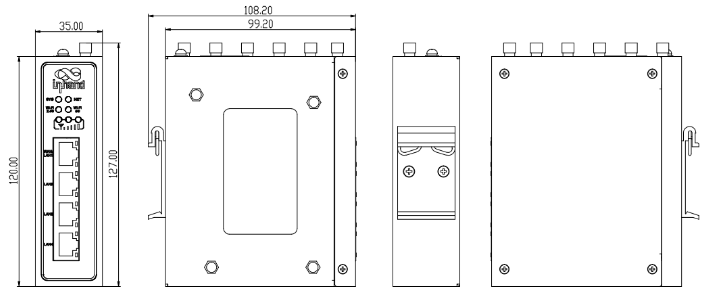
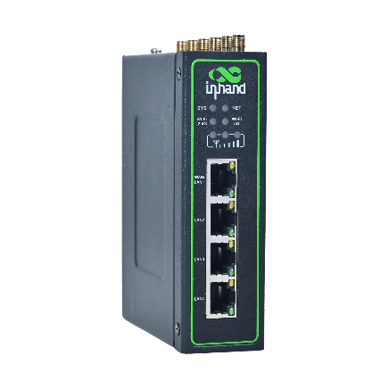
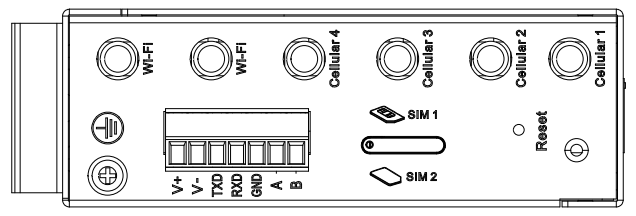

  

    

      
    

    

      拥抱5G时代，网络新体验，安全可靠云管理
    

  

  

    

      InRouter624 工业级路由器
    

    

      

        
· 5G

        
· Wi-Fi 5

      

      

        
· 安全

        
· 云管理

      

    

  

# 1. 产品概述

**InRouter624（IR624）系列是面向工业物联网场景的高性能蜂窝路由器，支持5G/4G、Wi-Fi与VPN安全互联。**

**产品特点：**
- **5G高速接入:** 支持5G蜂窝网络，下行最高可达2Gbps
- **稳定在线:** 链路备份、双SIM切换与看门狗保障通信连续性
- **安全可信:** 集成VPN、防火墙、策略路由等多层安全策略
- **云端运维:** 接入DeviceLive平台实现批量管理和远程维护
- **工业设计:** 金属机身、宽温工作与导轨/壁挂安装，适配现场部署

## 核心技术指标

|技术指标|规格|
|---------|------|
|蜂窝网络|5G（Sub-6，450 MHz~6 GHz）/4G/3G，下行最高 2 Gbps|
|Wi-Fi|双频 2.4 GHz / 5.8 GHz；5G: 867 Mbps；2.4G: 300 Mbps|
|以太网接口|4 × 10/100/1000 Mbps，支持 WAN/LAN/VLAN，1.5KV 网络隔离变压保护|
|VPN|IPSec VPN、L2TP VPN|
|防火墙与访问控制|基于 MAC/IP/端口/协议过滤，支持 NAT、端口映射、访问控制列表（ACL）、策略路由、802.1X|
|可靠性|接口备份、双 SIM 链路切换、心跳包检测与断线自动重连、内嵌看门狗|
|DTU/协议转换|支持 TCP/UDP 透明传输；支持 Modbus RTU 转 Modbus TCP|
|功耗（12V）|待机 370~480 mA；工作 415~530 mA；峰值 530 mA|
|串口|1 × RS232，1 × RS485（静电放电防护 15KV）|
|尺寸与重量|127 × 108.2 × 35 mm；544 g|
|工作温度|常规：-35 ~ 70 ℃；拓展：-40 ~ 75 ℃|
|防护等级|IP30|

# 2. 产品尺寸

    
    
正视图

  

  

    
    
侧视图

  

  

    
    
接口图

  

  
  

    
注意：

    
1.所有尺寸单位为毫米（mm）。

    
2.所有尺寸均为近似值，仅供参考。

    
3.图示尺寸不得用于生产加工。

    
4.尺寸需符合零件及制造公差要求。

    
5.尺寸如有变更，恕不另行通知。

  

# 3. 硬件规格

| 类别/参数 | 规格 |
|--------------------------|------|
| **CPU与存储** | |
| CPU | 880 MHz |
| 内存 | 256 MB |
| Flash | 128 MB |
| **连接与接口** | |
| 以太网端口 | 4 × 10/100/1000 Mbps，支持 WAN/LAN/VLAN，1.5KV 网络隔离变压保护 |
| 电源接口 | DC 9~48V，防过流、防反接，2-PIN 工业端子 |
| 串口 | 1 × RS232，1 × RS485（静电放电防护 15KV） |
| 复位按键 | 针孔式复位按键 |
| SIM卡座 | 1 × 抽屉式卡座（2 × Nano SIM，1.8V/3V），eSIM 选配 |
| 天线接头 | 4 × 5G 蜂窝天线或 1 × 4G 蜂窝天线，2 × Wi-Fi 天线 |
| 接地端子 | 支持 |
| LED指示灯 | 系统、联网、2.4G Wi-Fi、5G Wi-Fi、3 × 信号灯 |
| **WiFi** | |
| 无线频率 | 双频 2.4 GHz / 5.8 GHz |
| 最大传输速率 | 5G: 867 Mbps；  2.4G: 300 Mbps |
| 协议 | 802.11 ac/a/b/g/n Wave MU-MIMO |
| 发射功率 | 5G: 17 dBm；  2.4G: 17 dBm |
| **设备功率** | |
| 待机功率 | 370~480 mA@12V |
| 工作功率 | 415~530 mA@12V |
| 峰值功率 | 530 mA@12V |
| **机械规格** | |
| 产品尺寸（W × D × H） | 127 × 108.2 × 35 mm |
| 产品重量 | 544 g |
| 安装方式 | 导轨、壁挂 |
| 防护等级 | IP30 |
| 外壳与散热 | 金属；无风扇散热 |
| **环境与认证** | |
| 存储温度 | -40~85 ℃ |
| 工作温度 | 常规：-35 ~ 70 ℃ 拓展：-40 ~ 75 ℃ |
| 环境湿度 | 5~95%（无凝霜） |
| 物理特性 | 防震 IEC60068-2-27 振动 IEC60068-2-6 跌落 IEC60068-2-32 |
| EMC指标 | EN61000-4-2，level 3，静电 EN61000-4-3，level 3，辐射电场 EN61000-4-4，level 3，脉冲电场 EN61000-4-5，level 3，浪涌 EN61000-4-6，level 3，传导骚扰抗扰度 EN61000-4-8，>level 3，工频磁场抗绕度，水平方向/垂直方向 400A/m EN61000-4-12，level 3，震荡波抗绕度 |
| 认证 | CE、E-MARK、ECE R118、FCC、PTCRB、Verizon(NSA)、AT&T、T-Mobile |

# 4. 软件规格

| 类别/参数 | 规格 |
|--------------------------|------|
| **网络特性** | |
| 网络接入 | APN、VPDN |
| 接入认证 | CHAP/PAP |
| 网络制式 | WCDMA、LTE TDD/LTE FDD、5G NR（SA/NSA） |
| WAN协议 | 静态 IP、DHCP、PPPoE |
| LAN协议 | ARP、Ethernet |
| IP应用 | TCP、UDP、IPv4/IPv6、ICMP、NTP、DNS、HTTP/HTTPS、SSL/TLS、PPP、SSH、DDNS、Telnet、IP 透传（IP Passthrough） |
| IP路由 | 静态路由 |
| NAT功能 | 网络地址转换（NAT）；端口映射 |
| **安全性** | |
| 网络安全 | 基于 MAC/IP/端口/协议的防火墙过滤，支持访问控制列表（ACL）、策略路由、802.1X |
| 数据安全 | IPSec VPN、L2TP VPN |
| **可靠性** | |
| 链路探测 | 心跳包检测，断线自动重连 |
| 内置看门狗 | 内嵌看门狗，运行故障自修复 |
| 备份功能 | 支持接口备份 |
| 双卡切换 | 双 SIM 链路切换 |
| **WLAN** | |
| 工作模式 | AP/Client，支持 Wi-Fi Portal |
| 安全特性 | WPA/WPA2，WEP/TKIP/AES |
| **智能化** | |
| DTU功能 | 支持 TCP/UDP 透明传输 |
| 网桥 | 支持 Modbus RTU 转 Modbus TCP |
| **网络管理** | |
| QoS管理 | 支持流量整形 |
| 配置方式 | Web/CLI 远程访问，支持配置导入/导出 |
| 日志功能 | 系统日志、诊断日志 |
| 告警功能 | 邮件告警 |
| 维护工具 | Ping、Traceroute、抓包、测速 |
| 网管功能 | 支持 DeviceLive 设备云平台，批量管理与远程维护 |
| 状态查询 | 仪表盘-设备信息、接口状态、精细化流量统计； 链路监控-链路时延、抖动、丢包、吞吐率监控；   蜂窝信号监控-实时查看蜂窝信号强度、RSSI、RSRP、RSRQ、SINR； |

# 5. 订购信息

## 型号规则

**Model code:** IR624-\<WMNN\>-\<WLAN/NA\>-S

\<WMNN\>: 无线通讯类型 & 模块  
\<WLAN/NA\>: Wi-Fi（NA为无Wi-Fi）  
S: 串口（1×RS232 + 1×RS485）

## 产品型号

| 型号 | 区域 | \<WMNN\>: 无线通讯类型 & 模块 | \<WLAN/NA\>: Wi-Fi | S: 串口 |
|------|------|------------------------------|--------------------|---------|
| IR624-NRF2-\<WLAN/NA\>-S | 中国 | 5G NR: n1/3*/5/8/28/41/78/79 LTE FDD: B1/3/5/7*/8 LTE TDD: B34/38/39/40/41 WCDMA: B1/5/8 | WLAN 或 NA | 1×RS232+1×RS485 |
| IR624-NRF4-\<WLAN/NA\>-S | 欧洲/亚太 | 5G NR: n1/3/5/7/8/20/28/38/40/41/71/77/78/66 LTE FDD: B1/3/5/7/8/20/28/71/66 LTE TDD: B38/40/41 WCDMA: B1/3/5/8 | WLAN 或 NA | 1×RS232+1×RS485 |
| IR624-LQ20-\<WLAN/NA\>-S | 中国 | LTE CAT4 FDD: B1/3/5/8 TDD: B34/38/39/40/41 WCDMA: B1/5/8 GSM/EDGE: B3/8 | WLAN 或 NA | 1×RS232+1×RS485 |
| IR624-FQ58-\<WLAN/NA\>-S | 欧洲/亚太 | LTE CAT4 LTE FDD: B1/3/5/7/8/20/28 LTE TDD: B34/38/39/40/41 WCDMA: B1/5/8 GSM: B3/8 | WLAN 或 NA | 1×RS232+1×RS485 |
| IR624-EN00-\<WLAN/NA\>-S | NA | 无蜂窝 | WLAN 或 NA | 1×RS232+1×RS485 |
| IR624-NRQ3-WLAN-S | 北美 | 5G NR NSA/SA: n1/2/3/5/7/8/12/13/14/18/20/25/26/28/29/30/38/40/41/48/66/70/71/75/76/77/78/79 LTE FDD: B1/2/3/4/5/7/8/12/13/14/17/18/19/20/25/26/28/29/30/32/66/71 LTE TDD: B34/38/39/40/41/42/43/48 LTE LAA: B46 WCDMA: B1/2/4/5/8/19 | WLAN | 1×RS232+1×RS485 |

# 6. 联系我们

- **官网：** [映翰通官网](https://www.inhand.com.cn)
- **版权声明：** ©映翰通网络 保留所有权利
