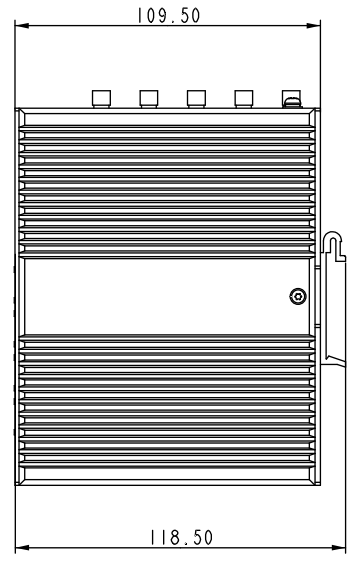
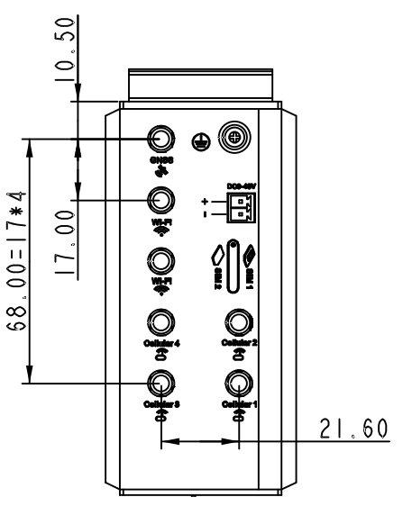
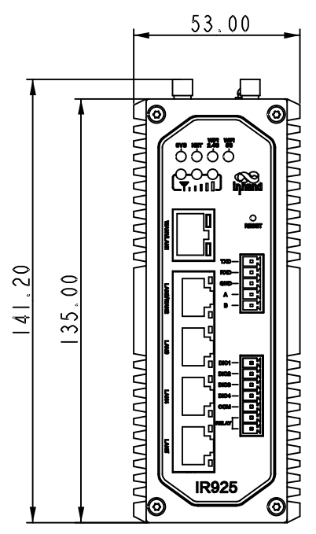

  

    

      
    

    

      拥抱5G时代，网络新体验，安全可靠云管理
    

  

  

    

      InRouter925 工业级路由器
    

    

      

        
· 5G

        
· Wi-Fi 6

      

      

        
· 安全

        
· 云管理

      

    

  

# 1. 产品概述

**InRouter925（IR925）系列是面向工业物联网的高性能5G路由器，集成蜂窝、Wi-Fi 6、VPN与云管理能力。**

**产品特点：**
- **5G高速接入:** 下行峰值最高3.4Gbps，兼容4G/3G网络
- **持续在线:** 双SIM切换、链路检测、看门狗提升连接可靠性
- **多层防护:** 支持防火墙、策略路由、IPSec/L2TP/OpenVPN/Wireguard
- **高效运维:** 支持DeviceLive云平台集中管理与远程维护
- **工业扩展:** 提供2.5GbE+4GbE、串口、DIO、继电器与GNSS能力

## 核心技术指标

|技术指标|规格|
|---------|------|
|蜂窝网络|5G（Sub-6）/4G/3G，下行最高 3.4Gbps（按型号）|
|Wi-Fi|Wi‑Fi 6，双频 2.4 GHz / 5.8 GHz，双频并发 3000 Mbps|
|VPN|IPSec、L2TP、OpenVPN、WireGuard|
|安全|防火墙与访问控制（ACL/策略路由/802.1X 等），支持 CA 证书与用户权限分级管理|
|云管理|DeviceLive 平台批量管理与远程维护|
|可靠性|双 SIM 切换、链路检测、内嵌看门狗|
|以太网接口|1 × 2.5GbE + 4 × 1GbE RJ45，支持 WAN/LAN/VLAN，1.5KV 网络隔离变压保护|
|串口与 I/O|RS232 ×1、RS485 ×1（静电放电防护 15KV）；4 × DIO；继电器 ×1（2A@30VDC）|
|存储|8 GB eMMC；RAM 512 MB|
|供电|DC 9~48 V，防过流、防反接，2-PIN 工业端子|
|工作温度|-40~70 ℃|
|防护等级|IP30|

# 2. 产品尺寸

  

    
    
正视图

  

  

    
    
侧视图

  

  

    
    
接口图

  

  
注意：

  
1.所有尺寸单位为毫米（mm）。

  
2.所有尺寸均为近似值，仅供参考。

  
3.图示尺寸不得用于生产加工。

  
4.尺寸需符合零件及制造公差要求。

  <d
5.尺寸如有变更，恕不另行通知。

# 3. 硬件规格

| 类别/参数 | 规格 |
|--------------------------|------|
| **处理器与存储** | |
| CPU | 1 GHz |
| RAM | 512 MB |
| 存储 | 8 GB eMMC |
| **连接与接口** | |
| 以太网端口 | 1 × 2.5GbE + 4 × 1GbE RJ45，支持WAN/LAN/VLAN，1.5KV网络隔离变压保护 |
| 电源接口 | DC 9~48V，防过流、防反接，2-PIN工业端子 |
| IO口与继电器 | 4 × DIO（DO/IO可配），1 × Relay（2A@30VDC） |
| 串口 | 1 × RS232，1 × RS485（ESD防护15KV） |
| 复位按键 | 针孔式复位按键 |
| SIM卡座 | 1 × 抽屉式卡座（双Nano SIM，1.8V/3V），eSIM选配 |
| 天线接头 | 4 × 5G天线或2 × 4G天线，2 × Wi-Fi天线，1 × GNSS天线 |
| 接地端子 | 支持 |
| LED指示灯 | 系统、联网、2.4G Wi-Fi、5G Wi-Fi、3 × 信号灯 |
| GNSS | 可选 |
| **Wi-Fi** | |
| 频率 | 2.4 GHz & 5.8 GHz |
| 最大带宽 | 双频并发3000Mbps |
| 协议 | 802.11 ax/ac/a/b/g/n |
| 发射功率 | 5G:  21dBm；  2.4G:  21dBm |
| 覆盖半径 | 视距约50米（与现场环境相关） |
| **机械规格** | |
| 尺寸（W × D × H） | 141.2 × 118.5 × 53 mm |
| 重量 | 544 g（裸机），1002 g（含包装） |
| 安装方式 | 导轨、壁挂 |
| 防护等级 | IP30 |
| 外壳与散热 | 金属外壳，无风扇散热 |
| RTC | 支持 |
| TPM | 支持 |
| **环境与认证** | |
| 工作温度 | -40~70 ℃ |
| 存储温度 | -40~85 ℃ |
| 湿度 | 5~95%（无凝霜） |
| 物理特性 | 防震 IEC60068-2-27 振动 IEC60068-2-6 跌落 IEC60068-2-32 |
| EMC指标 | EN61000-4-2，level 3，静电 EN61000-4-3，level 3，辐射电场 EN61000-4-4，level 3，脉冲电场 EN61000-4-5，level 3，浪涌 EN61000-4-6，level 3，传导骚扰抗扰度 EN61000-4-8，>level 2，工频磁场抗绕度，水平方向/垂直方向 400A/m EN61000-4-12，level 3，震荡波抗绕度 |
| 认证 | CE*、E-MARK*、FCC*、IC*、PTCRB*、Verizon*、AT&T*、T-Mobile* |

说明:标记*的项暂未实现。

# 4. 软件规格

| 类别/参数 | 规格 |
|--------------------------|------|
| **网络特性** | |
| 网络接入 | APN、VPDN |
| 接入认证 | CHAP/PAP |
| 网络制式 | WCDMA、TDD LTE/FDD LTE、5G NR（SA/NSA） |
| WAN协议 | 静态IP、DHCP、PPPoE |
| LAN协议 | ARP、Ethernet |
| IP应用 | TCP、UDP、IPv4、IPv6、ICMP、NTP、DNS、HTTP/HTTPS、SSL/TLS、VRRP*、SSH、DHCP Server/Relay/Client、DDNS、Telnet、IP Passthrough |
| IP路由 | 静态路由、OSPF、BGP |
| NAT功能 | NAT、端口映射 |
| **安全性** | |
| 网络安全 | 基于MAC/IP/端口/协议过滤，支持ACL、策略路由、802.1X |
| 用户管理 | 用户权限分级管理 |
| 数据安全 | IPSec VPN、L2TP VPN、OpenVPN、Wireguard VPN、VXLAN* |
| CA证书 | 支持CA证书 |
| **可靠性** | |
| 链路探测 | 心跳包检测，断线自动重连 |
| 内置看门狗 | 内嵌看门狗，运行故障自修复 |
| 热备份机制 | 支持VRRP 热备份机制 |
| 双卡切换 | 双SIM链路切换 |
| **WLAN** | |
| 工作模式 | AP/Client，支持Wi-Fi Portal、多SSID |
| 安全特性 | WPA/WPA2/WPA3与WEP/TKIP/AES |
| **智能化** | |
| DTU功能 | 支持TCP/UDP透传 |
| 网桥 | 支持Modbus RTU转Modbus TCP |
| **网络管理** | |
| QoS管理 | 支持流量整形 |
| 配置方式 | Web/CLI 远程访问，支持配置导入/导出 |
| 日志功能 | 系统日志、诊断日志 |
| 短信功能 | 短信重启 |
| 告警功能 | 邮件告警 |
| 维护工具 | Ping、Traceroute、抓包、测速 |
| 网管功能 | 支持 DeviceLive 设备云平台，批量管理与远程维护 |
| 简单网络管理功能 | 简单网络管理协议（SNMP）v1、v2c、v3 |
| 状态查询 | 仪表盘-设备信息、接口状态、精细化流量统计； 链路监控-链路时延、抖动、丢包、吞吐率监控；   蜂窝信号监控-实时查看蜂窝信号强度、RSSI、RSRP、RSRQ、SINR； |

# 5. 订购信息

## 型号规则

**Model code:** IR925-\<WMNN\>-\<WLAN/NA\>

\<WMNN\>: 无线通讯类型 & 模块  
\<WLAN/NA\>: Wi-Fi & GPS（NA为无Wi-Fi和GPS）

## 产品型号

| 型号 | 区域 | \<WMNN\>: 无线通讯类型 & 模块 | \<WLAN/NA\>: Wi-Fi & GPS |
|------|------|------------------------------|--------------------------|
| IR925-CNNR-\<WLAN/NA\> | 中国 | 5G NR NSA: n41/78/79 5G NR SA: n1/3/5/8/28A/41/77/78/79 LTE FDD: B1/3/5/8 LTE TDD: B34/38/39/40/41 WCDMA: B1/5/8 | WLAN 或 NA |
| IR925-GLNR-\<WLAN/NA\> | 北美 | 5G NR NSA/SA: n1/2/3/5/7/8/12/13/14/18/20/25/26/28/29/30/38/40/41/48/66/70/71/75/76/77/78/79 LTE FDD: B1/2/3/4/5/7/8/12/13/14/17/18/19/20/25/26/28/29/30/32/66/71 LTE TDD: B34/38/39/40/41/42/43/48 LTE LAA: B46 WCDMA: B1/2/4/5/8/19 | WLAN 或 NA |
| IR925-EN00-WLAN | 全球 | 无蜂窝 | WLAN |

# 6. 联系我们

- **官网：** [映翰通官网](https://www.inhand.com.cn)
- **版权声明：** ©映翰通网络 保留所有权利
