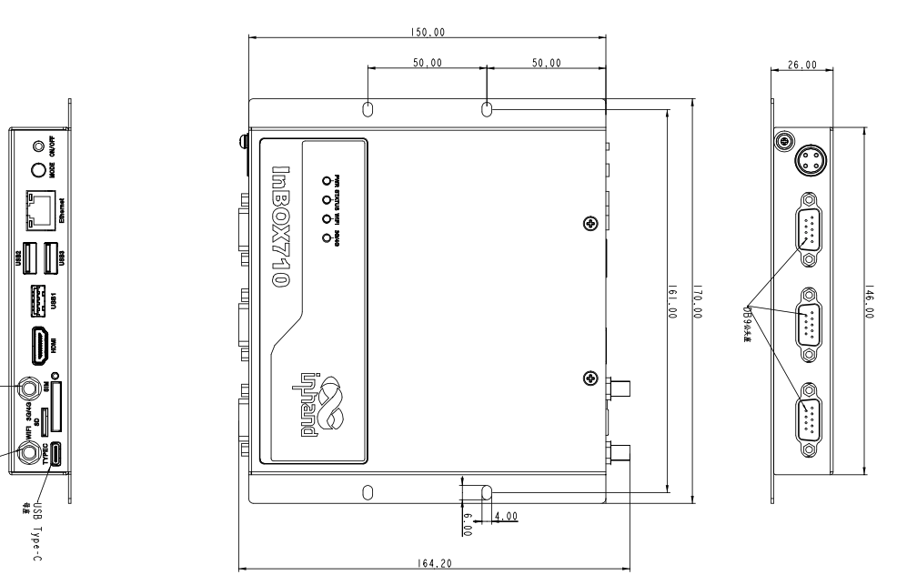

  

    

      
    

    

      性能强、稳定性好的 ARM 工控机
    

  

  

    

      InBOX710 系列
    

    

      

        
· 六核处理器

        
· 4G/WiFi/蓝牙

      

      

        
· 4K视频输出

        
· Android/Linux

      

    

  

# 1. 产品概述

**InBOX710 系列 ARM 工控机面向工商业领域，提供高性能数据处理与稳定网络连接能力。**

**产品特点：**

- **强劲配置:** 瑞芯微六核处理器，2GB/16GB存储，4K输出，接口丰富
- **多系统支持:** 可选Android/Linux系统，深度优化保证长期稳定运行
- **无缝网络:** 支持4G/WiFi/有线连接，保障设备通讯不间断
- **工业品质:** 金属外壳IP40，Level3级EMC，-20°C~70°C宽温工作

## 核心技术指标

| 项目             | 规格                                    |
| -------------- | ------------------------------------- |
| 蜂窝网络           | 4G 全网通                                |
| Wi-Fi          | 802.11 b/g/n，AP / Client 模式           |
| 蓝牙             | 蓝牙 4.2                                |
| 操作系统           | Linux(Debian9) / Android7.1/Android10 |
| 视频输出           | HDMI2.0，支持 4K@60fps                   |
| 网络接入           | 4G / WiFi / 有线                        |
| 尺寸 (W × D × H) | 170 × 150 × 26 mm                     |
| 安装方式           | 壁挂式安装                                 |
| 接口             | 2×RS232、1×RS232/RS485、3×USB、百兆网口、HDMI |
| 供电             | 12 V DC                               |
| 工作温度           | -20 °C ~ +70 °C                       |
| 防护等级           | IP40                                  |

# 2. 产品尺寸

  

  
注意：

  
1.所有尺寸单位为毫米（mm）。

  
2.所有尺寸均为近似值，仅供参考。

  
3.图示尺寸不得用于生产加工。

  
4.尺寸需符合零件及制造公差要求。

  
5.尺寸如有变更，恕不另行通知。

# 3. 硬件规格

| 类别/参数                                        | 规格                                          |
| -------------------------------------------- | ------------------------------------------- |
| **处理器**   |                                             |
| CPU                                          | 瑞芯微六核处理器，最高主频 1.8 GHz                       |
| 内存                                           | 2 GB                                        |
| 存储                                           | 16 GB FLASH                                 |
| **连接与联网** |                                             |
| 蜂窝网络                                         | 4G 全网通                                      |
| SIM 卡规格                                      | 1.8 V / 3 V，抽屉式卡座 × 1                       |
| 蜂窝天线                                         | 1 × SMA                                     |
| Wi-Fi                                        | 802.11 b/g/n，AP / Client 模式                 |
| Wi-Fi 天线                                     | 1 × RP-SMA                                  |
| 蓝牙(选配)                                       | 蓝牙 4.1+                                     |
| **接口**    |                                             |
| 以太网                                          | 1 × 10/100 Mbps，LAN/WAN                     |
| 串口                                           | 2 × RS232 (DB9 公头)；1 × RS232/RS485 (DB9 公头) |
| USB                                          | 2 × USB 2.0；1 × USB 3.0                     |
| HDMI                                         | HDMI 2.0 × 1，支持 4K@60fps，带音频输出              |
| SD 卡槽                                        | 1 × SD 卡槽                                   |
| 调试接口                                         | 1 × Type-C                                  |
| 按键                                           | 电源键(Power) × 1；模式键(Mode) × 1                |
| **电源**    |                                             |
| 输入电源                                         | 12 V DC（自锁4芯圆形接口）                           |
| 功耗                                           | 整机小于 10 W（不带外设）                             |
| **机械规格**  |                                             |
| 尺寸 (W × D × H)                               | 170 × 150 × 26 mm（含安装件）                     |
| 安装方式                                         | 壁挂式安装                                       |
| 防护等级                                         | IP40                                        |
| 散热                                           | 无风扇散热                                       |
| 外壳工艺                                         | 金属外壳                                        |
| **环境**    |                                             |
| 工作温度                                         | -20 °C ~ +70 °C（工业级）                        |
| 储存温度                                         | -40 °C ~ +85 °C                             |
| 湿度                                           | 5 ~ 95 % RH（无凝霜）                            |
| **指示灯**   |                                             |
| 指示灯                                          | 电源、状态、Wi-Fi、3G/4G                           |
| **电磁兼容**  |                                             |
| EMC 指标                                       | 静电 Level 3；EFT Level 3；浪涌 Level 3           |
| **其他**    |                                             |
| 看门狗                                          | 支持                                          |
| 实时时钟                                         | 内置 RTC，纽扣电池供电                               |
| 硬件信息API                                      | 可定制                                         |
| **认证**    |                                             |
| 认证                                           | CCC、CE、FCC、IC                               |

# 4. 软件规格

| 类别/参数                                       | 规格                                 |
| ------------------------------------------- | ---------------------------------- |
| **操作系统** |                                    |
| 操作系统                                        | Android / Linux(Debian9)           |
| **网络特性** |                                    |
| 网络制式                                        | 4G 全网通                             |
| Wi-Fi                                       | 802.11 b/g/n，支持 Client / AP 模式     |
| 蓝牙                                          | 蓝牙 4.2                             |
| **多媒体**  |                                    |
| 图形处理                                        | 双 ISP 800 MPix/s，支持双路摄像头、3D、深度信息提取 |
| 视频编解码                                       | H.265/H.264/VP9 4K@60fps 高清解码      |
| 图像格式                                        | BMP, JPG, PNG, GIF                 |
| **配置管理** |                                    |
| 定时开关机                                       | 支持                                 |
| 升级功能                                        | 本地 USB 升级                          |

# 5. 订购信息

## 型号规则

**Model code:** InBOX710-\<WMNN\>-\<STD/PLAT/L\>-\<A\>-\<S\>

\<WMNN\>: Cellular Type & Module（蜂窝类型与模块）
\<STD/PLAT/L\>: OS
\<A\>: —
\<S\>: Serial port type（串口类型）

## 产品型号

| 型号                           | 区域   | \<WMNN\>: Cellular Networks                                                                                                                                                                                            | \<STD/PLAT/L\>: OS | \<A\> | \<S\>: Serial port type |
| ---------------------------- | ---- | ---------------------------------------------------------------------------------------------------------------------------------------------------------------------------------------------------------------------- | ------------------ |:-----:|:-----------------------:|
| InBOX710-DQ20-L/STD/PLAT     | 中国   | LTE-FDD: B1/B3/B5/B8 LTE-TDD: B34/B38/B39/B40/B41 WCDMA: B1/B8 TD-SCDMA: B34/B39 CDMA/EVDO: BC0 GSM/EDGE: 900/1800 MHz                                                                             | L/STD/PLAT         | —     | —                       |
| InBOX710-DQ20-L/STD/PLAT-485 | 中国   | LTE-FDD: B1/B3/B5/B8 LTE-TDD: B34/B38/B39/B40/B41 WCDMA: B1/B8 TD-SCDMA: B34/B39 CDMA/EVDO: BC0 GSM/EDGE: 900/1800 MHz                                                                             | L/STD/PLAT         | —     | 485                     |
| InBOX710-FQ58-L/STD/PLAT     | EMEA | LTE-FDD: B1/B3/B7/B8/B20/B28A WCDMA: B1/B8 GSM/EDGE: B3/B8                                                                                                                                                     | L/STD/PLAT         | —     | —                       |
| InBOX710-FQ58-L/STD/PLAT-485 | EMEA | LTE-FDD: B1/B3/B7/B8/B20/B28A WCDMA: B1/B8 GSM/EDGE: B3/B8                                                                                                                                                     | L/STD/PLAT         | —     | 485                     |
| InBOX710-FQ39-L/STD/PLAT     | 北美   | LTE-FDD: B2/B4/B5/B7/B12/B13/B25/B26/B29/B30/B66 2×CA B2+B2/B5/B12/B13/B29; B4+B4/B5/B12/B13/B29; B7+B5/B7/B12/B26; B25+B5/B12/B25/B26; B30+B5/B12/B29; B66+B5/B12/B13/B29/B66 WCDMA: B2/B4/B5 | L/STD/PLAT         | —     | —                       |
| InBOX710-FQ39-L/STD/PLAT-485 | 北美   | LTE-FDD: B2/B4/B5/B7/B12/B13/B25/B26/B29/B30/B66 2×CA B2+B2/B5/B12/B13/B29; B4+B4/B5/B12/B13/B29; B7+B5/B7/B12/B26; B25+B5/B12/B25/B26; B30+B5/B12/B29; B66+B5/B12/B13/B29/B66 WCDMA: B2/B4/B5 | L/STD/PLAT         | —     | 485                     |
| InBOX710-EN00-L/STD/PLAT     | —    | —                                                                                                                                                                                                                      | L/STD/PLAT         | —     | —                       |
| InBOX710-EN00-L/STD/PLAT-485 | —    | —                                                                                                                                                                                                                      | L/STD/PLAT         | —     | 485                     |

# 6. 联系我们

- **官网：** [映翰通官网](https://www.inhand.com.cn)
- **版权声明：** ©映翰通网络 保留所有权利
