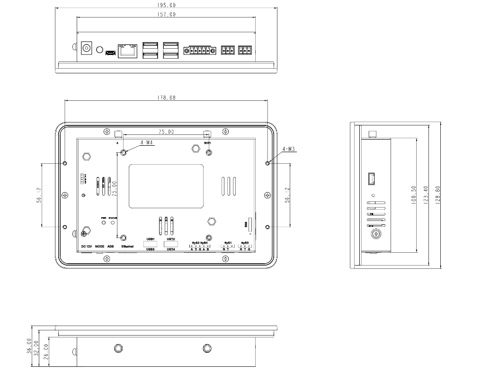

  

    

      
    

    

      7寸屏安卓一体机
    

  

  

    

      InPAD070S 系列
    

    

      

        
· 4G/WiFi/蓝牙

        
· RK3288四核

      

      

        
· 7寸高亮屏

        
· Android7/12

      

    

  

# 1. 产品概述

**InPAD070S 系列安卓一体机面向工商业领域，提供实时界面显示、人机交互与设备联网能力。**

**产品特点：**

- **强劲配置:** RK3288四核处理器，2GB/8GB存储，7寸高亮电容触摸屏
- **丰富接口:** RS232/RS485、USB、百兆网口、音频，满足多样化扩展
- **多系统支持:** 支持Android7.1/Android12，便于应用开发部署
- **稳定连接:** 支持4G、WiFi、有线网络，保障设备通讯不间断
- **工业品质:** 屏幕面IP65防护、高EMC保护、-10°C~60°C宽温工作

## 核心技术指标

| 项目             | 规格                               |
| -------------- | -------------------------------- |
| 蜂窝网络           | 4G 全网通                           |
| Wi-Fi          | 802.11 b/g/n，AP / Client 模式      |
| 蓝牙             | 蓝牙 4.2                           |
| 操作系统           | Android 7.1 / Android 12         |
| 显示屏            | 7寸，1024×600，450cd/㎡，电容触摸         |
| 网络接入           | 4G / WiFi / 有线                   |
| 尺寸 (W × D × H) | 195 × 128.8 × 36 mm              |
| 安装方式           | 壁挂式安装                            |
| 接口             | 2×RS232、2×RS485、4×USB、百兆网口、Audio |
| 供电             | 12 V DC                          |
| 工作温度           | -10 °C ~ +60 °C                  |
| 防护等级           | IP65（屏幕面）                        |

# 2. 产品尺寸

  

  
注意：

  
1.所有尺寸单位为毫米（mm）。

  
2.所有尺寸均为近似值，仅供参考。

  
3.图示尺寸不得用于生产加工。

  
4.尺寸需符合零件及制造公差要求。

  
5.尺寸如有变更，恕不另行通知。

# 3. 硬件规格

| 类别/参数                                        | 规格                                                                  |
| -------------------------------------------- | ------------------------------------------------------------------- |
| **处理器**   |                                                                     |
| CPU                                          | RK3288 四核 Cortex-A17 处理器，主频 1.6 GHz                                 |
| 内存                                           | 2 GB                                                                |
| 存储                                           | 8 GB FLASH                                                          |
| **连接与联网** |                                                                     |
| 蜂窝网络                                         | 4G 全网通                                                              |
| SIM 卡规格                                      | 1.8 V / 3 V，抽屉式卡座 × 1                                               |
| 蜂窝天线                                         | 1 × SMA                                                             |
| Wi-Fi                                        | 802.11 b/g/n，AP / Client 模式                                         |
| Wi-Fi 天线                                     | 1 × RP-SMA                                                          |
| 蓝牙                                           | 蓝牙 4.2                                                              |
| **显示屏**   |                                                                     |
| 显示屏                                          | 7 寸，分辨率 1024 × 600，亮度 450 cd/㎡（典型值），对比度 800:1，全视角                   |
| 触摸屏                                          | 高亮电容触摸屏                                                             |
| **接口**    |                                                                     |
| 以太网                                          | 1 × 10/100 Mbps，LAN/WAN                                             |
| 串口                                           | 2 × RS232（3 pin 工业端子，间距 3.5 mm）；2 × RS485（5 pin 工业端子，间距 3.5 mm，带法兰） |
| USB                                          | 4 × USB 2.0                                                         |
| Audio                                        | SPK × 1，可外接 2 声道 8 Ω 5 W 扬声器（2.0 mm 4Pin 插座）                        |
| 调试接口                                         | 1 × ADB                                                             |
| 按键                                           | 电源键(Power) × 1；模式键(Mode) × 1                                        |
| **电源**    |                                                                     |
| 输入电源                                         | 12 V DC（圆形接口），支持通电自启                                                |
| 功耗                                           | 整机小于 10 W（不带外设）                                                     |
| **机械规格**  |                                                                     |
| 尺寸 (W × D × H)                               | 195 × 128.8 × 36 mm                                                 |
| 安装方式                                         | 壁挂式安装                                                               |
| 防护等级                                         | IP65（屏幕面）                                                           |
| 散热                                           | 无风扇散热                                                               |
| 外壳工艺                                         | 金属外壳                                                                |
| **环境**    |                                                                     |
| 工作温度                                         | -10 °C ~ +60 °C                                                     |
| 储存温度                                         | -40 °C ~ +85 °C                                                     |
| 湿度                                           | 5 ~ 95 % RH（无凝霜）                                                    |
| **指示灯**   |                                                                     |
| 指示灯                                          | 电源、状态                                                               |
| **电磁兼容**  |                                                                     |
| EMC 指标                                       | 静电 Level 2；EFT Level 2；浪涌 Level 2                                   |
| **其他**    |                                                                     |
| 实时时钟                                         | 内置 RTC，纽扣电池供电                                                       |
| **认证**    |                                                                     |
| 认证                                           | CE                                                                  |

# 4. 软件规格

| 类别/参数                                       | 规格                                                                                    |
| ------------------------------------------- | ------------------------------------------------------------------------------------- |
| **操作系统** |                                                                                       |
| 操作系统                                        | Android 7.1 / Android 12                                                              |
| **网络特性** |                                                                                       |
| 网络制式                                        | 4G 全网通                                                                                |
| Wi-Fi                                       | 802.11 b/g/n，支持 Client / AP 模式                                                        |
| 蓝牙                                          | 蓝牙 4.2                                                                                |
| **多媒体**  |                                                                                       |
| 图形处理                                        | 双 ISP 800 MPix/s，支持双路摄像头数据同时输入，支持 3D、深度信息提取                                           |
| 视频编解码                                       | 支持 4K 10bits H.265/H.264 视频解码，1080P 多格式视频解码（VC-1、MPEG-1/2/4、VP8），1080P H.264/VP8 视频编码 |
| 图像格式                                        | BMP, JPG, PNG, GIF                                                                    |
| **配置管理** |                                                                                       |
| 定时开关机                                       | 支持                                                                                    |
| 升级功能                                        | 本地 USB 升级                                                                             |

# 5. 订购信息

## 型号规则

**Model code:** InPAD070S-\<WMNN\>-\<STD/PLAT/L\>-\<A\>-\<S\>

\<WMNN\>: Cellular Type & Module（蜂窝类型与模块）
\<STD/PLAT/L\>: OS
\<A\>: —
\<S\>: Serial port type（串口类型）

## 产品型号

| 型号                      | 区域   | \<WMNN\>: Cellular Networks                                                                                                                                                                                            | \<STD/PLAT/L\>: OS | \<A\> | \<S\>: Serial port type |
| ----------------------- | ---- | ---------------------------------------------------------------------------------------------------------------------------------------------------------------------------------------------------------------------- | ------------------ |:-----:|:-----------------------:|
| InPAD070S-DQ20-STD/PLAT | 中国   | LTE-FDD: B1/B3/B5/B8 LTE-TDD: B34/B38/B39/B40/B41 WCDMA: B1/B8 TD-SCDMA: B34/B39 CDMA/EVDO: BC0 GSM/EDGE: 900/1800 MHz                                                                             | STD/PLAT           | —     | —                       |
| InPAD070S-FQ58-STD/PLAT | EMEA | LTE-FDD: B1/B3/B7/B8/B20/B28A WCDMA: B1/B8 GSM/EDGE: B3/B8                                                                                                                                                     | STD/PLAT           | —     | —                       |
| InPAD070S-FQ39-STD/PLAT | 北美   | LTE-FDD: B2/B4/B5/B7/B12/B13/B25/B26/B29/B30/B66 2×CA B2+B2/B5/B12/B13/B29; B4+B4/B5/B12/B13/B29; B7+B5/B7/B12/B26; B25+B5/B12/B25/B26; B30+B5/B12/B29; B66+B5/B12/B13/B29/B66 WCDMA: B2/B4/B5 | STD/PLAT           | —     | —                       |
| InPAD070S-EN00-STD/PLAT | —    | —                                                                                                                                                                                                                      | STD/PLAT           | —     | —                       |

# 6. 联系我们

- **官网：** [映翰通官网](https://www.inhand.com.cn)
- **版权声明：** ©映翰通网络 保留所有权利
