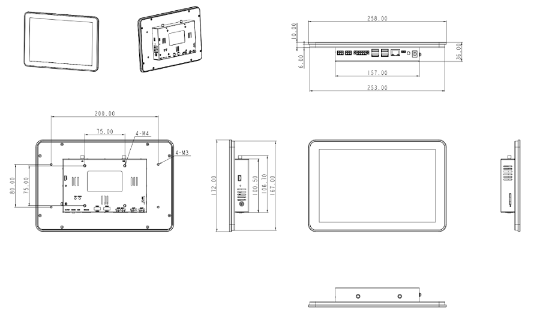

  

    

      
    

    

      10.1寸安卓工业平板, 高亮触控交互, 丰富接口扩展
    

  

  

    

      InPAD3101 工控一体机
    

    

      

        
· 4G全网通

        
· Wi-Fi/蓝牙

      

      

        
· RK3288四核

        
· 10.1寸高亮触控

      

    

  

# 1. 产品概述

**InPAD3101 系列工控一体机面向自助终端、智能零售、工业物联等场景，提供稳定可靠的人机交互与数据采集能力。**

**产品特点：**

- **强劲配置:** RK3288四核处理器，2GB+8GB存储，多接口扩展能力强
- **多系统支持:** 支持Android 7.1/12，深度优化保障长期稳定运行
- **稳定互联:** 支持4G、Wi-Fi、蓝牙及百兆网口，无缝网络接入体验
- **工业品质:** 金属外壳无风扇散热，宽温设计，屏幕面IP65防护等级
- **丰富接口:** 2路RS232、2路RS485、4路USB、扬声器及ADB调试接口

## 核心技术指标

| 项目             | 规格                                 |
| -------------- | ---------------------------------- |
| 蜂窝网络           | 4G全网通                              |
| 操作系统           | Android 7.1 / 12                   |
| Wi-Fi          | 802.11 b/g/n，支持Client/AP模式         |
| 蓝牙             | Bluetooth 4.2                      |
| 视频编解码          | 4K H.265/H.264解码，1080P编码           |
| 定时开关机          | 支持                                 |
| 尺寸 (W × D × H) | 258 × 172 × 36 mm                  |
| 显示屏            | 10.1寸，1280 × 800，450 cd/㎡          |
| 接口             | 2×RS232 + 2×RS485 + 4×USB + 1×百兆网口 |
| 供电             | DC 12V输入，圆形接口                      |
| 工作温度           | -10 °C ~ +60 °C                    |
| 防护等级           | IP65（屏幕面）                          |

# 2. 产品尺寸

  

    
    
产品尺寸图

  

  
注意：

  
1.所有尺寸单位为毫米（mm）。

  
2.所有尺寸均为近似值，仅供参考。

  
3.图示尺寸不得用于生产加工。

  
4.尺寸需符合零件及制造公差要求。

  
5.尺寸如有变更，恕不另行通知。

## 端子定义

### RS232 端子定义（3pin工业端子，间距3.5mm，无法兰）

| 引脚  | 定义  | 说明                  |
|:---:|:---:|:------------------- |
| 1   | TXD | 串口发送（ttyS1 / ttyS3） |
| 2   | RXD | 串口接收（ttyS1 / ttyS3） |
| 3   | GND | 信号地                 |

**说明：**

- 共2路RS232串口，分别为ttyS1、ttyS3
- ttyS3默认为调试串口，可配置为普通串口

### RS485 端子定义（5pin工业端子，间距3.5mm，带法兰）

| 引脚  | 定义  | 说明                      |
|:---:|:---:|:----------------------- |
| 1   | A   | RS485数据正（ttyS2 / ttyS4） |
| 2   | B   | RS485数据负（ttyS2 / ttyS4） |
| 3   | GND | 信号地                     |
| 4   | NC  | 保留                      |
| 5   | NC  | 保留                      |

**说明：**

- 共2路RS485串口，分别为ttyS2、ttyS4

# 3. 硬件规格

| 类别/参数                                        | 规格                                        |
| -------------------------------------------- | ----------------------------------------- |
| **处理器**   |                                           |
| CPU                                          | RK3288 四核 Cortex-A17，主频 1.6 GHz           |
| RAM                                          | 2 GB                                      |
| 存储                                           | 8 GB eMMC，（16G 可选）                        |
| **显示屏**   |                                           |
| 尺寸                                           | 10.1 寸                                    |
| 分辨率                                          | 1280 × 800                                |
| 亮度                                           | 450 cd/㎡（典型值）                             |
| 对比度                                          | 800:1                                     |
| 可视角度                                         | 全视角                                       |
| 触摸屏                                          | 高亮电容触摸屏                                   |
| **连接与联网** |                                           |
| 蜂窝网络                                         | 4G 全网通                                    |
| SIM 卡槽                                       | 1.8 V / 3 V，抽屉式卡座 × 1                     |
| 天线接口                                         | Cellular：SMA × 1；Wi-Fi：RP-SMA × 1         |
| **接口**    |                                           |
| 以太网                                          | 10/100 Mbps × 1，LAN/WAN                   |
| USB                                          | USB 2.0 × 4                               |
| RS232                                        | 2 路，3 pin 工业端子，间距 3.5 mm，无法兰              |
| RS485                                        | 2 路，5 pin 工业端子，间距 3.5 mm，带法兰              |
| Audio                                        | SPK × 1，可外接 2 声道 8 Ω 5 W 扬声器，2.0 mm 4 Pin |
| 调试接口                                         | ADB 接口 × 1                                |
| 按键                                           | 电源键 × 1，模式键 × 1                           |
| **无线**    |                                           |
| Wi-Fi                                        | 802.11 b/g/n，支持 Client / AP 模式            |
| 蓝牙                                           | Bluetooth 4.2                             |
| **指示灯**   |                                           |
| 电源灯                                          | 供电指示灯，上电后常亮                               |
| 状态灯                                          | 状态指示灯，正常运行时闪烁                             |
| **电源**    |                                           |
| 输入电源                                         | DC 12 V，圆形接口                              |
| 通电自启                                         | 来电时机器自动启动                                 |
| 功耗                                           | 整机小于 10 W（不带外设）                           |
| **机械**    |                                           |
| 尺寸 (W × D × H)                               | 258 × 172 × 36 mm                         |
| 安装方式                                         | 壁挂                                        |
| 防护等级                                         | IP65（屏幕面）                                 |
| 散热                                           | 无风扇散热                                     |
| 外壳                                           | 金属                                        |
| **环境**    |                                           |
| 工作温度                                         | -10 °C ~ +60 °C                           |
| 储存温度                                         | -40 °C ~ +85 °C                           |
| 湿度                                           | 5 % ~ 95 % RH（无凝霜）                        |
| **EMC**   |                                           |
| 静电                                           | Level 2                                   |
| EFT                                          | Level 2                                   |
| 浪涌                                           | Level 2                                   |
| **其他**    |                                           |
| 实时时钟                                         | 内置 RTC，纽扣电池供电                             |
| **认证**    |                                           |
| 认证                                           | CE                                        |

# 4. 软件规格

| 类别/参数                                       | 规格                                                                                                                       |
| ------------------------------------------- | ------------------------------------------------------------------------------------------------------------------------ |
| **网络特性** |                                                                                                                          |
| 网络制式                                        | 4G 全网通                                                                                                                   |
| Wi-Fi                                       | 802.11 b/g/n，支持 Client / AP 模式                                                                                           |
| Bluetooth                                   | 蓝牙 4.2                                                                                                                   |
| **操作系统** |                                                                                                                          |
| 操作系统                                        | Android 7.1 / 12                                                                                                         |
| **图形处理** |                                                                                                                          |
| 视频编解码                                       | 双 ISP 像素处理能力高达 800 MPix/s；支持 4K 10 bits H.265 / H.264 视频解码；1080P 多格式视频解码（VC-1、MPEG-1/2/4、VP8）；1080P 视频编码，支持 H.264、VP8 格式 |
| 图像处理                                        | BMP、JPG、PNG、GIF                                                                                                          |
| **配置管理** |                                                                                                                          |
| 定时开关机                                       | 支持                                                                                                                       |
| 系统升级                                        | 本地 USB 升级                                                                                                                |

# 5. 订购信息

## 型号规则

**Model code:** InPAD3101-\<WMNN\>-\<STD/PLAT/L\>-\<A\>-\<S\>

\<WMNN\>: Cellular Networks（蜂窝网络频段）

\<STD/PLAT/L\>: 操作系统版本

\<A\>: 天线类型

\<S\>: 串口类型

## 产品型号

| 型号                      | 区域       | \<WMNN\>: Cellular Networks                                                                                                                | \<STD/PLAT/L\>: 操作系统                | \<A\>: 天线 | \<S\>: 串口 |
| ----------------------- | -------- | ------------------------------------------------------------------------------------------------------------------------------------------ | ----------------------------------- |:---------:|:---------:|
| InPAD3101-DQ20-STD/PLAT | 中国       | LTE-FDD: B1/B3/B5/B8 LTE-TDD: B34/B38/B39/B40/B41 WCDMA: B1/B8 TD-SCDMA: B34/B39 CDMA/EVDO: BC0 GSM/EDGE: 900/1800 MHz | STD: Android PLAT: Android（平台版） | —         | —         |
| InPAD3101-FQ58-STD/PLAT | 欧洲、中东、非洲 | LTE-FDD: B1/B3/B7/B8/B20/B28A WCDMA: B1/B8 GSM/EDGE: B3/B8                                                                         | STD: Android PLAT: Android（平台版） | —         | —         |
| InPAD3101-FQ39-STD/PLAT | 北美       | LTE-FDD: B2/B4/B5/B7/B12/B13/B25/B26/B29/B30/B66 2×CA WCDMA: B2/B4/B5                                                                  | STD: Android PLAT: Android（平台版） | —         | —         |
| InPAD3101-EN00-STD/PLAT | —        | —                                                                                                                                          | STD: Android PLAT: Android（平台版） | —         | —         |
| InPAD3101-FQ88-STD/PLAT | 日本       | LTE-FDD: B1/B3/B8/B18/B19/B26 LTE-TDD: B41 WCDMA: B1/B6/B8/B19                                                                     | STD: Android PLAT: Android（平台版） | —         | —         |

# 6. 联系我们

- **官网：** [映翰通官网](https://www.inhand.com.cn)
- **版权声明：** ©映翰通网络 保留所有权利
