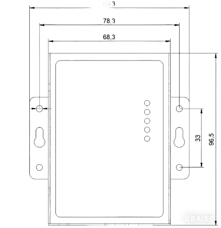

  

    

      
    

    

      拥抱 LPWAN，为工业数字化赋能
    

  

  

    

      LT312 LoRaWAN-DTU
    

    

      

        
· LoRaWAN

        
· RS232/RS485

      

      

        
· Modbus-RTU

        
· 多频段

      

    

  

## 1. 产品概述

**LT312 是一款通用型 LoRaWAN® 数据终端，面向工业设备的远程采集与透明传输。内置 LoRaWAN® 1.0.3 协议栈，支持 Class A/C、OTAA/ABP 入网，支持 ADR 或固定扩频因子，发射功率与信道可调，兼顾覆盖与可靠性。**

**产品特点：** 
- **工业串口更“硬核”：** RS232/RS485 全隔离设计，内置 15 kV ESD 保护；支持透明传输与定时/主动采集（兼容 Modbus-RTU）
- **LoRaWAN 协议完善：** 内置 LoRaWAN 1.0.3，支持 Class A/C、OTAA/ABP，支持 ADR/固定 SF 切换，发射功率与信道可调
- **强劲射频性能：** 带宽 125 kHz，SF7–SF12 六档可调（典型速率 5.5/3.1/1.8/1.0/0.6/0.3 kbps），接收灵敏度 –135 dBm@SF12/BW125 kHz
- **频段覆盖多地区：** 支持 EU433、CN470、CN779、EU868、AS923、AU915、KR920 等频段，适配不同区域部署
- **供电与安装友好：** DC 9–28 V 宽压输入，支持接线端子或 DC 5.5×2.1；SMA 天线接口；工作温度 –20～70 °C
- **灵活定义任务与脚本：** 可自定义采集任务与脚本编排，支持心跳与 I/O 输出配置，内置看门狗提升稳定性

## 核心技术指标

| 技术指标 | 规格 |
| --- | --- |
| 网络特性 | LoRaWAN 1.0.3；Class A/C；OTAA/ABP |
| 区域部署 | EU433、CN470、CN779、EU868、AS923、AU915、KR920 |
| 串口接口 | 1 × RS232（DB9）+ 1 × RS485（3.81 mm 端子） |
| 射频性能 | 22 dBm 发射功率；-135 dBm（SF12/BW125 kHz） |
| 扩频与速率 | SF7~SF12 可调；典型 5.5/3.1/1.8/1.0/0.6/0.3 kbps |
| 供电与功耗 | DC 12 V / 1 A；平均功耗 ≤ 0.5 W |
| 工作环境 | 工作温度 -20 °C ~ +70 °C；储存温度 -40 °C ~ +85 °C |
| 接口防护 | RS232/RS485 全隔离；15 kV ESD 保护 |

## 2. 产品尺寸

  

    
    
正视图

  

  

    
注意：

    
1. 所有尺寸单位为毫米（mm）。

    
2. 所有尺寸均为近似值，仅供参考。

    
3. 图示尺寸不得用于生产加工。

  

## 3. 硬件规格

| 类别/参数 | 规格 |
| --- | --- |
| **无线参数** | |
| 通信协议 | LoRaWAN 1.0.3 |
| 工作频段 | EU433、CN470、CN779、EU868、AS923、AU915、KR920 |
| 发射功率 | 22 dBm |
| 接收灵敏度 | -135 dBm@SF12 BW125 kHz |
| 入网/工作模式 | OTAA/ABP，Class A/C |
| 扩频因子 | SF7~SF12 6 级可调（5.5、3.1、1.8、1.0、0.6、0.3 kbps） |
| **RS485** | |
| 数量与形态 | 3.81 mm 2Pin 端子 × 1 |
| 波特率 | 2400~115200 bps；默认 9600 bps，8 位数据位，1 位停止位，无校验 |
| 防护 | 全隔离电路，内置 15 kV ESD 保护 |
| **RS232** | |
| 数量与形态 | DB9 × 1 |
| 波特率 | 2400~115200 bps；默认 115200 bps，8 位数据位，1 位停止位，无校验 |
| 防护 | 全隔离电路，内置 15 kV ESD 保护 |
| **电气参数** | |
| 输入 | DC 12 V，1 A |
| 接口形式 | 接口 1：3.81 mm 2pin 端子；接口 2：DC 5.5×2.1 mm |
| 功耗 | 平均功耗 ≤ 0.5 W |
| **环境** | |
| 储存温度 | -40 °C ~ +85 °C |
| 工作温度 | -20 °C ~ +70 °C |
| 环境湿度 | 0 ~ 95 % RH（无凝露） |
| **指示灯** | |
| POWER 灯 | 电源指示灯，供电正常常亮，电压不足或损坏熄灭 |
| RUN 灯 | 系统运行灯，正常运行闪烁，故障时常灭或常亮 |
| LoRa 灯 | LoRa 发送指示灯，发送时常亮，无发送时常灭 |
| RS232 灯 | RS232 通信指示灯 |
| RS485 灯 | RS485 通信指示灯 |

## 4. 订购信息

<table style="width:100%;">
  <colgroup>
    <col style="width:16%;">
    <col style="width:22%;">
    <col style="width:62%;">
  </colgroup>
  <tr><th align="center">型号</th><th align="center">区域</th><th align="left">规格说明</th></tr>
  <tr><td align="center" style="white-space: nowrap;">LT312-US915</td><td align="center">北美</td><td align="left">US915 频段，发射功率 22 dBm；1 × RS232 + 1 × RS485</td></tr>
  <tr><td align="center" style="white-space: nowrap;">LT312-EU868</td><td align="center">欧洲</td><td align="left">EU868 频段，发射功率 22 dBm；1 × RS232 + 1 × RS485</td></tr>
  <tr><td align="center" style="white-space: nowrap;">LT312-CN470</td><td align="center">中国</td><td align="left">CN470 频段，发射功率 22 dBm；1 × RS232 + 1 × RS485</td></tr>
  <tr><td align="center" style="white-space: nowrap;">LT312-AS923</td><td align="center">亚太（除韩国和印度）</td><td align="left">AS923 频段，发射功率 22 dBm；1 × RS232 + 1 × RS485</td></tr>
</table>

## 5. 联系我们

- **官网：** [映翰通官网](https://www.inhand.com.cn)
- **版权声明：** ©映翰通网络 保留所有权利
