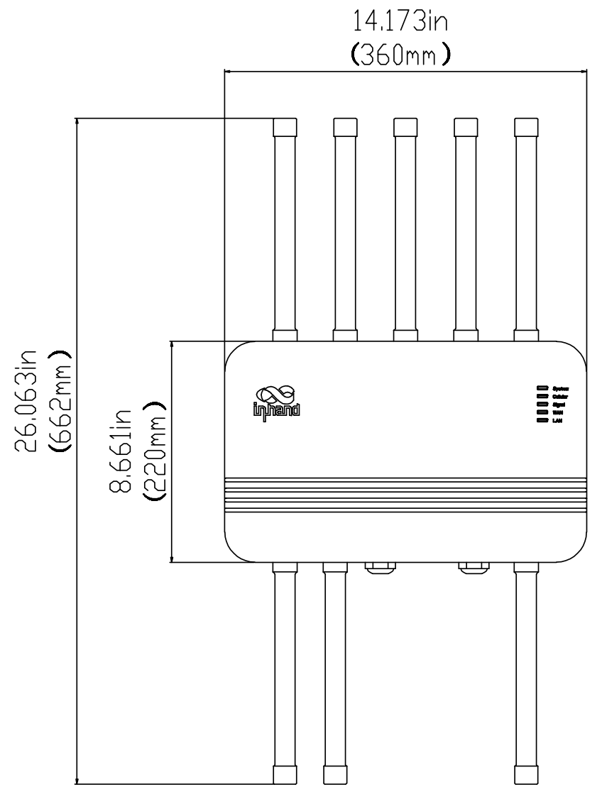
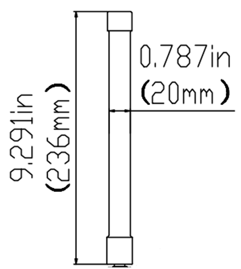
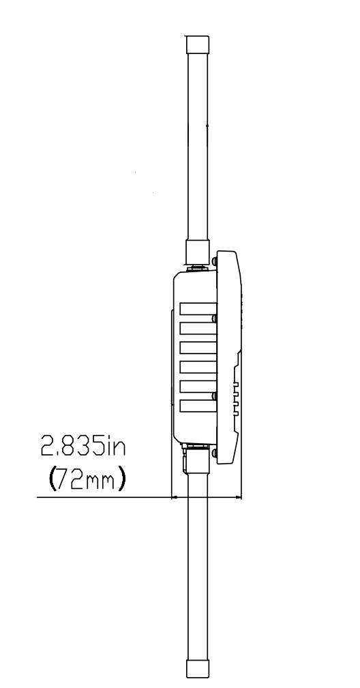

  

    

      
    

    

      超越边界，连接无限
    

  

  

    

      ODU2002 5G 室外单元
    

    

      

        
· 5G

        
· 云管理

      

      

        
· 室外 IP67

        
· 链路高可靠

      

    

  

## 1. 产品概述

**ODU2002 是一款 5G 室外单元，具备千兆蜂窝上行能力，下行高达 4.76 Gbps、上行高达 1.25 Gbps，支持 SA/NSA 网络，兼容 LTE CAT 19，可在严苛户外环境下为用户提供高速、稳定的网络接入。**

**产品特点：** 
- **极速 5G 连接：** 下行 4.76 Gbps、上行 1.25 Gbps，双 SIM 设计保障链路可靠
- **IP67 防护：** 防尘防水，宽温 -30 °C ~ +70 °C，适应严苛户外环境
- **链路高可靠：** 5G/有线备份、蜂窝故障转移、双 SIM 切换、可选 eSIM、故障自恢复
- **灵活安装：** GPS、PoE 供电、外置 5G 天线，壁挂/抱杆多种安装
- **云端管理：** 小星云管家平台，零接触部署、远程配置、可视化监控

### 核心技术指标

| 技术指标 | 规格 |
| --- | --- |
| 蜂窝网络 | 5G SA/NSA、4G LTE，双 Nano SIM，可选 eSIM |
| 定位 | GPS / GLONASS / Beidou / Galileo / QZSS 多星 |
| 云管理 | 小星云管家（集中管理、批量升级、上行链路管理） |
| VPN | IPSec VPN、L2TP VPN |
| Wi-Fi | 2.4 GHz，802.11 b/g/n，AP 模式，最高 150 Mbps |
| 尺寸 (长 × 宽 × 高) | 360 × 220 × 72 mm |
| 重量 | 2.87 kg |
| 接口 | 2 × 2.5 GbE RJ45，支持 802.3af/at PoE 受电 |
| 供电 | 802.3af/at PoE，≤15 W |
| 工作温度 | -30 °C ~ +70 °C |
| 防护等级 | IP67 |

## 2. 产品尺寸

  

    
    
俯视图（顶视）

  

  

    
    
接口图

  

  

    
    
侧视图（高度）

  

  

    
注意：

    
1. 所有尺寸单位为毫米（mm）。

    
2. 尺寸（长 × 宽 × 高）：360 × 220 × 72 mm。

    
3. 所有尺寸均为近似值，仅供参考。

    
4. 图示尺寸不得用于生产加工。

  

## 3. 硬件规格

| 类别/参数 | 规格 |
| --- | --- |
| **性能指标** | |
| 吞吐量 | 最高 2 Gbps |
| 带机量 | 200 |
| **接口** | |
| 蜂窝 | 5G：4.67 Gbps 下行 / 1.25 Gbps 上行；4G：1.6 Gbps 下行 / 200 Mbps 上行 |
| 以太网端口 | 2 × 2.5 GbE RJ45，WAN/LAN 切换、双 LAN，LAN 口支持 802.3af/at 受电 |
| USB | 1 × Type-C（调试用） |
| GPS | GPS / GLONASS / Beidou / Galileo / QZSS |
| SIM 卡 | 1 × eSIM，2 × Nano 4FF SIM，支持热插拔 |
| 复位 | 硬件 Reset 按钮 |
| 接地端子 | 1 × GND |
| 天线接口 | TNC 接口，6 × Sub 6，1 × GNSS，1 × Wi-Fi |
| **指示灯** | |
| LED | System、Cellular、Signal、WAN、LAN |
| **Wi-Fi** | |
| 射频 | 2.4 GHz 单频 |
| 速率 | 150 Mbps |
| 传输协议 | 802.11 b/g/n |
| 最大发射功率 | 17 dBm |
| 工作模式 | AP 模式 |
| **供电** | |
| 供电方式 | 802.3af/at PoE 受电 |
| 功耗 | ≤15 W |
| **机械特性** | |
| 尺寸 | 360 × 220 × 72 mm |
| 重量 | 2.87 kg |
| 安装方式 | 壁挂安装、抱杆安装 |
| 外壳与散热 | 金属外壳、无风扇设计 |
| **环境** | |
| 工作温度 | -30 °C ~ +70 °C |
| 存储温度 | -40 °C ~ +85 °C |
| 湿度 | 5 % ~ 95 % RH（无凝结） |
| 防护等级 | IP67 |
| 盐雾 | IEC 60068-2-52 |
| **EMC** | |
| 静电放电抗扰 | EN 61000-4-2 Level 3 |
| RFI 抗扰 | EN 61000-4-3 Level 3 |
| 电气快速瞬变/脉冲抗扰 | EN 61000-4-4 Level 3 |
| 浪涌 | EN 61000-4-5 Level 3 |
| 抗传导干扰 | EN 61000-4-6 Level 3 |
| RE/CE | Class A，Margin 3 dB |
| **物理特性** | |
| 防震 | IEC 60068-2-27 |
| 抗振 | IEC 60068-2-6 |
| 跌落 | IEC 60068-2-32 |
| **认证** | |
| 认证 | FCC、IC、PTCRB、Verizon、T-Mobile、CE |

## 4. 软件规格

| 类别/参数 | 规格 |
| --- | --- |
| **云管理** | |
| 平台 | 小星云管家 |
| 功能 | 集中式云管理、仪表盘、批量升级管理、上行链路管理 |
| **网络特性** | |
| 接入 | 5G/4G、以太网 |
| 拨号服务 | PPPoE、蜂窝自动重拨、双 SIM 切换、APN 配置 |
| 智能链路 | 多链路备份、分组负载均衡、实时监测延迟/抖动/丢包、上行链路优先级 |
| IP 协议 | IPv4 / IPv6 |
| 网络应用 | VLAN、DHCP Server/Client、DNS、DDNS、固定地址分配、IP 穿透 |
| 端口管理 | 双工模式、协商速率 |
| **安全** | |
| VPN | IPSec VPN、L2TP VPN |
| 防火墙 | 访问控制、端口映射、端口转发、MAC 过滤，基于 MAC/IP/端口/协议过滤 |
| **监控与告警** | |
| 仪表盘 | 设备信息、端口状态、流量统计 |
| 链路监控 | 延迟、抖动、丢包、上行流量 |
| 蜂窝信号 | 实时监测信号强度、RSSI、RSRP、RSRQ、SINR |
| 日志告警 | 系统日志、诊断日志、设备事件、邮件告警 |
| **Wi-Fi** | |
| 功能 | 2.4 G Wi-Fi，AP 模式 |
| **策略管理** | |
| 路由 | 策略路由、流量整形 |
| **自我修复** | |
| 看门狗 | 内置软硬件看门狗，自愈设备故障 |
| **远程维护** | |
| 访问控制 | 远程访问 Web UI、CLI |
| 云连接 | 远程维护 PC、监控设备、服务器 |
| 网络诊断 | Ping、Traceroute、抓包工具、诊断日志 |
| 配置备份 | 配置文件导入/导出 |

## 5. 订购信息

### 型号规则

**Model code：** ODU2002-\<WMNN\>

\<WMNN\>：型号 & 模组（Cellular Type & Module）

### 产品型号

<table style="width:100%;">
  <colgroup>
    <col style="width:30%;">
    <col style="width:14%;">
    <col style="width:56%;">
  </colgroup>
  <tr><th align="center">型号</th><th align="center">区域</th><th align="left">频段</th></tr>
  <tr><td align="center" style="white-space: nowrap;">ODU2002-NAVA</td><td align="center">北美 Verizon</td><td align="left">5G Sub 6：n2/n5/n7/n12/n14/n25/n30/n41/n48/n66/n71/n77/n78 LTE-FDD：B2/B4/B5/B7/B12/B13/B14/B17/B25/B26/B29/B30/B66/B71 LTE-TDD：B41/B46/B48</td></tr>
  <tr><td align="center" style="white-space: nowrap;">ODU2002-NATM</td><td align="center">北美 T-Mobile</td><td align="left">5G Sub 6：n25/n41/n66/n71 LTE-FDD：B2/B4/B5/B12/B66/B71 LTE-TDD：B41；LAA B46</td></tr>
  <tr><td align="center" style="white-space: nowrap;">ODU2002-EUNR</td><td align="center">欧洲/澳大利亚/亚洲/中国</td><td align="left">5G Sub 6：n1/n3/n5/n7/n8/n20/n28/n38/n40/n41/n71/n77/n78/n79 LTE-FDD：B1/B3/B5/B7/B8/B20/B28/B32/B71 LTE-TDD：B38/B40/B41/B42/B43</td></tr>
</table>

## 6. 联系我们

- **官网：** [映翰通官网](https://www.inhand.com.cn)
- **版权声明：** ©映翰通网络 保留所有权利
