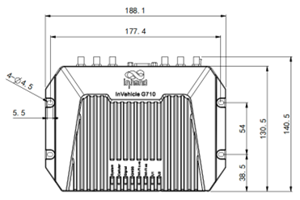
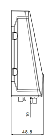

  

    

      
    

    

      车载专型设计，稳定互联，开放边缘计算
    

  

  

    

      VG710 车载网关
    

    

      

        
· 4G/LTE

        
· Wi-Fi 5

      

      

        
· GNSS+惯导

        
· OBD-II/J1939

      

    

  

# 1. 产品概述

**VG710 车载网关面向公交、物流、工程机械与特种车辆场景，提供安全稳定的蜂窝联网、车辆诊断与边缘计算能力。**

**产品特点：**
- **车载专型:** 工业级器件与加固设计，适应冲击、振动与宽温环境
- **稳定互联:** 支持 LTE CAT6/CAT4、双 SIM、Wi-Fi 5 与千兆以太网
- **精准定位:** 72 通道 GNSS 与惯性导航融合，提升弱信号场景连续定位
- **丰富接口:** 集成 OBD-II/J1939、CAN、RS485 与多路 I/O
- **开放平台:** 支持 Python 二次开发、Docker 容器与 OTA 升级

## 核心技术指标

|技术指标|规格|
|------|------|
|蜂窝网络|LTE Cat4 / Cat6（按型号）|
|定位能力|72 通道 GNSS（北斗/GPS/GLONASS/Galileo）+ 惯性导航|
|网络安全|SPI 防火墙、DoS 防护、ACL，支持 NAT/PAT/DMZ|
|VPN 能力|IPSec VPN、L2TP、PPTP、GRE、OpenVPN|
|无线局域网|Wi-Fi 5（2.4/5 GHz，AP/Client）+ Bluetooth 4.1|
|云与运维|支持 SmartFleet、OTA、远程管理与批量升级|
|外观尺寸|188 x 140.5 x 48.8 mm|
|设备重量|775 g|
|车载接口|4 x 千兆 RJ45、RS232、RS485、CAN、OBD-II/J1939、USB 2.0、MicroSD|
|I/O 能力|DI 6 路、AI 6 路（可复用）、DO 4 路、1-Wire|
|供电与功耗|9-36 V DC（可配 7-36 V DC），工作功耗 12.00 W，峰值 18.20 W|
|环境防护|工作温度 -30 C~+70 C，IP64，抗冲击振动与车规认证|

# 2. 产品尺寸

  

    

      
    

    
正视图

  

  

    

      
    

    
底部图

  

  

    

      
    

    
侧视图

  

  
<strong>注意：</strong>

  
1. 所有尺寸单位为毫米（mm）。

  
2. 所有尺寸均为近似值，仅供参考。

  
3. 图示尺寸不得用于生产加工。

  
4. 尺寸需符合零件及制造公差要求。

  
5. 尺寸如有变更，恕不另行通知。

# 3. 硬件规格

| 类别/参数 | 规格 |
|--------------------------|------|
| **处理器与存储** | |
| CPU | ARM Cortex A7 工业级处理器 |
| 主频 | 717 MHz |
| RAM | 512 MB / 1 GB（按型号） |
| FLASH | 8 GB eMMC |
| **连接与联网** | |
| 蜂窝网络 | LTE CAT4 / CAT6（按型号） |
| SIM 槽类型 | 推推式双 SIM，2FF |
| 天线接口 | SMA-K（Cellular、GNSS、Diversity），RPSMA-K（2x Wi-Fi、Bluetooth） |
| 天线建议配置 | LTE 天线 2 根，GNSS 天线 1 根，Wi-Fi 天线 2 根，蓝牙天线 1 根 |
| **卫星定位** | |
| GNSS | 72 通道高灵敏度定位系统，支持北斗/GPS/GLONASS/Galileo |
| 内置传感器 | 惯性导航（加速度计和陀螺仪） |
| 定位偏差 | 1.5 m（SBAS 星基增强系统），2.5 m（Autonomous） |
| 跟踪灵敏度 | -160 dBm |
| 位置更新率 | Max 10 Hz（100 ms） |
| **接口** | |
| 以太网 | 4 x 10/100/1000 Mbps RJ45 |
| CAN Bus | 支持 |
| 车辆诊断 | OBD-II、J1939 |
| 串口 | RS232（DB-9）、RS485（A+、B-、GND） |
| USB | USB 2.0 Micro-B（最大 480 Mbps） |
| MicroSD | MicroSD 卡（最高 32 GB） |
| 车载 I/O | DI 6 路、AI 6 路（6 路可复用为 DI/AI）、DO 4 路 |
| 其他车载接口 | 1-Wire（DS18B20 传感器） |
| 指示灯 | System、LTE、Signal、GNSS、Wi-Fi 2.4G、Wi-Fi 5G、U1、U2 |
| **无线** | |
| Wi-Fi 频段 | 2.4 / 5 GHz 双频 |
| Wi-Fi 标准 | Wi-Fi 5（802.11ac/a/b/g/n Wave2） |
| Wi-Fi 模式 | AP / Client |
| Wi-Fi 最大发射功率 | 2.4G：17 dBm；5G：17 dBm |
| 蓝牙 | Bluetooth 4.1 |
| **电源** | |
| 针脚定义 | V+, V-, 点火信号, NC（4 pins） |
| 输入电压 | 9-36 V DC（可配置 7-36 V DC） |
| 保护 | 内置电压瞬变保护与延时点火关闭 |
| 待机功耗 | 0.006 W（仅监测点火信号） |
| 工作功耗 | 12.00 W（射频模块启动、非满负荷平均功耗） |
| 峰值功耗 | 18.20 W（射频模块启动、满负荷峰值功耗） |
| **机械与环境** | |
| 安装方式 | 壁挂式安装 |
| 冷却方式 | 辐射散热 |
| 外壳工艺 | 压铸铝 |
| 外观尺寸 | 188 x 140.5 x 48.8 mm |
| 重量 | 775 g |
| 实时时钟 | RTC |
| 防护等级 | IP64 |
| 工作温度 | -30 C ~ +70 C |
| 存储温度 | -40 C ~ +85 C |
| 湿度 | 95%RH @ 60 C |
| 车载标准 | ECE-R118 |
| 铁路设施标准 | EN50155、EN50121、EN61373、EN45545 |
| EMC | Level 3（EN61000-4-2/-3/-4/-5/-6/-18） |
| 冲击与振动 | EN61373、IEC61371 |
| 认证 | CE、E-Mark、ITxPT、FCC、IC、PTCRB、AT&T、RoHS |

# 4. 软件规格

| 类别/参数 | 规格 |
|--------------------------|------|
| **网络特性** | |
| 网络接入 | APN、VPDN |
| LAN 协议 | ARP、以太网 |
| 接入认证 | CHAP、PAP、MS-CHAP、MS-CHAPV2 |
| IP 应用 | IPv6、Ping、Traceroute、DHCP Server/Relay/Client、DNS Relay、DDNS、Telnet、SSH、HTTP、HTTPS、TFTP、FTP、SFTP |
| 路由与转发 | 静态路由、RIP、OSPF、BGP、IGMP Proxy |
| 传输协议 | MQTT、DDS、AMQP、XMPP、JMS、REST、CoAP |
| **安全** | |
| 防火墙 | SPI、DoS 防护、ACL，支持 NAT/PAT/DMZ |
| 多级用户 | 支持管理员与只读用户 |
| AAA | 本地认证、Radius、Tacacs+、LDAP |
| VPN | IPSec VPN、L2TP、PPTP、GRE、OpenVPN |
| 证书 | PEM、PKCS12、SCEP |
| **可靠性** | |
| 备份功能 | 浮动路由、VRRP、接口备份 |
| 链路检测 | 心跳包检测、断线自动重连 |
| 设备自愈 | 看门狗与故障自恢复机制 |
| 离线缓存 | 网络不可用时记录关键数据 |
| **交换与 WLAN** | |
| VLAN | 支持 VLAN 划分 |
| 端口镜像 | 支持 |
| WLAN 协议 | IEEE 802.11b/g/n/a/ac |
| WLAN 安全 | 共享密钥、WPA/WPA2 认证、WEP/TKIP/AES 加密 |
| **配置与运维** | |
| 配置方式 | 本地或远程 HTTP、HTTPS、Telnet、SSH |
| 升级方式 | 本地或远程 Web、OTA、DM 平台、TFTP、FTP、SFTP Server |
| 网络诊断 | Ping、Traceroute、Sniffer（抓包工具） |
| **边缘计算与应用** | |
| 边缘计算平台 | 网络、计算、存储、应用一体化边缘计算平台 |
| 开发环境 | 标准 Python 3、Visual Studio Code、可视化 Docker 管理 |
| 功能函数库 | 支持 Python 官方库、自定义函数库、FlexAPI |
| 云平台对接 | Azure、AWS、阿里云等第三方平台 |
| 车队管理 | SmartFleet（任务分发、路径规划、车辆轨迹、实时消息、地理围栏） |
| 批量运维 | 批量固件升级、批量配置备份、应用程序升级 |
| 车辆状态监控 | 支持设备对接、远程诊断、资产监控 |
| 车辆告警事件 | 支持数字输入、网络、业务状态、电源、温度、电压等类型 |
| 消息推送 | SMS、Email、App、DO 数字输出事件推送 |

# 5. 订购信息

## 型号规则

**Model code:** VG710-\<WMNN\>

\<WMNN\>: Cellular Type & Module（蜂窝类型与模块）

## 产品型号

<table style="width:100%;">
  <colgroup>
    <col style="width:28%;">
    <col style="width:10%;">
    <col style="width:62%;">
  </colgroup>
  <tr><th align="center">型号</th><th align="center">区域</th><th align="left">&lt;WMNN&gt;: Cellular Type & Module</th></tr>
  <tr><td align="center" style="white-space: nowrap;">VG710-L-LQ20</td><td align="center">中国</td><td align="left">LTE CAT4，512MB/1GB（按配置）</td></tr>
  <tr><td align="center" style="white-space: nowrap;">VG710-L-FQ09</td><td align="center">全球</td><td align="left">LTE CAT6，多频段全球覆盖</td></tr>
  <tr><td align="center" style="white-space: nowrap;">VG710-L-EN00</td><td align="center">全球</td><td align="left">无蜂窝版本</td></tr>
</table>

## 天线选配

<table style="width:100%;">
  <colgroup>
    <col style="width:32%;">
    <col style="width:22%;">
    <col style="width:46%;">
  </colgroup>
  <tr><th align="center">天线类型</th><th align="center">订购编码</th><th align="left">规格</th></tr>
  <tr><td align="center">LTE4G 天线（背胶贴片）</td><td align="center" style="white-space: nowrap;">AANT090025</td><td align="left">LTE/GSM/CDMA 全网段天线，线长约 2000 mm</td></tr>
  <tr><td align="center">GNSS 天线</td><td align="center" style="white-space: nowrap;">AANT040005</td><td align="left">GPS/GALILEO/GLONASS，约 55.6 x 50.5 mm</td></tr>
  <tr><td align="center">GNSS 天线</td><td align="center" style="white-space: nowrap;">AANT040006</td><td align="left">GPS/GALILEO/GLONASS，约 50 x 38.5 mm</td></tr>
  <tr><td align="center">Wi-Fi 天线（胶棒）</td><td align="center" style="white-space: nowrap;">AANT060016</td><td align="left">2.4/5 GHz，峰值增益约 5 dBi</td></tr>
  <tr><td align="center">Wi-Fi 天线（背胶贴片）</td><td align="center" style="white-space: nowrap;">AANT060018</td><td align="left">2.4/5 GHz，线长约 2000 mm</td></tr>
  <tr><td align="center">Bluetooth 天线（胶棒）</td><td align="center" style="white-space: nowrap;">AANT060017</td><td align="left">2.4 GHz，峰值增益约 2 dBi</td></tr>
</table>

## 线缆选配

| 线缆类型 | 订购编码 | 规格 |
|----------|----------|------|
| 电源线 | SCAB000216 | A 端 4PIN 接 VG710，B 端裸线，线长 3 m |
| 20PIN 延长线 | SCAB000219 | A 端 20PIN 接 VG710，B 端线头，线长 0.5 m |
| OBD-II 多合一线 | SCAB000235 | 多端口测试与接入线缆组件 |

# 6. 联系我们

- **官网：** [映翰通官网](https://www.inhand.com.cn)
- **版权声明：** ©映翰通网络 保留所有权利

# 7. 20PIN 端子定义

<table style="width:88%;">
  <colgroup>
    <col style="width:10%;">
    <col style="width:25%;">
    <col style="width:65%;">
  </colgroup>
  <tr><th align="center">引脚</th><th align="center">定义</th><th align="left">说明</th></tr>
  <tr><td align="center">1</td><td align="center">-485</td><td>485 接口（PDF 原文）</td></tr>
  <tr><td align="center">2</td><td align="center">CANL</td><td>CAN 低电平</td></tr>
  <tr><td align="center">3</td><td align="center">1-Wire</td><td>1-Wire 接口</td></tr>
  <tr><td align="center">4</td><td align="center">DO4</td><td>数字输出 4</td></tr>
  <tr><td align="center">5</td><td align="center">DO2</td><td>数字输出 2</td></tr>
  <tr><td align="center">6</td><td align="center">GND</td><td>信号地</td></tr>
  <tr><td align="center">7*</td><td align="center">AI6/DI6</td><td>模拟输入 6 / 数字输入 6（复用）</td></tr>
  <tr><td align="center">8</td><td align="center">AI4/DI4</td><td>模拟输入 4 / 数字输入 4（复用）</td></tr>
  <tr><td align="center">9</td><td align="center">AI2/DI2</td><td>模拟输入 2 / 数字输入 2（复用）</td></tr>
  <tr><td align="center">10</td><td align="center">GND</td><td>信号地</td></tr>
  <tr><td align="center">11</td><td align="center">485</td><td>485 接口（PDF 原文）</td></tr>
  <tr><td align="center">12</td><td align="center">CANH</td><td>CAN 高电平</td></tr>
  <tr><td align="center">13</td><td align="center">GND</td><td>信号地</td></tr>
  <tr><td align="center">14</td><td align="center">DO3</td><td>数字输出 3</td></tr>
  <tr><td align="center">15</td><td align="center">DO1</td><td>数字输出 1</td></tr>
  <tr><td align="center">16</td><td align="center">GND</td><td>信号地</td></tr>
  <tr><td align="center">17*</td><td align="center">AI5/DI5</td><td>模拟输入 5 / 数字输入 5（复用）</td></tr>
  <tr><td align="center">18</td><td align="center">AI3/DI3</td><td>模拟输入 3 / 数字输入 3（复用）</td></tr>
  <tr><td align="center">19</td><td align="center">AI1/DI1</td><td>模拟输入 1 / 数字输入 1（复用）</td></tr>
  <tr><td align="center">20</td><td align="center">GND</td><td>信号地</td></tr>
</table>

**注：**
- `7*`：`AI6/DI6/FWD`
- `17*`：`AI5/DI5/WHEELTICK`

## 电源针脚定义（4pins）

- `V+`：电源正极  
- `V-`：电源负极  
- `点火信号`：ACC/IGN 输入  
- `NC`：预留（未连接）

