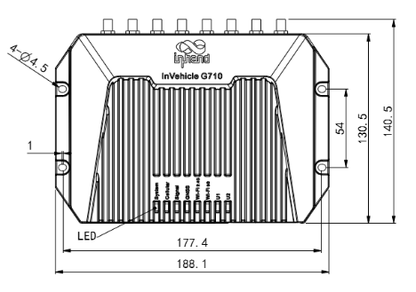
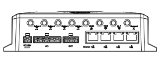
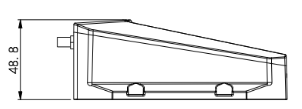

  

    

      
    

    

      高性能车域网络，强劲数据处理，灵活开发扩展
    

  

  

    

      InVehicle G710 5G 车载无线通信网关
    

    

      

        
· 5G SA/NSA

        
· Wi-Fi 5

      

      

        
· GNSS+惯导

        
· OBD-II/J1939

      

    

  

# 1. 产品概述

**InVehicle G710 是面向车联网场景推出的新一代 5G 车载网关，适用于特种车辆、执法、应急、工程、救护、物流等行业，提供高速、安全、稳定的移动网络能力。**

**产品特点：**
- **5G 高速互联：** 支持 5G SA/NSA 组网模式，兼容 LTE/3G 网络
- **车载专型设计：** 工业级平台，适应冲击、振动、湿热与宽温环境，防护等级 IP64
- **精准定位：** 72 通道 GNSS + 惯性导航，弱信号环境下保持连续定位能力
- **丰富接口：** 集成 OBD-II/J1939、CAN、RS232/RS485、多路 I/O 与蓝牙
- **边缘智能：** 支持 Python 开发、Docker 容器与车队管理平台接入

## 核心技术指标

|技术指标|规格|
|------|------|
|蜂窝网络|5G NR SA/NSA，兼容 LTE/3G（按型号频段）|
|定位能力|北斗/GPS/GLONASS/Galileo + 惯性导航|
|无线能力|Wi-Fi 5（2.4/5 GHz，AP/Client）+ Bluetooth 4.1|
|网络安全|SPI 防火墙、DoS 防护、ACL，支持 NAT/PAT/DMZ|
|VPN 能力|IPsec VPN、L2TP、PPTP、GRE、OpenVPN|
|边缘计算|Python3 开发环境、Visual Studio Code、Docker 管理|
|外观尺寸|188.1 x 140.5 x 48.8 mm|
|设备重量|775 g|
|供电能力|9-36 V DC（可配置 7-36 V DC）|
|防护等级|IP64|

# 2. 产品尺寸

  

    
    
正视图

  

  

    
    
接口图

  

  

    
    
侧视图

  

  

    
注意：

    
1.所有尺寸单位为毫米（mm）。

    
2.所有尺寸均为近似值，仅供参考。

    
3.图示尺寸不得用于生产加工。

    
4.尺寸需符合零件及制造公差要求。

    
5.尺寸如有变更，恕不另行通知。

  

# 3. 硬件规格

| 类别/参数 | 规格 |
|--------------------------|------|
| **处理器与存储** | |
| CPU | ARM Cortex A7 |
| 主频 | 717 MHz |
| RAM | 1 GB DDR3 |
| FLASH | 8 GB eMMC |
| **连接与联网** | |
| 蜂窝网络 | 5G NR SA/NSA，兼容 LTE/3G（按型号） |
| 蜂窝速率 | 5G 下行 2 Gbps（Sub6） |
| SIM 槽类型 | 推推式双 SIM，2FF |
| 以太网 | 4 x 10/100/1000 Mbps RJ45 |
| 天线接口 | 4 x Cellular、1 x GNSS、2 x Wi-Fi、1 x Bluetooth（SMA） |
| **卫星定位** | |
| GNSS | 支持北斗、GPS、GLONASS、Galileo |
| 内置传感器 | 惯性导航（加速度计和陀螺仪） |
| 定位偏差 | 1.5 m（SBAS）/ 2.5 m（Autonomous） |
| 跟踪灵敏度 | -160 dBm |
| 位置更新率 | Max 10 Hz（100 ms） |
| **接口** | |
| 串口 | RS485 x1、RS232 x1 |
| 车载 I/O | DI/AI 4 路（含复用），DO 2 路 |
| 其他车载接口 | 1-Wire（DS18B20 传感器） |
| 语音接口 | 左声道、右声道、Mic |
| 诊断接口 | CAN Bus x2、J1708 x1、LIN x1 |
| MicroSD | 支持（最高 32 GB） |
| 蓝牙 | Bluetooth 4.1 |
| **电源与机械** | |
| 针脚定义 | V+、V-、点火信号、NC（4pins） |
| 输入电压 | 9-36 V DC（可配置 7-36 V DC） |
| 待机功耗 | 0.006 W（仅监测点火信号） |
| 工作功耗 | 12.00 W（平均） |
| 峰值功耗 | 18.20 W |
| 安装方式 | 壁挂式安装 |
| 冷却方式 | 辐射散热 |
| 外壳工艺 | 压铸铝 |
| 外观尺寸 | 188.1 x 140.5 x 48.8 mm |
| 重量 | 775 g |
| 防护等级 | IP64 |
| 工作温度 | -30 C ~ +70 C |
| 存储温度 | -40 C ~ +85 C |
| 湿度 | 95%RH @ 60 C |
| **认证** | |
| 汽车标准 | ECE-R10、R118 |
| 铁路设施标准 | EN50155、EN50121、EN61373、EN45545 |
| EMC | Level 3（EN61000-4-2/-3/-4/-5/-6/-18） |
| 冲击与振动 | EN61373、IEC61371 |
| 认证 | CE、E-Mark、ITxPT、FCC、IC、PTCRB、AT&T、RoHS |

# 4. 软件规格

| 类别/参数 | 规格 |
|--------------------------|------|
| **网络特性** | |
| 网络接入 | APN、VPDN |
| LAN 协议 | ARP、Ethernet |
| 接入认证 | CHAP、PAP、MS-CHAP、MS-CHAPV2 |
| IP 应用 | IPv6、Ping、Traceroute、DHCP Server/Relay/Client、DNS Relay、DDNS、Telnet、SSH、HTTP、HTTPS、TFTP、FTP、SFTP |
| 路由协议 | 静态路由、RIP、OSPF、BGP、IGMP Proxy |
| IoT 协议 | MQTT、DDS、AMQP、XMPP、JMS、REST、CoAP |
| **网络安全** | |
| 防火墙 | SPI、DoS 防护、ACL，支持 NAT/PAT/DMZ、端口映射、虚拟服务器 |
| 多级用户 | 管理员与只读用户 |
| AAA | 本地认证、Radius、Tacacs+、LDAP |
| VPN | IPsec VPN、L2TP、PPTP、GRE、OpenVPN |
| CA 证书 | PEM、PKCS12、SCEP |
| **可靠性与运维** | |
| 备份功能 | 浮动路由、VRRP、接口备份 |
| 链路检测 | 心跳检测、断线自动重连 |
| 设备自愈 | 看门狗故障自恢复 |
| 离线缓存 | 网络不可用时缓存关键数据 |
| 配置方式 | 本地或远程 HTTP/HTTPS/Telnet/SSH |
| 升级方式 | 本地或远程 Web、OTA、DeviceManager、InConnect |
| 网络诊断 | Ping、Traceroute、Sniffer |
| **边缘计算与云平台** | |
| 边缘平台 | 网络、计算、存储、应用一体化平台 |
| 开发环境 | Python3、Visual Studio Code、可视化 Docker 管理 |
| IDE 集成开发环境 | Visual Studio Code |
| 函数库 | Python 官方库、自定义函数库、FlexAPI |
| 云平台 | Azure、AWS、阿里云及第三方云平台 |

# 5. 订购信息

## 产品型号

<table style="width:100%;">
  <colgroup>
    <col style="width:22%;">
    <col style="width:58%;">
    <col style="width:20%;">
  </colgroup>
  <tr><th align="center">型号</th><th align="left">主要特性</th><th align="center">区域</th></tr>
  <tr><td align="center" style="white-space: nowrap;">VG710-H-NRQ0</td><td align="left">5G NR SA/NSA，多频段，2 x CAN，GNSS，Wi-Fi，Bluetooth</td><td align="center">全球（不含北美）</td></tr>
  <tr><td align="center" style="white-space: nowrap;">VG710-H-NRQ5</td><td align="left">5G NR SA/NSA（3GPP Release 16），2 x CAN，GNSS，Wi-Fi，Bluetooth</td><td align="center">全球</td></tr>
  <tr><td align="center" style="white-space: nowrap;">VG710-H-NRQ2</td><td align="left">5G NR SA/NSA，中国频段，2 x CAN，GNSS，Wi-Fi，Bluetooth</td><td align="center">中国</td></tr>
</table>

# 6. 联系我们

- **官网：** [映翰通官网](https://www.inhand.com.cn)
- **版权声明：** ©映翰通网络 保留所有权利

# 7. 端子引脚定义

## IO 20PIN Definition

| PIN | 定义 | PIN | 定义 |
|-----|------|-----|------|
| 1 | L_Channel | 11 | R_Channel |
| 2 | Mic_IN | 12 | GND |
| 3 | RS_485A | 13 | RS_485B |
| 4 | GND | 14 | GND |
| 5 | RS232_TX | 15 | RS232_RX |
| 6 | 1Wire | 16 | GNSS_1PPS |
| 7 | DO1 | 17 | DO2 |
| 8 | GND | 18 | GND |
| 9 | AI1/DI1 | 19 | AI2/DI2 |
| 10 | AI3/DI3/FWD* | 20 | AI4/DI4/WHEELTICK* |

## EXT 10PIN Definition

| PIN | 定义 | PIN | 定义 |
|-----|------|-----|------|
| 1 | K_LINE | 6 | L_LINE |
| 2 | CAN1_H | 7 | CAN1_L |
| 3 | GND | 8 | GND |
| 4 | CAN2_H | 9 | CAN2_L |
| 5 | J1708_A | 10 | J1708_B |