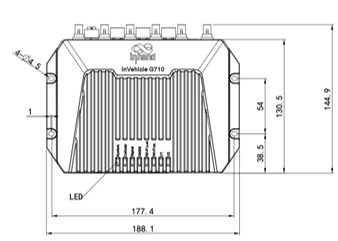
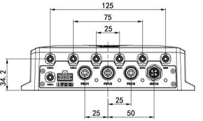
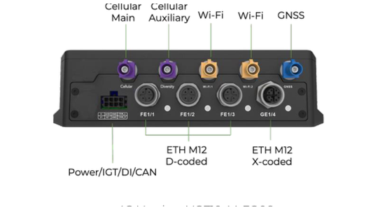
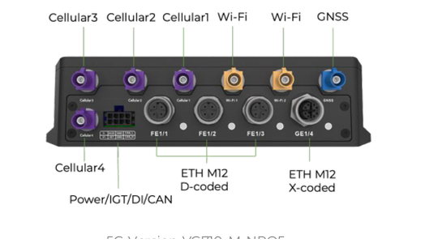

  

    

      
    

    

      极速5G互联，航空级加固，开放可编程网关
    

  

  

    

      VG710 5G 车载网关
    

    

      

        
· 5G/LTE

        
· Wi-Fi 5

      

      

        
· GNSS

        
· M12连接器

      

    

  

## 1. 产品概述

**VG710-M12 系列车载网关面向工程机械、执法车辆、救护车队等场景，提供极速、安全、稳定的车载联网能力。其以太网接口采用坚固耐用的 M12 航空接口，符合欧洲公共交通 ITxPT 标准。**

**产品特点：** 
- **车载专型:** 驾驶行为监控、车辆数据监控、惯性导航，适配车队管理平台
- **极速互联:** 5G/LTE CAT6/CAT4、双 SIM、Wi-Fi5 双频、GNSS 多星定位
- **工业加固:** M12 航空接头、IP64防护、-30~70°C宽温、车载标准认证
- **开放可编程:** Python/C、Docker、MQTT、Azure IoT Edge，支持边缘计算
- **云管一体:** DeviceLive 远程管理、SmartFleet 车队管理

## 核心技术指标

|技术指标|规格|
|---|---|
|蜂窝网络|5G、LTE CAT6、LTE CAT4；双 SIM，支持贴片 eSIM|
|定位能力|GNSS 多星定位（GPS/BDS/Galileo/GLONASS/QZSS）+ 惯性导航|
|云管理|DeviceLive 远程管理与 SmartFleet 车队管理|
|VPN|IPSec VPN、L2TP、GRE、OpenVPN|
|Wi-Fi|Wi-Fi 5 双频（2.4/5 GHz），支持 AP/Client|
|边缘计算|支持 Python、C/C++、Docker 与 Azure IoT Edge SDK|
|产品尺寸（W×D×H）|188.1 × 144.9 × 48.8 mm|
|整机重量|974 g|
|接口能力|3 × M12 D-coded 百兆口 + 1 × M12 X-coded 千兆口，CAN 2.0，1 × AI/DI|
|供电输入|9–36 V DC（可配置最低 7–36 V DC）|
|工作温度|-30 °C ~ +70 °C|
|防护等级|IP64|

## 2. 产品尺寸

  

    
    
正视图

  

  

    
    
接口图

  

  

    
    
侧视图

  

  

    
注意：

    
1.所有尺寸单位为毫米（mm）。

    
2.所有尺寸均为近似值，仅供参考。

    
3.图示尺寸不得用于生产加工。

    
4.尺寸需符合零件及制造公差要求。

    
5.尺寸如有变更，恕不另行通知。

  

## 3. 硬件规格

| 类别/参数 | 规格 |
|--------------------------|------|
| **处理器** | |
| CPU | 4 核 ARM Cortex-A7 |
| 主频 | 717 MHz |
| RAM | 1 GB DDR3 |
| 存储 | 8 GB eMMC |
| **连接与联网** | |
| 蜂窝网络 | 5G、LTE CAT6、LTE CAT4 |
| SIM 槽类型 | 双 SIM，支持贴片 eSIM |
| SIM 卡规格 | 2FF |
| 天线 | Cellular 4 或 2 × FAKRA D-coded；Wi-Fi 2 × FAKRA I-coded；GNSS 1 × FAKRA C-coded |
| **卫星定位** | |
| GNSS 接收器 | GPS L1 C/A + L5, BDS, Galileo, GLONASS, QZSS |
| 内置传感器 | 加速度计，陀螺仪，支持惯性导航 |
| 定位精度 | 1 m CEP |
| SBAS | WAAS, EGNOS, MSAS, GAGAN |
| 捕获灵敏度 | -145 dBm |
| 跟踪灵敏度 | -165 dBm |
| 重捕获灵敏度 | -157 dBm |
| 定位更新频率 | 10 Hz |
| 位置更新率 | GNSS: 1 Hz；IMU: 100 Hz |
| **接口** | |
| 以太网 | 3 × M12 D-coded 航空接头 10/100 Mbps；1 × M12 X-coded 航空接头 10/100/1000 Mbps |
| CAN Bus | CAN Bus [2 pins], CAN 2.0 |
| I/O | 1 × AI/DI |
| 实时时钟 | 支持 |
| **Wi-Fi** | |
| 频率 | 2.4 / 5 GHz 双频 |
| 协议 | Wi-Fi 5 |
| 最大输出功率 | 2.4G: 17 dBm；5G: 17 dBm |
| 模式 | AP / Client |
| **指示灯** | |
| 指示灯 | System, Cellular, Signal, GNSS, Wi-Fi 2.4G, Wi-Fi 5G, U1, U2 |
| **电源** | |
| 输入电源 | 9–36 V DC（可配置最低 7–36 V DC） |
| 针脚定义 | V+, V-, IGT 点火信号 (8 pins) |
| 功耗 | 6.44 W（射频模块非满负荷运行时的平均功耗） |
| 峰值功耗 | 23.24 W |
| 保护 | 内置电压瞬变保护，具有延时关闭的点火感应 |
| **机械** | |
| 尺寸 (W × D × H) | 188.1 × 144.9 × 48.8 mm |
| 裸机重量 | 974 g |
| 安装方式 | 壁挂式安装 |
| 防护等级 | IP64 |
| 散热 | 无风扇，被动散热 |
| 外壳工艺 | 压铸铝 |
| **环境** | |
| 工作温度 | -30 °C ~ +70 °C |
| 储存温度 | -40 °C ~ +85 °C |
| 湿度 | 95 % RH @ 40 °C |
| **车载标准** | |
| 车辆标准 | ECE-R10, R118 |
| 铁路设施标准 | EN 50155, EN 50121, EN 61373 |
| 防火标准 | EN 45545 |
| 车规测试标准 | IEC60068-2-31 |
| EMC 等级 | Level 3（EN61000-4-2, EN61000-4-3, EN61000-4-4, EN61000-4-5, EN61000-4-6, EN61000-4-18） |
| 抗冲击标准 | IEC60068-2-27 |
| 抗振动标准 | IEC60068-2-6 |
| 自由落体标准 | IEC60068-2-32 |
| **认证** | |
| 认证 | CE, E-Mark, UKCA, ITxPT, FCC, IC, PTCRB, RoHS, EN 18031 |
| 运营商认证 | VZW, AT&T, TMO |

## 4. 软件规格

| 类别/参数 | 规格 |
|--------------------------|------|
| **网络特性** | |
| 网络接入 | APN, VPDN |
| LAN 协议 | ARP, Ethernet, VLAN |
| 认证方式 | CHAP/PAP/MS-CHAP/MS-CHAP V2 |
| IP 应用 | IPv4, IPv6, DHCP Server/Relay/Client, DNS relay, DDNS, Telnet, SSH, HTTP, HTTPS, TFTP, FTP, SFTP, Portal |
| IP 路由协议 | 静态路由, RIP, OSPF, BGP, IGMP Proxy |
| **安全** | |
| 防火墙 | 全状态包检测(SPI)、防范拒绝服务(DoS)攻击，过滤多播/Ping 探测包、访问控制列表(ACL)，支持 NAT、PAT、DMZ、端口映射、虚拟服务器 |
| 多级用户 | 支持管理员和只读用户 |
| AAA | 本地认证、Radius、Tacacs+、LDAP |
| CA 证书 | PEM, PKCS12, SCEP |
| VPN | IPSec VPN, L2TP, GRE, OpenVPN, CA |
| **可靠性** | |
| 备份功能 | 浮动路由，VRRP，接口备份 |
| 链路探测 | 发送心跳包检测，断线自动连接 |
| 看门狗 | 设备运行自检技术，设备运行故障自修复 |
| 离线缓存 | 内置缓存机制，网络不可用时记录关键数据 |
| **端口** | |
| VLAN 划分 | 支持 |
| 端口镜像 | 支持 |
| **WLAN** | |
| 协议标准 | IEEE 802.11 b/g/n/a/ac |
| 安全特性 | 共享密钥、WPA/WPA2 认证，WEP/TKIP/AES 加密 |
| **配置管理** | |
| 配置方式 | HTTPS, Telnet, SSH, DeviceLive Platform |
| 升级方式 | 本地或远程 WEB、OTA、DeviceLive 平台 |
| 认证方式 AAA | Local / Radius / TACACS+ |
| 网络诊断 | Ping、Traceroute、Sniffer（网络抓包工具） |
| **边缘计算** | |
| 边缘计算框架 | 采用网络、计算、存储、应用为一体的边缘计算平台 |
| 可编程支持 | Python, C/C++ & Docker |
| SDK | Python 3 SDK, Docker SDK and Azure IoT Edge SDK |
| IDE | Visual Studio Code |
| IoT 架构 | Supports MQTT, DDS, AMQP, XMPP, JMS, REST, CoAP |
| 云平台 | Azure、AWS、阿里云，等其他第三方云平台 |
| Docker 镜像 | Node-RED, Ubuntu, Docker for ARM 32, etc. |
| **应用服务** | |
| 车队管理 | InHand SmartFleet 云平台：车辆跟踪、实时消息传递、地理围栏、批量固件升级、批量配置备份、应用程序升级 |
| 车辆状态监控 | 支持车载诊断协议 J1939，OBD II，定制协议 |
| 告警事件 | 数字输入、网络、服务状态、电源、温度、电压等 |
| 消息推送 | 短信、电子邮件、应用程序、设备数字输出 |

## 5. 订购信息

### 型号规则

**Model code:** VG710-\<M/NA\>-\<WMNN\>

\<WMNN\>: Cellular Type & Module（蜂窝类型与模块）

### 产品型号

<table style="width:100%;">
  <colgroup>
    <col style="width:25%;">
    <col style="width:25%;">
    <col style="width:50%;">
  </colgroup>
  <tr><th align="center">型号</th><th align="center">类型/区域</th><th align="left">规格说明</th></tr>
  <tr><td align="center" style="white-space: nowrap;">VG710-M-NRQ5</td><td align="center">5G，全球</td><td align="left">5G NSA/SA n1/2/3/5/7/8/12/13/14/18/20/25/26/28/29/30/38/40/41/48/66/70/71/75/76/77/78/79；LTE-FDD B1/2/3/4/5/7/8/12/13/14/17/18/19/20/25/26/28/29/30/32/66/71；LTE-TDD B34/38/39/40/41/42/43/48 LAA 46；WCDMA B1/2/4/5/8/19</td></tr>
  <tr><td align="center" style="white-space: nowrap;">VG710-M-FQ09</td><td align="center">LTE CAT6，全球</td><td align="left">LTE-FDD B1/2/3/4/5/7/8/12/13/14/17/18/19/20/25/26/28/29/30/32/66/71；LTE-TDD B34/38/39/40/41/42/43/46(LAA)/48(CBRS)；WCDMA B1/2/3/4/5/6/8/19</td></tr>
  <tr><td align="center" style="white-space: nowrap;">VG710-M-FQ58</td><td align="center">LTE CAT4，欧洲、亚太</td><td align="left">LTE-FDD B1/B3/B7/B8/B20/B28A；LTE-TDD B38/B40/B41；WCDMA B1/B8；GSM B3/8</td></tr>
  <tr><td align="center" style="white-space: nowrap;">VG710-M-EN00</td><td align="center">NONE，全球</td><td align="left">—</td></tr>
</table>

### 天线选配

| 天线类型 | 订购编码 | 规格 |
|----------|----------|------|
| 4G FAKRA 天线 | AANT090038 | 4G 背胶天线 FAKRA 紫色连接器，线长 2000 mm |
| 5G FAKRA 天线 | AANT110017 | 5G 背胶天线 FAKRA 紫色连接器，线长 2000 mm |
| Wi-Fi FAKRA 天线 | AANT060024 | Wi-Fi 背胶天线 FAKRA 米色连接器，线长 2000 mm |
| GNSS FAKRA 天线 | AANT040013 | GNSS 背胶天线 FAKRA 蓝色连接器，线长 2000 mm |

### 线缆选配

| 线缆类型 | 订购编码 | 规格 |
|----------|----------|------|
| VG710-M12 电源线 | SCAB000564 | VG710-M12 版本电源线，8PIN，线长 2000 mm |
| M12 X to RJ45 网线 | AETH050002 | 网线 M12 X-coded 航空接头转 RJ45 接口，线长 1000 mm |

## 6. 联系我们

- **官网：** [映翰通官网](https://www.inhand.com.cn)
- **版权声明：** ©映翰通网络 保留所有权利

# 7. 连接器引脚

<table style="width:100%; border:none; border-collapse:collapse; table-layout:fixed;">
  <tr>
    <td style="width:50%; text-align:center; vertical-align:bottom; border:none; padding:0 8px;">
      
      
引脚接口图4G版本

    </td>
    <td style="width:50%; text-align:center; vertical-align:bottom; border:none; padding:0 8px;">
      
      
引脚接口图5G版本

    </td>
  </tr>
</table>