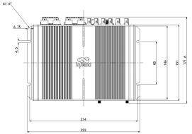
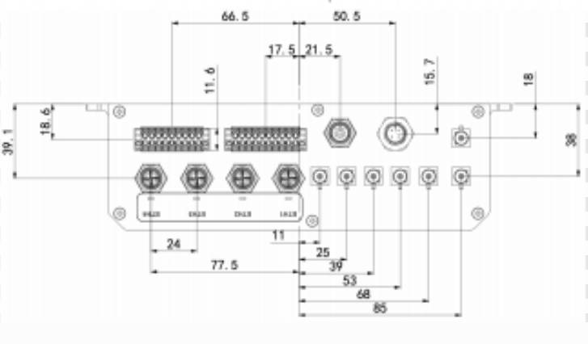
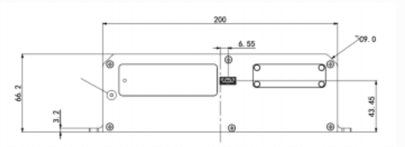
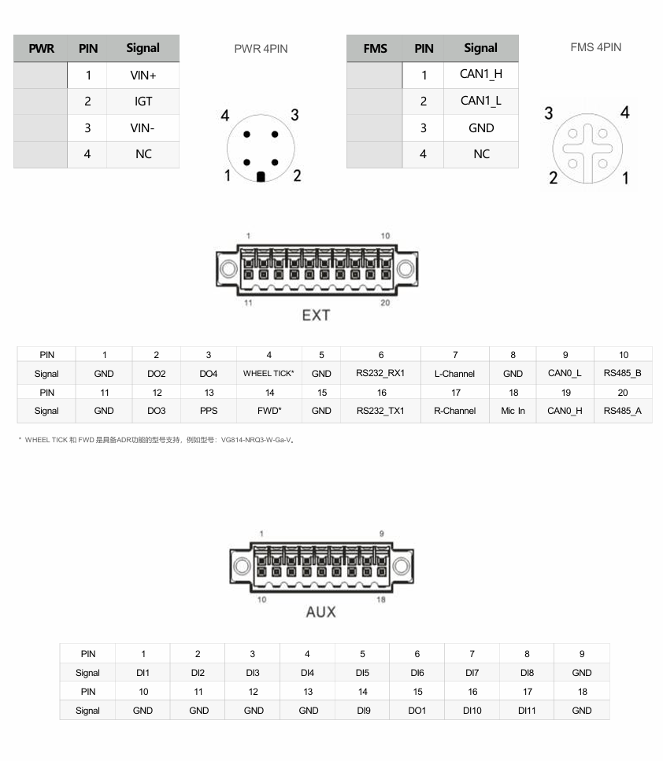

  

    

      
    

    

      高性能车域网络，一体化设计，灵活扩展
    

  

  

    

      VG814 车载网关
    

    

      

        
· 5G/4G

        
· Wi-Fi 5

      

      

        
· GNSS

        
· M12 + FAKRA

      

    

  

# 1. 产品概述

**VG814 车载网关面向无人驾驶小车、公交与轨道交通等场景，提供稳定、安全、可扩展的车载联网与边缘计算能力。**

**产品特点：**
- **高速互联:** 支持 5G/4G 广域接入，满足低时延高带宽业务
- **车规设计:** M12 航空接口与 FAKRA 天线接口，适配复杂车载环境
- **融合接入:** 集成双频 Wi-Fi、全千兆以太网与 CAN 总线
- **精准定位:** 内置 GNSS 与惯性导航能力，支持 ADR/UDR 模式
- **开放开发:** 支持 Python 与 Docker，兼容 Azure、AWS 等云平台

## 核心技术指标

|技术指标|规格|
| --- | --- |
| 蜂窝网络 | 5G Sub-6 / 4G LTE（因型号而异），2 × Mini SIM，eSIM 可选 |
| 定位 | GPS / GLONASS / Galileo / Beidou，惯性导航，2.5 m CEP |
| 云管理 | DeviceManager 云平台（远程配置、升级与诊断） |
| VPN | IPSec VPN、OpenVPN、L2TP、GRE |
| Wi-Fi | Wi-Fi 5 双频（2.4 / 5 GHz），AP / Client，2 × 2 MIMO |
| 安全 | SPI 防火墙、NAT/PAT/DMZ、AAA、证书管理 |
| 尺寸 (W × H × D) | 223 × 60 × 148.8 mm |
| 重量 | 1340 g |
| 接口 | 4 × 千兆 M12、2 × CAN 2.0B、RS232/RS485、11DI/4DO、USB 3.0 |
| 供电 | 9–36 V DC，M12 A-coded 电源接口 |
| 工作温度 | -30 °C ~ +70 °C |
| 防护等级 | IP53 |

# 2. 产品尺寸

  

    
    
俯视图（顶视）

  

  

    
    
接口面尺寸图

  

  

    
    
侧视图（高度）

  

  

    
注意：

    
1.所有尺寸单位为毫米（mm）。

    
2.所有尺寸均为近似值，仅供参考。

    
3.图示尺寸不得用于生产加工。

    
4.尺寸需符合零件及制造公差要求。

    
5.尺寸如有变更，恕不另行通知。

  

# 3. 硬件规格

| 类别/参数 | 规格 |
|--------------------------|------|
| **处理器** | |
| CPU | ARM Cortex-A7（4 核） |
| 主频 | 717 MHz |
| RAM | 1 GB DDR3L |
| 存储 | 8 GB eMMC |
| **连接与联网** | |
| 蜂窝网络 | 5G Sub-6 或 4G LTE（因型号而异） |
| SIM 槽类型 | 2 × Mini SIM (2FF) |
| 天线接口 | 蜂窝：FAKRA D-coded；Wi-Fi：FAKRA I-coded |
| eSIM | 可选 |
| **卫星定位** | |
| GNSS 接收器 | GPS, GLONASS, Galileo, Beidou |
| GNSS 天线接口 | FAKRA C-coded male |
| 内置传感器 | 加速度计 + 陀螺仪，支持惯性导航 |
| 定位精度 | 2.5 m CEP |
| 跟踪灵敏度 | -160 dBm |
| 定位更新频率 | Max 10 Hz |
| **接口** | |
| 以太网 | 4 × Gigabit Ethernet（M12 X-coded female） |
| CAN Bus | 2 × CAN 2.0B（含 FMS 接口） |
| 串口 | 1 × RS232，1 × RS485 |
| USB | 1 × USB 3.0 Type-A |
| I/O | 11 × DI，4 × DO |
| 语音接口 | 左声道、右声道、Mic In |
| **Wi-Fi** | |
| 频率 | 2.4 / 5 GHz 双频 |
| 协议 | Wi-Fi 5 |
| MIMO | 2 × 2 |
| 最大输出功率 | 2.4G: 17 dBm；5G: 17 dBm |
| 模式 | AP / Client |
| **电源** | |
| 输入电压 | 9–36 V DC |
| 电源接口 | M12 A-coded male（4 pins） |
| 针脚定义 | V+, V-, IGT, NC |
| **机械** | |
| 尺寸 (W × H × D) | 223 × 60 × 148.8 mm |
| 裸机重量 | 1340 g |
| 安装方式 | 壁挂式安装 |
| 防护等级 | IP53 |
| 散热 | 无风扇散热 |
| 外壳材质 | 铝型材 |
| **环境与认证** | |
| 工作温度 | -30 °C ~ +70 °C |
| 储存温度 | -40 °C ~ +85 °C |
| 湿度 | 95 % RH @ 40 °C |
| 轨道交通认证 | EN 50155, EN 45545-2, EN 50121-3-2, EN 61373 |
| 其他认证 | CE, RoHS, E-Mark |

# 4. 软件规格

| 类别/参数 | 规格 |
|--------------------------|------|
| **网络特性** | |
| 网络接入 | APN, VPDN |
| LAN 协议 | ARP, Ethernet |
| 认证方式 | CHAP/PAP/MS-CHAP/MS-CHAP V2 |
| VLAN | 1–127 |
| IP 应用 | Ping, Traceroute, DHCP Server/Relay/Client, DNS Relay, DDNS, Telnet, SSH, HTTP, HTTPS, MQTT |
| 路由协议 | 静态路由, RIP, OSPF, BGP |
| **安全** | |
| 防火墙 | SPI、DoS 防护、ACL，支持 NAT/PAT/DMZ/端口映射/虚拟服务器 |
| AAA | 本地认证、Radius、TACACS+、LDAP |
| 证书 | PEM, PKCS12, SCEP, CRL |
| VPN | IPSec VPN, OpenVPN, L2TP, GRE |
| **可靠性** | |
| 备份功能 | 浮动路由、VRRP、接口备份 |
| 链路检测 | 心跳检测、断线自动重连、ICMP 主动探测 |
| 看门狗 | 设备自检与故障自恢复 |
| 离线缓存 | 网络不可用时记录关键数据 |
| **无线网络管理** | |
| 协议标准 | IEEE 802.11 a/b/g/n/ac |
| 安全特性 | 共享密钥、WPA/WPA2 认证，WEP/TKIP/AES 加密 |
| 认证模式 | Captive Portal |
| **配置管理** | |
| 配置方式 | HTTP, HTTPS, Telnet, SSH, DeviceManager 云平台 |
| 升级方式 | HTTP, HTTPS, DeviceManager 云平台升级 |
| 网络诊断 | ping, traceroute, tcpdump, speed test |
| **边缘计算与开放平台** | |
| 边缘计算框架 | 网络、计算、存储、应用一体化边缘平台 |
| 开发语言 | Python 3.0, C/C++, Docker |
| SDK | Python 3 SDK, Docker SDK, Azure IoT Edge SDK |
| IDE | Visual Studio Code |
| 可视化管理 | Python App Web 管理, Docker Web 管理 |
| API | FlexAPI over MQTT/HTTP/TCP |
| 云平台接入 | Microsoft Azure, AWS IoT, MQTT/TCP 第三方平台 |

# 5. 订购信息

## 型号规则

**Model code:** VG814-\<WMNN\>-W-G-V

\<WMNN\>: Cellular Type & Module（蜂窝类型与模块）

## 产品型号

<table style="width:100%;">
  <colgroup>
    <col style="width:38%;">
    <col style="width:17%;">
    <col style="width:45%;">
  </colgroup>
  <tr><th align="center">型号</th><th align="center">类型/区域</th><th align="left">说明</th></tr>
  <tr><td align="center" style="white-space: nowrap;">VG814-NRQ0-W-G-V</td><td align="center">5G 全球除北美</td><td align="left">5G NR NSA n38/n41/n71/n77/n78/n79；5G NR SA n1/n2/n3/n5/n7/n8/n12/n20/n25/n28/n38/n40/n41/n48/n66/n71/n77/n78/n79；LTE-FDD B1/B2/B3/B4/B5/B7/B8/B12/B13/B14/B17/B18/B19/B20/B25/B26/B28/B29/B30/B32/B66/B71；LTE-TDD B34/B38/B39/B40/B41/B42/B43/B48；WCDMA B1/B2/B3/B4/B5/B8/B19</td></tr>
  <tr><td align="center" style="white-space: nowrap;">VG814-NRQ3-W-G-V</td><td align="center">5G，全球除中国</td><td align="left">5G NR 与 LTE 频段同级别全球覆盖，支持 5G Sub-6/LTE CAT20，支持 ADR 定位模式</td></tr>
  <tr><td align="center" style="white-space: nowrap;">VG814-NRQ2NRR2-W-G-V</td><td align="center">双 5G，中国</td><td align="left">双模组设计，支持 5G NR SA/NSA 与 LTE 多频段，支持 UDR 定位模式</td></tr>
  <tr><td align="center" style="white-space: nowrap;">VG814-FS59-W-G-V</td><td align="center">双 4G，欧洲亚太</td><td align="left">4G 双模组版本，支持 Wi-Fi 5、4GE-M12X、FMS 与扩展 I/O 接口</td></tr>
</table>

# 6. 联系我们

- **官网：** [映翰通官网](https://www.inhand.com.cn)
- **版权声明：** ©映翰通网络 保留所有权利

# 7. 端子定义

  

    
    

  

  

