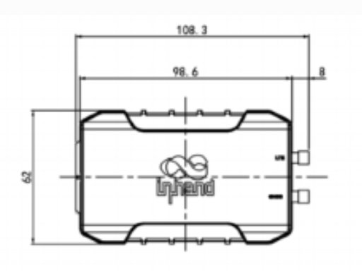
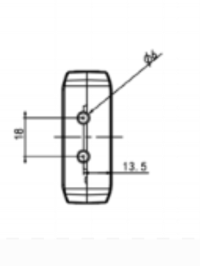
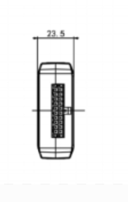

  

    

      
    

    

      轻量车载追踪，稳定连接，精准定位
    

  

  

    

      VT200 车载追踪网关
    

    

      

        
· LTE Cat1

        
· GNSS

      

      

        
· CAN/OBD

        
· 低功耗

      

    

  

# 1. 产品概述

**VT200 集成 LTE、GNSS 与惯性传感器，面向车队管理与资产追踪场景，提供实时定位、行驶监控与可靠数据回传能力。**

**产品特点：**
- **精准追踪:** GNSS + 惯导融合定位，支持连续轨迹记录
- **车规设计:** 宽压输入与耐温设计，适配复杂车辆工况
- **接口丰富:** CAN、RS232/RS485、DI/DO、1-Wire 满足扩展需求
- **可靠传输:** 支持离线缓存与低功耗模式，保障数据连续性
- **云端兼容:** 支持 AWS、Azure、ThingsBoard 等物联网云平台

## 核心技术指标

|技术指标|规格|
|---|---|
|蜂窝网络|LTE Cat1|
|卫星定位|GPS / Galileo / Beidou / GLONASS，支持惯导传感器|
|车辆数据传输|支持 OBDII、J1939、CAN bus、ELD 数据透明传输|
|协议支持|TCP、UDP、HTTP、MQTT；RS232/RS485 透明传输与 Modbus|
|事件告警|碰撞、运动、超速、I/O 变化、点火检测，支持 FlexAPI 告警推送|
|云平台接入|AWS IoT、Azure IoT、Aliyun IoT、Wialon、Traccar、GPSWox、ThingsBoard、MQTT Cloud 等|
|产品尺寸|98.6 × 62 × 23.5 mm（内置）/ 108.3 × 62 × 23.5 mm（外置）|
|车载接口|CAN Bus（OBD-II/J1939）、USB 2.0 Type-C、4FF SIM|
|串口与I/O|RS232、RS485、4DI/4AI、2DO、1-Wire、ACC|
|供电|9–36 V DC，可选 1000 mAh 锂电池版本|
|工作温度|-20 °C ~ 60 °C（电池版：-30 °C ~ 70 °C）|
|防护等级|IP40|

# 2. 产品尺寸

  

    

      

        
      

      
正视图

    

    

      

        
      

      
接口图

    

    

      

        
      

      
侧视图

    

  

  
注意：

  
1.所有尺寸单位为毫米（mm）。

  
2.所有尺寸均为近似值，仅供参考。

  
3.图示尺寸不得用于生产加工。

  
4.尺寸需符合零件及制造公差要求。

  
5.尺寸如有变更，恕不另行通知。

# 3. 硬件规格

| 类别/参数 | 规格 |
|--------------------------|------|
| **处理器与存储** | |
| 平台 | 车载追踪网关多任务系统 |
| 本地缓存 | 超过 3K 条位置记录 |
| **连接与联网** | |
| 蜂窝网络 | LTE Cat1 |
| LTE 频段 | FDD: B1/B3/B5/B8；TDD: B34/B38/B39/B40/B41；GSM: 900/1800 MHz |
| SIM 卡 | 4FF（Single SIM） |
| 天线形式 | 内置陶瓷天线 / 外置 SMA（按型号） |
| **卫星定位** | |
| GNSS 系统 | GPS, Galileo, Beidou, GLONASS |
| 信道数 | 72 channels |
| 灵敏度 | -164 dBm（初始定位） |
| 初始定位时间 | 26 s |
| 跟踪灵敏度 | -156 dBm（热启动）/ -147 dBm（冷启动） |
| 定位精度 | 2.5 m（CEP50） |
| 更新频率 | 10 MHz（源文档标注） |
| 惯导传感器 | 加速度计、陀螺仪 |
| 加速度量程 | ±2 / ±4 / ±8 / ±16 g |
| 角速度量程 | ±125 / ±250 / ±500 / ±1000 / ±2000 dps |
| **接口** | |
| CAN Bus | 1 channel，支持 OBD-II/J1939 |
| 串口 | RS232、RS485 |
| I/O | 4DI/4AI，2DO（max 300 mA），1-Wire |
| 点火信号 | 1 channel（ACC） |
| USB | USB 2.0 Type-C |
| LED 指示 | 2 LEDs（Cellular/GNSS） |
| **电源** | |
| 输入电压 | 9–36 V DC |
| 电池版本 | 可选 1000 mAh 锂电池型号 |
| 电池工作温度 | -30 °C ~ 70 °C |
| 电池储存温度 | -20 °C ~ 35 °C |
| **机械** | |
| 尺寸 | 98.6 × 62 × 23.5 mm（内置）；108.3 × 62 × 23.5 mm（外置） |
| 外壳材质 | ABS + PC |
| 防护等级 | IP40 |
| **环境与认证** | |
| 工作温度 | -20 °C ~ 60 °C |
| 储存温度 | -40 °C ~ 85 °C |
| 湿度 | 95% RH @ 50 °C 无凝霜 |
| ESD | IEC 61000-4-2（4 kV test） |
| 认证 | FCC, IC, PTCRB |

# 4. 软件规格

| 类别/参数 | 规格 |
|--------------------------|------|
| **网络特性** | |
| 传输协议 | TCP、UDP、HTTP、MQTT |
| 数据传输 | OBDII、J1939、CAN bus、ELD 数据透明传输 |
| 串口能力 | RS232/RS485 透明传输，支持 Modbus |
| **事件与告警** | |
| Event Alarm | 碰撞检测、运动检测、超速、I/O 变化、点火检测 |
| 告警推送 | 短信或 FlexAPI over TCP/UDP/MQTT |
| **边缘与蓝牙扩展** | |
| BLE 数据转发 | Forward vehicle data via BLE（ELD） |
| **云平台接入** | |
| 云平台 | AWS IoT、Azure IoT、Aliyun IoT、Wialon、Traccar、GPSWox、WhiteLable Tracking、ThingsBoard、MQTT Cloud、客户私有平台 |
| **配置管理** | |
| 配置方式 | 本地与云端结合的车载终端配置 |
| 协议与平台 | 支持主流 IoT 平台对接与应用扩展 |

# 5. 订购信息

## 型号规则

**Model code:** VT200-\<WMNN\>

\<WMNN\>: Cellular Type & Module（蜂窝类型与模块）

## 产品型号

| 型号 | 类型/配置 | 区域 | 说明 |
|------|-----------|------|------|
| VT200-LQ00 | 标准版（内置天线） | 中国 | LTE Cat1，支持多星定位与车载追踪 |
| VT200-LQ00-ANT-BDS | 外置天线、无电池、北斗定位 | 中国 | 适合外置天线部署场景 |
| VT200-LQ00-BAT | 内置天线、有电池 | 中国 | 具备驻车低功耗与断电续传能力 |
| VT200-LQ00-BAT-ANT | 外置天线、无电池 | 中国 | LTE Cat1 版本，适配外置天线安装 |

## 配件选配

| 线缆类型 | 订购编码 | 规格 |
|----------|----------|------|
| 20 PIN Cable | SCAB000381 | P1 为 20PIN 母头连接 VT200，P2 开口端，AWG24，接口 HX30002-20 |
| OBD 16PIN Test Cable | SCAB000399 | OBD 16PIN 测试线，UL2464，线长 1500 mm |
| J1939 6PIN Test Cable | SCAB000409 | J1939 6PIN 测试线，UL2464，线长 1500 mm |

# 6. 联系我们

- **官网：** [映翰通官网](https://www.inhand.com.cn)
- **版权声明：** ©映翰通网络 保留所有权利

# 7. 20PIN 端子定义（I/O）

<table style="width:78%;">
  <colgroup>
    <col style="width:15%;">
    <col style="width:23%;">
    <col style="width:62%;">
  </colgroup>
  <tr><th align="center">引脚</th><th align="center">定义</th><th align="left">说明</th></tr>
  <tr><td align="center">1</td><td align="center">CAN0_H</td><td>CAN0 总线高电平信号</td></tr>
  <tr><td align="center">2</td><td align="center">RS485_A</td><td>RS485 A 线</td></tr>
  <tr><td align="center">3</td><td align="center">GND</td><td>信号地</td></tr>
  <tr><td align="center">4</td><td align="center">RS232_TX</td><td>RS232 发送信号</td></tr>
  <tr><td align="center">5</td><td align="center">DO1</td><td>数字输出 1</td></tr>
  <tr><td align="center">6</td><td align="center">GND</td><td>信号地</td></tr>
  <tr><td align="center">7</td><td align="center">AI1/DI1</td><td>模拟输入 1 或数字输入 1</td></tr>
  <tr><td align="center">8</td><td align="center">AI3/DI3</td><td>模拟输入 3 或数字输入 3</td></tr>
  <tr><td align="center">9</td><td align="center">IGT</td><td>点火检测输入</td></tr>
  <tr><td align="center">10</td><td align="center">VIN-</td><td>电源负极</td></tr>
  <tr><td align="center">11</td><td align="center">CAN0_L</td><td>CAN0 总线低电平信号</td></tr>
  <tr><td align="center">12</td><td align="center">RS485_B</td><td>RS485 B 线</td></tr>
  <tr><td align="center">13</td><td align="center">1Wire</td><td>1-Wire 总线接口</td></tr>
  <tr><td align="center">14</td><td align="center">RS232_RX</td><td>RS232 接收信号</td></tr>
  <tr><td align="center">15</td><td align="center">DO2</td><td>数字输出 2</td></tr>
  <tr><td align="center">16</td><td align="center">GND</td><td>信号地</td></tr>
  <tr><td align="center">17</td><td align="center">AI2/DI2</td><td>模拟输入 2 或数字输入 2</td></tr>
  <tr><td align="center">18</td><td align="center">AI4/DI4</td><td>模拟输入 4 或数字输入 4</td></tr>
  <tr><td align="center">19</td><td align="center">GND</td><td>信号地</td></tr>
  <tr><td align="center">20</td><td align="center">VIN+</td><td>电源正极</td></tr>
</table>

