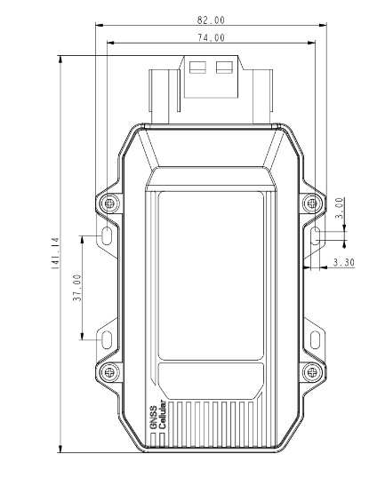
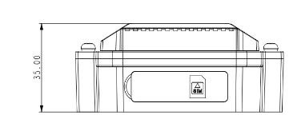
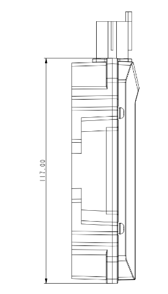

  

    

      
    

    

      智能车载追踪，IP66 防护，全场景连接
    

  

  

    

      VT310 车载追踪网关
    

    

      

        
· LTE Cat-M/1/4

        
· GNSS

      

      

        
· IP66

        
· 双 CAN

      

    

  

# 1. 产品概述

**VT310 车载追踪网关面向物流、公共交通、重型机械与资产追踪等场景，集成 LTE Cat-M/1/4、GNSS 与惯性传感，提供可靠的车队管理与远程监控能力。**

**产品特点：**
- **车载专型:** 双 CAN、OBD-II/J1939/J1708，支持驾驶行为与紧急事件监测
- **全域连接:** LTE Cat-M / Cat1 / Cat4，内置蜂窝与 GNSS 天线，蓝牙 4.1
- **工业级防护:** IP66、9~48 V 宽压、1200 mAh 内置锂电池
- **云端兼容:** AWS、Azure、Aliyun、Wialon、Traccar、ThingsBoard 及客户私有平台
- **本地缓存:** 离线缓存超过 30000 条位置记录，断网不丢数据

## 核心技术指标

|技术指标|规格|
|---|---|
|蜂窝网络|LTE Cat-M / Cat1 / Cat4|
|定位能力|GPS / GNSS / A-GNSS，定位精度 2.5 m（CEP50）|
|云平台接入|支持 AWS IoT、Azure IoT、Aliyun IoT、Wialon、Traccar、ThingsBoard 及客户平台|
|网络与传输|支持 TCP、UDP、HTTP、MQTT|
|车辆数据采集|支持 OBDII、J1939、J1708，支持 RS232/RS485 透明传输与 Modbus 采集|
|事件告警|支持碰撞、运动、超速、I/O 变化、点火信号等告警并可经 SMS/FlexAPI 上报|
|外形尺寸| 141.14 × 82 × 35 mm|
|整机重量|152 g|
|接口能力|双 CAN、1 路 J1708/RS485、RS232、4 路 DI、3 路 DO、1 路 AI、1 路 1-Wire|
|供电与电池|9-48 V DC 宽压输入，内置 1200 mAh 锂离子电池|
|工作温度|主电源供电 -40~85 C；电池供电 -20~60 C|
|防护等级|IP66|

# 2. 产品尺寸

  

    

      

        
      

      
正视图

    

    

      

        
      

      
接口图

    

    

      

        
      

      
侧视图

    

  

  
注意：

  
1.所有尺寸单位为毫米（mm）。

  
2.所有尺寸均为近似值，仅供参考。

  
3.图示尺寸不得用于生产加工。

  
4.尺寸需符合零件及制造公差要求。

  
5.尺寸如有变更，恕不另行通知。

# 3. 硬件规格

| 类别/参数 | 规格 |
|--------------------------|------|
| **处理器与存储** | |
| 平台 | 车载追踪网关多任务系统 |
| 本地缓存 | 超过 30000 条位置记录 |
| **连接与联网** | |
| 蜂窝网络 | LTE Cat-M / Cat1 / Cat4 |
| 天线 | LTE FPC 内置天线 |
| SIM 卡 | 2FF，双卡 push-in 卡槽 |
| **卫星定位** | |
| 卫星支持 | GPS / GNSS / A-GNSS |
| 信道数 | 31 channels |
| 灵敏度 | -162 dBm（初始定位时间约 32 s） |
| 跟踪灵敏度 | -156 dBm（热启动）；-148 dBm（冷启动） |
| 定位精度 | 2.5 m（CEP50） |
| 更新频率 | 1 Hz（默认），最高 10 Hz |
| 低功耗定位 | 连续运行：&lt;15 mA（@ 3.3 V 单系统定位） |
| **内置传感器** | |
| 加速度 | 量程：±2 / ±4 / ±8 / ±16 g |
| 角速度 | 量程：±125 / ±250 / ±500 / ±1000 / ±2000 dps |
| **无线** | |
| 蓝牙 | Bluetooth 4.1 |
| 蓝牙天线 | 陶瓷内置天线 |
| GNSS 天线 | 陶瓷内置天线 |
| **接口** | |
| CAN Bus | 2 channels |
| J1708 / RS485 | 1 channel |
| 串口 | RS232 |
| 点火信号 | 1 channel |
| 数字输入 | 4 channels |
| 数字输出 | 3 channels（max. 300 mA） |
| 1-Wire | 1 channel，4 sensor |
| 模拟输入 | 1 channel |
| I/O 连接器 | 26 PIN |
| LED 指示 | 2 个（蜂窝状态、GNSS 状态） |
| **电源** | |
| 工作电压 | 9–48 V DC |
| 功耗 | 0.45 W / 0.55 W / 0.77 W（工况相关） |
| **电池** | |
| 容量 | 1200 mAh |
| 额定电压 | 3.7 V |
| 截止电压 | 4.2 V |
| 类型 | 锂离子 |
| 充电温度 | 0 ~ 45 °C |
| 放电温度 | -20 ~ 60 °C |
| 存储温度 | 1 个月：-20 ~ 45 °C；6 个月：-10 ~ 35 °C |
| **机械** | |
| 外壳材质 | 工程塑料 + 工程塑料合金（PC + ABS） |
| 尺寸 (W × D × H) | 141.14 × 82 × 35 mm |
| 重量 | 152 g |
| 防护等级 | IP66 |
| **环境** | |
| 工作温度 | -40 ~ 85 °C（连接主电源）；-20 ~ 60 °C（内置电池供电） |
| 湿度 | 95% RH @ 50 °C，无凝露 |
| ESD | IEC 61000-4-2（4 kV test） |
| **认证** | |
| 认证 | CE, FCC, IC, PTCRB, E-Mark |

# 4. 软件规格

| 类别/参数 | 规格 |
|--------------------------|------|
| **云平台接入** | |
| 云平台 | AWS IoT、Azure IoT、Aliyun IoT、Wialon、Traccar、GPSWox、WhiteLabel Tracking、ThingsBoard、客户平台 |
| **网络特性** | |
| 协议 | TCP、UDP、HTTP、MQTT |
| **车辆数据** | |
| 诊断协议 | OBDII、J1939、J1708 |
| 串口 | RS232/RS485 透明传输、Modbus 数据采集 |
| **事件与告警** | |
| Event Alarm | 碰撞检测、运动检测、超速、I/O 变化、点火信号检测等 |
| 上报 | 短信或 FlexAPI over TCP/UDP/MQTT |
| **ELD 与蓝牙** | |
| ELD | 通过 BLE 转发车辆数据 |
| **配置管理** | |
| 配置方式 | RS232 或 Bluetooth |

# 5. 订购信息

## 型号规则

**Model code:** VT310-\<WMNN\>

\<WMNN\>: Cellular Type & Module（蜂窝类型与模块）

## 产品型号

<table style="width:100%;">
  <colgroup>
    <col style="width:30%;">
    <col style="width:12%;">
    <col style="width:58%;">
  </colgroup>
  <tr><th align="center">型号</th><th align="center">区域</th><th align="left">\<WMNN\>: Cellular Type & Module</th></tr>
  <tr><td align="center" style="white-space: nowrap;">VT310-FQ58-B</td><td align="center">中国</td><td align="left">LTE FDD: B1/B3/B5/B8 LTE TDD: B34/B38/B39/B40/B41 WCDMA: B1/B8 GSM: 900/1800 MHz CAT4</td></tr>
  <tr><td align="center" style="white-space: nowrap;">VT310-FQ53-B</td><td align="center">欧洲、亚太</td><td align="left">LTE FDD: B1/B3/B5/B8/B20/B28 CAT1</td></tr>
  <tr><td align="center" style="white-space: nowrap;">VT310-FQ08-B</td><td align="center">全球</td><td align="left">LTE-FDD: B1/2/3/4/5/7/8/12/13/18/19/20/25/26/28/66 LTE-TDD: B34/38/39/40/41 WCDMA: B1/2/4/5/6/8/19 GSM/EDGE: B2/3/5/8 CAT4</td></tr>
</table>

*示例：VT310-FS08-B 表示支持 LTE Cat 4、适用于全球等配置（以实际订购型号为准）。*

## 线缆选配

| 线缆类型 | 订购编码 | 规格 |
|----------|----------|------|
| 26 PIN All-in-one 测试线 | SCAB000229 | P1 为 26PIN 母头连接 VT310，P2 为开放端，需 9–48 V 适配器；适用于工程与室内测试 |
| OBD-II 7 PIN All-in-one 线 | SCAB000231 | P1 26PIN 母头接 VT310；P2 车辆 OBD-II 公头；P3 点火信号端子；适用于带 OBD-II 的重卡并由接口供电 |
| OBD-II 26 PIN All-in-one 线 | SCAB000232 | P1 26PIN 母头；P2 OBD-II 公头；P3 含 I/O、RS232-1、1-Wire 开放端；P4 点火信号；适用于需 DI/DO/AI/1-Wire 扩展的场景 |

# 6. 联系我们

- **官网：** [映翰通官网](https://www.inhand.com.cn)
- **版权声明：** ©映翰通网络 保留所有权利

# 7. 26PIN 端子定义

<table style="width:78%;">
  <colgroup>
    <col style="width:15%;">
    <col style="width:23%;">
    <col style="width:62%;">
  </colgroup>
  <tr><th align="center">引脚</th><th align="center">定义</th><th align="left">说明</th></tr>
  <tr><td align="center">1</td><td align="center">V-</td><td>电源负极</td></tr>
  <tr><td align="center">2</td><td align="center">GND</td><td>地</td></tr>
  <tr><td align="center">3</td><td align="center">DI2</td><td>数字输入2</td></tr>
  <tr><td align="center">4</td><td align="center">DI4</td><td>数字输入4</td></tr>
  <tr><td align="center">5</td><td align="center">GND</td><td>地</td></tr>
  <tr><td align="center">6</td><td align="center">DO2</td><td>数字输出2</td></tr>
  <tr><td align="center">7</td><td align="center">AI</td><td>模拟输入</td></tr>
  <tr><td align="center">8</td><td align="center">1-Wire</td><td>1-Wire 接口</td></tr>
  <tr><td align="center">9</td><td align="center">RS232_RX</td><td>RS232 接收</td></tr>
  <tr><td align="center">10</td><td align="center">GND</td><td>地</td></tr>
  <tr><td align="center">11</td><td align="center">CAN1_L</td><td>CAN1 低电平</td></tr>
  <tr><td align="center">12</td><td align="center">CAN2_L</td><td>CAN2 低电平</td></tr>
  <tr><td align="center">13</td><td align="center">J1708_B</td><td>J1708 B</td></tr>
  <tr><td align="center">14</td><td align="center">V+</td><td>电源正极</td></tr>
  <tr><td align="center">15</td><td align="center">IGT</td><td>点火信号</td></tr>
  <tr><td align="center">16</td><td align="center">DI1</td><td>数字输入1</td></tr>
  <tr><td align="center">17</td><td align="center">DI3</td><td>数字输入3</td></tr>
  <tr><td align="center">18</td><td align="center">GND</td><td>地</td></tr>
  <tr><td align="center">19</td><td align="center">DO1</td><td>数字输出1</td></tr>
  <tr><td align="center">20</td><td align="center">DO3</td><td>数字输出3</td></tr>
  <tr><td align="center">21</td><td align="center">GND</td><td>地</td></tr>
  <tr><td align="center">22</td><td align="center">RS232_TX</td><td>RS232 发送</td></tr>
  <tr><td align="center">23</td><td align="center">GND</td><td>地</td></tr>
  <tr><td align="center">24</td><td align="center">CAN1_H</td><td>CAN1 高电平</td></tr>
  <tr><td align="center">25</td><td align="center">CAN2_H</td><td>CAN2 高电平</td></tr>
  <tr><td align="center">26</td><td align="center">J1708_A</td><td>J1708 A</td></tr>
</table>