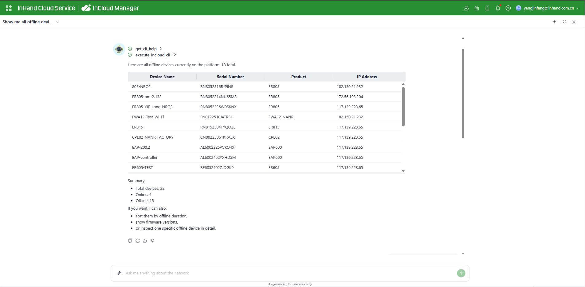
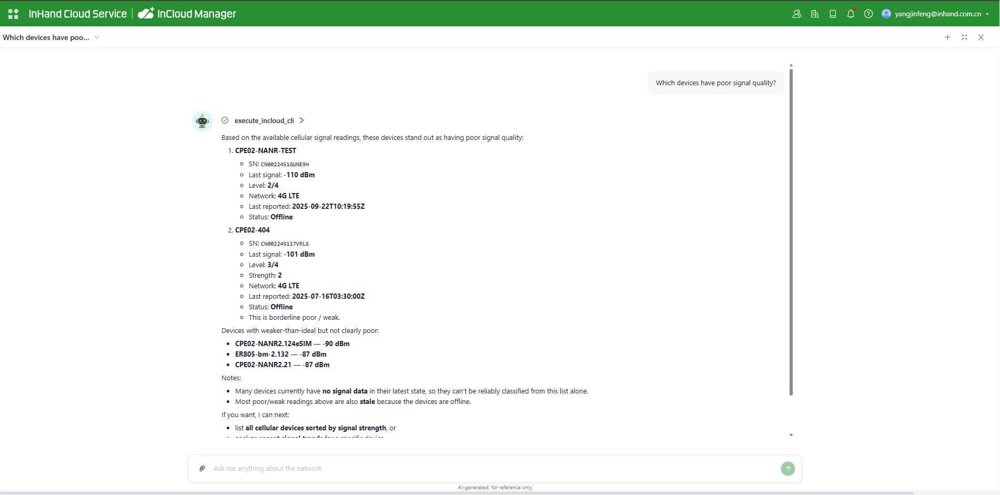
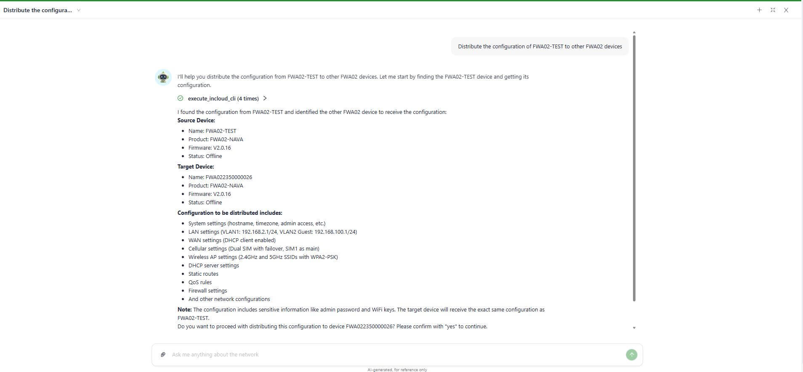
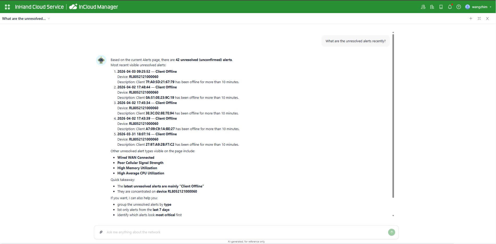
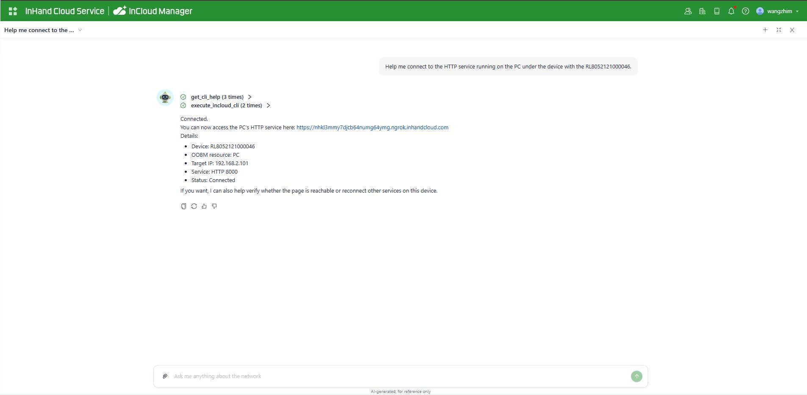
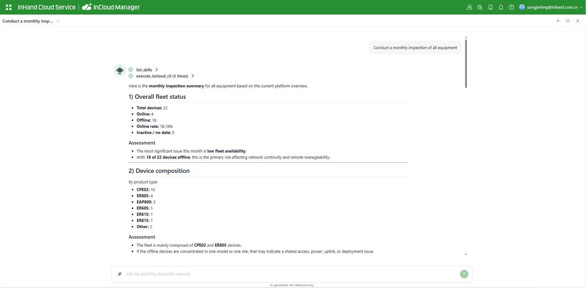

  

    

      
    

    

      智能管理，无忧连接
    

  

  

    

      小星云管家
    

    

      

        
· AI 网络助手

        
· 极简云管理

      

      

        
· 云原生管理

        
· 远程部署

      

    

  

# 1. 云平台概述

映翰通小星云管家，是面向零售门店、中小企业办公的企业网络管理平台，其结合映翰通边缘路由器、AP、交换机等联网硬件打造出极简管理、便捷运维的网络云管理解决方案。小星云管家支撑企业将设备及网络管理工作迁移到云端，可满足各种应用场景下对网络及通信设备的一站式远程部署和集中管理需求。

全新上线的 **AI 网络助手**，让网络运维进入自然语言时代——通过自然语言指令即可完成设备巡检、故障排查、批量配置等操作，大幅提升运维效率。帮助企业实现业务高效增长，促进管理降本增效，增强数字业务发展的竞争力。

# 2. AI 网络助手

只需在 AI 网络助手对话框输入自然语言，即可完成设备管理全流程操作——无需逐页操作，无需专业网络工程师经验。

# 3. 运维痛点：人力不足与效率瓶颈

传统网络管理面临的共同困境：

| 渠道的痛                 | 客户的痛                   |
| -------------------- | ---------------------- |
| 一个人能管的设备有限，客户多了就忙不过来 | 几十台设备巡检要在 Web UI 上点大半天 |
| 有经验的网工难招、成本高         | 设备掉线要翻好几个页面排查，费时费力     |
| 客户散布各地，出一趟差成本不低      | 信号好坏得自己对着标准算           |
|                      | 批量操作全靠手动，逐台跟踪          |

# 4. 覆盖设备全生命周期的 9 大 AI 能力

## 设备监控

实时掌握每台设备的运行状态，无需逐页翻找。

- 查询设备在线 / 离线状态，支持按名称、位置、分组筛选
- 查看在线历史记录，掌握设备近期稳定性趋势
- 实时流量统计，发现异常带宽消耗
- 查看连接终端数量与详情

**示例对话：**

> 用户：帮我查一下所有离线设备
> 
> 管家：
> | 设备名 | SN | 离线时间 |
> |---|---|---|
> | 路由 A | SN001 | 5 分钟前 |
> | 路由 B | SN002 | 5 分钟前 |

## 故障排查

不仅是简单执行查询，更通过多步自动化诊断链，给出完整分析结论与处置建议。

以"设备掉线排查"为例，AI 自动执行 5 步诊断：

| 步骤       | AI 执行内容    | 发现                        |
| -------- | ---------- | ------------------------- |
| 1. 查设备状态 | 确认离线时间     | 最后在线 10:23                |
| 2. 查在线历史 | 统计近期掉线规律   | 最近一周掉线 3 次，集中在凌晨          |
| 3. 查信号记录 | 分析 RSRP 趋势 | 从 −95 降至 −112 dBm（弱信号区间）  |
| 4. 查系统日志 | 检索关键事件     | 发现 modem reset 记录         |
| 5. 综合结论  | —          | **"信号持续恶化导致频繁掉线，建议检查天线"** |

**示例对话：**

> 用户：第一台为什么掉线？
> 
> 管家：自动查信号 → 查日志 → 结论：信号恶化（RSRP −112 dBm），建议检查天线

---

## 信号分析

无需手动查阅标准、比对数值，AI 自动评估蜂窝信号质量并给出直观判断。

| 信号等级 | RSRP 范围         | 说明         |
| ---- | --------------- | ---------- |
| 优秀   | > −85 dBm       | 信号充足，业务稳定  |
| 良好   | −85 ~ −100 dBm  | 正常运行       |
| 一般   | −100 ~ −110 dBm | 存在隐患，建议关注  |
| 差    | < −110 dBm      | 高风险，建议立即处理 |

- 对标专业阈值，自动标注问题设备
- 查看历史信号趋势，提前发现恶化迹象
- 多设备信号质量横向对比，快速定位短板站点

**示例对话：**

> 用户：哪些设备信号比较差？
> 
> 管家：当前共有 3 台设备信号质量较差：
> | 设备名 | RSRP | 等级 | 建议 |
> |---|---|---|---|
> | 门店 A-路由 | −118 dBm | 差 | 建议检查天线或调整安装位置 |
> | 门店 C-路由 | −113 dBm | 差 | 建议检查天线 |
> | 仓储 B-路由 | −106 dBm | 一般 | 建议持续关注 |

---

## 远程诊断

直接下发诊断指令，无需登录设备 Web UI，结果即时返回。

- **Ping**：检测网络连通性和时延
- **Traceroute**：追踪路径，定位断点
- **抓包**：捕获数据包，分析报文
- **测速**：测量实际带宽，核验链路质量

**示例对话：**

> 用户：对门店 A 的路由器蜂窝接口做一次网络测速
> 
> 管家：测速完成，结果如下：
> 
> - 下行速率：48.3 Mbps
> - 上行速率：12.1 Mbps
> - 时延：34 ms / 丢包率：0%
> - 结论：网络状态正常，当前链路满足业务需求

---

## 配置管理

支持配置的读取、修改与复制，全程操作可追溯，变更可随时回滚。

- **读取 / 修改**：直接查询或更改设备配置项，无需打开 Web UI
- **复制配置**：将一台设备的配置快速复制到其他设备
- **快照备份**：变更前自动保存当前配置快照
- **回滚**：一键恢复到任意历史配置版本

**示例对话：**

> 用户：把 Device-xxx 的配置作为标准模板，下发给其他所有的 ER805 设备
> 
> 管家：当前设置对比 → 差异核对 → 确认执行项 → **等确认后执行**

---

## 固件升级

从版本选择到升级完成，AI 全程管理，有效降低手动操作风险。

- **兼容性检查**：升级前自动核验目标固件与设备型号的兼容性
- **分批执行**：支持按分组、按时间窗口分批升级，降低业务风险
- **进度监控**：实时跟踪每台设备的升级状态，异常自动提示
- **回滚保障**：升级失败可一键恢复至上一版本

**示例对话：**

> 用户：把所有 ER805 升级到最新固件
> 
> 管家：检测到 23 台 ER805，当前版本 V2.0.18，最新版本 V2.0.27。
> 兼容性检查：全部通过。
> 建议分 3 批次执行，每批约 8 台，间隔 10 分钟，预计总耗时 35 分钟。
> 确认后开始执行？

## 告警处理

集中查看和处理全网告警，不遗漏任何异常事件。

- 查看当前未处理告警列表，按严重程度排序
- 确认 / 关闭告警，记录处理动作
- 管理告警规则：新增、修改、启停告警策略
- 告警与设备状态联动分析

**示例对话：**

> 用户：最近有哪些未处理的告警？
> 
> 管家：当前共有 5 条未处理告警：
> | 设备 | 告警类型 | 触发时间 | 严重程度 |
> |---|---|---|---|
> | 门店 G-路由 | 设备离线 | 今日 09:15 | 严重 |
> | 仓储 B-路由 | 蜂窝流量超限 | 昨日 23:40 | 警告 |
> | 门店 D-路由 | CPU 利用率过高 | 昨日 18:22 | 警告 |
> | 门店 B-路由 | 链路状态异常 | 昨日 14:05 | 一般 |
> | 门店 F-路由 | 信号质量下降 | 昨日 11:30 | 一般 |
> 是否需要逐条处理，或指定设备优先处理？

## 远程终端

需要进行深度操作时，可直接调起设备控制界面，无需手动逐级导航。

- **打开设备 Web UI**：直接跳转到目标设备的管理页面
- **打开命令行**：直接进入设备 CLI，执行高级操作
- 操作全程基于账号鉴权，活动日志可查

**示例对话：**

> 用户：打开门店 A 路由器的管理界面
> 
> 管家：已为您建立远程连接，门店 A（SN: ER805-001）的 Web UI 已在新窗口中打开，可直接进行操作。本次连接已记录至活动日志。

---

## 批量操作

支持对多台设备同时下达操作指令，无需重复性手动逐台执行。

- **批量巡检**：一次性对所有设备执行健康检查，输出整体报告
- **批量推配置**：将配置模板统一下发到指定设备组
- **批量升固件**：批量发起固件升级任务，统一进度管理
- **批量管 License**：查看授权状态，统一续期或分配

**示例对话：**

> 用户：对所有零售门店设备做一次月度巡检
> 
> 管家：正在巡检 60 台设备……完成。报告如下：
> 
> - 在线正常：42 台
> - 信号偏弱（需关注）：3 台（门店 A、C、F）
> - 离线：18 台
> 
>     ...
> 
> - 我可以继续为您：
>   
>   1. **检查这 18 台离线设备**
>   2. **检查设备配置是否有异常或挂起**
>   3. **审查可用于升级的固件候选版本**
>   4. **着手检查列表中的某一特定设备**
>   
>   如果您愿意，我可以先从检查 **离线设备** 入手。

---

# 5. AI 赋能运维：效率全面提升

| 任务     | 传统方式               | AI 管家方式            |
| ------ | ------------------ | ------------------ |
| 月度设备巡检 | 逐台登录 Web UI，耗费大量时间 | 自然语言指令，数分钟输出完整报告   |
| 设备掉线排查 | 逐页翻查，人工研判          | AI 自动执行诊断流程，输出完整结论 |
| 批量下发配置 | 手动筛选，逐台执行          | 自然语言下达指令，自动批量完成    |
| 固件批量升级 | 逐台手动操作，人工跟踪进度      | 统一发起，分批执行，进度自动汇报   |
| 信号质量核查 | 手动查阅数据并比对标准        | AI 自动评估信号质量，直接输出结论 |

**降低人力成本**：无需每位运维人员都具备深厚网络经验，AI 有效弥补经验差距，新人可快速上手，大幅缩短培训周期。

**减少出差成本**：大部分问题可通过远程方式定位和解决，现场出差仅用于必要场景。

**创造增值收入**（适用于 MSP / 集成商）：巡检报告可直接输出为客户服务交付物，形成标准化增值服务。

# 6. 安全可控，每一步你都看得见

AI 助手的每一步操作均透明可见，不是黑盒，而是可见、可追责的助手。

| 安全机制       | 说明                              |
| ---------- | ------------------------------- |
| ✅ 只读操作无限制  | 查询状态、查看告警、分析信号，无风险，随时可用         |
| ✅ 写操作需二次确认 | 修改配置、升级固件、重启设备，执行前展示变更详情，等待用户确认 |
| ✅ 操作绑定账号   | 每次操作记录操作人，活动日志完整可查              |
| ✅ 标准化执行流程  | 相同操作每次遵循统一流程，不因人而异，有效降低人为失误风险   |

---

# 7. 行业应用

广泛适用于各类分布式设备需要集中管理的场景。

| 行业            | 典型场景      | 核心价值                   |
| ------------- | --------- | ---------------------- |
| **零售连锁**      | 便利店、茶饮、药房 | 网络中断直接影响销售，快速恢复可降低营收损失 |
| **ATM / 金融**  | 银行网点、支付终端 | 合规要求严格，SLA 保障要求高       |
| **工业能源**      | 产线、电站、矿区  | 远程运维减少停工，保障生产连续性       |
| **交通监控**      | 高速、城市交通   | 支持成百上千路设备的批量集中管理       |
| **MSP / 集成商** | 代运维多客户    | 单人管理多客户，巡检报告形成可销售的增值服务 |

**典型案例：零售连锁门店网络运维**（每家门店路由器承载 POS + 监控 + 价签 + 总部回连）

| 场景              | 传统做法         | AI 管家做法                     |
| --------------- | ------------ | --------------------------- |
| 门店断网 — 店长反馈     | 远程逐页排查，耗时费力  | AI 数分钟定位问题 → **大幅缩短业务中断时间** |
| 月度巡检 — 逐台核查耗时数天 | 手动逐台检查       | AI 数分钟输出完整报告 → **自动标注问题门店** |
| 大促保障 — 提前排查隐患   | 人工值守，缺乏系统化手段 | 活动期间实时监控 → **运维人员有据可查**     |
| 批量新店 — 统一推配置    | 逐台手动操作       | 自然语言指令批量完成 → **大幅节省人力投入**   |

